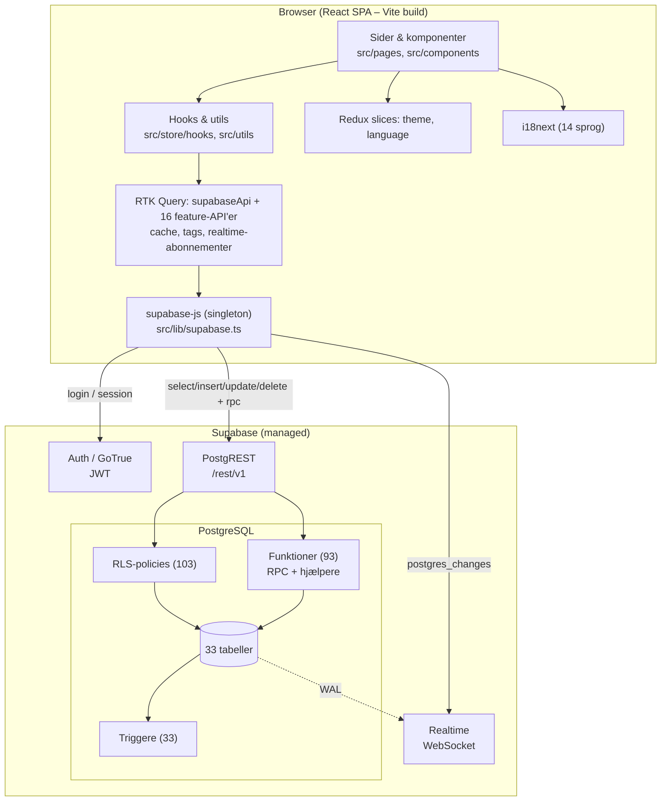

# 1. Projektets overordnede formål

## 1.1 Hvad projektet gør

**Ponos** er en multi-tenant webplatform, hvor en organisation samler sine **ressourcer**, **arbejdsopgaver**, **medarbejdere** og den **indsigt**, der kan udledes af dem. Den er bygget omkring tre spørgsmål (`README.md`, `docs/Project.md` §1):

| Spørgsmål | Område i appen | Rute |
|---|---|---|
| **Hvad har vi?** | Datalager (kategorier → varer → enheder → lagre/sektioner) | `/datalager` |
| **Hvem gør hvad?** | Opgaver (rum, tilmeldinger, godkendelse, materialer) | `/tasks…` |
| **Hvad fortæller data os?** | Dashboard og statistik | `/dashboard`, `/statistik` |

Derudover: organisationer og medlemskaber, roller og privilegier, nyheder, beskeder (1:1, grupper, auto-chats for opgaver/rum), notifikationer, profil og offentlige informationssider.

Projektets bærende idé er sammenhængen **Data → Mennesker → Opgaver → Handling → Indsigt**: det, der registreres ét sted (fx en vare i datalageret), genbruges de næste steder (som materiale på en opgave, som tal i statistikken) i stedet for at blive tastet ind igen.

## 1.2 Problemet det løser

Ifølge `docs/Project.md` §2 har organisationer deres overblik spredt over regneark, mails, chat og enkeltpersoners hukommelse. Det gør det svært at vide, hvad man allerede ejer, hvor det er, hvem der er ansvarlig, og hvad der faktisk skete. Et eksplicit mål er **cirkularitet**: "Vi mangler noget → undersøg hvad vi allerede har" i stedet for "køb nyt".

## 1.3 Hvem bruger systemet

| Bruger | Hvad de gør (observeret i koden) |
|---|---|
| Besøgende (udlogget) | Forside, Om os, Kontakt, Hjælp, opret konto, log ind, glemt adgangskode |
| Bruger uden organisation | Opret organisation, anmod om medlemskab, svar på invitationer |
| Medlem (rollen "Medlem": `read_news`, `read_tasks`) | Se nyheder og opgaver, tilmelde sig opgaver, beskeder, notifikationer |
| Brugerdefinerede roller (fx "Lagerchef", "Holdleder") | Det, deres privilegier tillader (datalager, opgavestyring, godkendelse, statistik …) |
| Administrator (rollen "Admin" med `admin`) | Alt – inkl. roller/privilegier, medlemmer, farver, sletning af organisationen. Højst én pr. organisation. |

**Pilotcase:** Roskilde Festival (seed-data i `docs/seed/`). Projektet er et **studieprojekt** (README: "et studieprojekt, men tænkt som et rigtigt værktøj") udviklet af tre studerende med hver sit domæne (Studerende 1: adgang/organisation/overblik; 2: datalager/lokationer; 3: opgaver/beskeder/notifikationer – ifølge `docs/`). Platformen skal være **generisk**, ikke festival-specifik (`Project.md` §3.3, §12).

## 1.4 Vigtigste funktioner

- Konti, flere organisationer pr. bruger, **aktiv organisation** som kontekst for alt.
- Granulære CRUD-privilegier pr. domæne og rolle (privilegie-matrix), beskyttede standardroller, én admin med "giv videre".
- Datalager med kategoritræ, lagre/sektioner, enheder med serienumre, mængder, beholdere med fyldniveau og automatiske statusser, favoritter.
- Opgaver i (rolle-begrænsede) rum, prioritet, frister, tilmelding/tildeling, godkendelsesflow med begrundet afvisning, materialereservation og -afrapportering.
- Beskeder i realtid (1:1, grupper, opgave- og rum-chats), læsestatus, redigering/sletning.
- Notifikationer i realtid med pr.-type-indstillinger.
- Nyheder med rich text.
- Statistik beregnet server-side: KPI'er med trend, udvikling, fordelinger, "lige nu", rum-oversigt, tab/forbrug, snapshots og sammenligning, CSV-eksport.
- 14 sprog, lys/mørk tilstand, organisationens egne brandfarver med automatisk kontrastjustering.

## 1.5 Teknologistack

| Lag | Teknologi (version) |
|---|---|
| Sprog | TypeScript 6 (strict som default) |
| UI | React 19 + **React Compiler** (automatisk memoisering) |
| Styling | Tailwind CSS v4 (konfigureret i CSS, ingen `tailwind.config.js`), `lucide-react`-ikoner |
| State | Redux Toolkit 2 + **RTK Query** (server-state), to små slices (tema, sprog) |
| Routing | React Router 7 |
| i18n | i18next 26 + react-i18next, typede nøgler |
| Diagrammer | Recharts 3 |
| Build | Vite 8 |
| Backend | **Supabase**: PostgreSQL + Row Level Security, PL/pgSQL-funktioner og triggere, Auth (GoTrue), PostgREST, Realtime |
| Kvalitet | ESLint 10 (inkl. react-hooks v7), `tsc`, eget i18n-check-script. **Ingen tests.** |

## 1.6 Overordnet arkitektur

Ponos er en **"tyk klient + smart database"**-arkitektur: der er **ingen applikationsserver**. Browseren taler direkte med Supabase; forretningsregler og sikkerhed ligger i Postgres (RLS-policies, `SECURITY DEFINER`-funktioner og triggere).

**Lagdeling i klienten** (det mønster CLAUDE.md og `Project.md` §15 beskriver, og som koden i hovedsagen følger):

1. **Præsentation** – `src/pages/*` (én pr. rute) og `src/components/*` (feature-mapper + `common/`).
2. **UI-logik** – custom hooks i `src/store/hooks/` og rene funktioner i `src/utils/`.
3. **Data-adgang** – RTK Query-endpoints i `src/store/apis/*Api.ts`, alle injiceret i ét `supabaseApi`.
4. **Infrastruktur** – `src/lib/supabase.ts`, `src/i18n/`, `src/store/store.ts`.
5. **Backend-logik** – i databasen (`docs/dbSchema.sql` dokumenterer den, med drift – se `06-database.md`).

**Multi-tenancy:** hver række bærer `organisation_id`; RLS sammenligner med `auth_profile_org()` (brugerens *aktive* organisation). Privilegier tjekkes med `has_privilege_or_admin('<navn>')`. Frontendens rettighedstjek er kun UX.

Næste fil (`02-projektstruktur.md`) viser, hvor hver del ligger.
