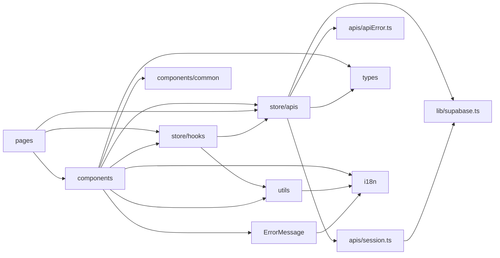

# 2. Projektstruktur

## 2.1 Mappetræ (de relevante dele)

```
Ponos/
├── index.html                 ← HTML-skal + pre-hydration-script (tema/sprog)
├── package.json               ← scripts + dependencies
├── vite.config.ts             ← React, Tailwind, React Compiler
├── tsconfig*.json, eslint.config.js
├── CLAUDE.md                  ← instruktioner til AI-assistent + projektnoter
├── README.md                  ← produktbeskrivelse (dansk)
├── scripts/
│   ├── i18n-check.mjs         ← nøgleparitet + flertal på tværs af sprog
│   └── i18n-split.mjs         ← del én oversættelsesfil op i namespaces
├── docs/
│   ├── Project.md             ← produkt- og udviklingsspecifikation (1.014 linjer)
│   ├── userStories.md         ← user stories (1.894 linjer)
│   ├── dbSchema.sql           ← dokumenteret DB-skema (7.051 linjer, med drift)
│   ├── exportSchema.sql       ← SQL der dumper live-skemaet som CSV
│   ├── migrations/README.md   ← proces for SQL-ændringer (mappen er ellers tom)
│   ├── seed/                  ← Roskilde Festival-mockdata + FACIT.md + generate.mjs
│   ├── statistik-plan.md      ← statistikkens definitioner og status
│   └── studerende1-plan.md, studerende1-historik.md ← progress-tracker for én studerende
├── public/                    ← favicon.svg, icons.svg (ubrugte)
└── src/
    ├── main.tsx               ← ENTRY POINT
    ├── App.tsx                ← layout + rutetabel
    ├── ErrorMessage.ts        ← fejl → oversat tekst
    ├── index.css              ← Tailwind + tema-tokens
    ├── lib/                   ← supabase-klient, rich text-sanitizer, kontaktdata
    ├── routes/ProtectedRoute/ ← login-guard
    ├── store/
    │   ├── store.ts           ← Redux store
    │   ├── apis/              ← RTK Query: supabaseApi + 16 feature-API'er + apiError + session
    │   ├── hooks/             ← 19 hook-filer (custom hooks + typede Redux-hooks)
    │   └── slices/            ← theme, language (+ dataLayersSlices = hjælpefunktioner)
    ├── pages/<feature>/       ← én komponent pr. rute (20 sidefiler)
    ├── components/<feature>/  ← feature-komponenter + common/ (UI-primitiver)
    ├── types/<domæne>/        ← domæne- og prop-typer
    ├── utils/                 ← rene hjælpefunktioner (23 filer)
    ├── i18n/                  ← config, sprogregister, typer, locales/<sprog>/<namespace>.json
    └── assets/logo/           ← Ponos-kompas (svg/png)
```

## 2.2 Hvor ligger hvad?

| Spørgsmål | Svar |
|---|---|
| **Application entry point** | `src/main.tsx` (indlæst af `index.html` via `<script type="module" src="/src/main.tsx">`) |
| **Configuration** | Build: `vite.config.ts`, `tsconfig*.json`, `eslint.config.js`. Runtime: `.env.local` (`VITE_SUPABASE_URL`, `VITE_SUPABASE_ANON_KEY`) læst i `src/lib/supabase.ts`. Sprog: `src/i18n/config.ts`/`languages.ts`. Tema: `src/index.css`. Se `13-konfiguration.md`. |
| **Business logic** | Primært i **databasen** (RLS, RPC'er, triggere – `docs/dbSchema.sql` + live). I klienten: endpoints (`src/store/apis/`), hooks (`src/store/hooks/`), rene funktioner (`src/utils/`, `src/components/dashboard/roles/privilegeLocking.ts`, `src/store/slices/dataLayersSlices/`). Nogle regler ligger i komponenter (fx godkendelsesgrenen i `TaskCard.tsx`). |
| **Database-/API-kald** | Kun i `src/store/apis/*.ts` – undtagen `Login.tsx` og `SignUp.tsx`, der kalder `supabase.auth` direkte. |
| **Authentication** | Supabase Auth; session i `authApi.getSession` (+ `onAuthStateChange`); guard i `ProtectedRoute.tsx`; sider i `src/pages/logIn/`. |
| **Authorization** | Server: RLS + RPC-guards. Klient (kun UX): `privilegeApi.ts` (`useHasPrivilege`, privilegiekonstanter), `useAdministrationTabs.ts`, `useTaskPermissions.ts`, `useNavItems.ts`, `privilegeLocking.ts`. |
| **Tests** | **Findes ikke.** |
| **Oversættelser** | `src/i18n/locales/<sprog>/<namespace>.json` (14 sprog × 15 namespaces) |
| **SQL** | Ikke i `src/`. Dokumenteret i `docs/dbSchema.sql`; nye ændringer som filer i `docs/migrations/` (køres manuelt). |

## 2.3 Vigtige filer og mapper

| Fil/mappe | Ansvar | Vigtige afhængigheder |
|---|---|---|
| `src/main.tsx` | Mounter React med Redux-, i18n- og Router-providers | `store/store.ts`, `i18n/config.ts`, `App.tsx` |
| `src/App.tsx` | Layout (Header, banner, Footer), ruter, scroll-til-top, holder session-query aktiv, org-farver | `react-router-dom`, `authApi`, `orgHook` |
| `src/lib/supabase.ts` | Supabase-klient (singleton) | `@supabase/supabase-js`, env-vars |
| `src/lib/richText.ts` | Whitelist-sanitizer + rich text-hjælpere | `DOMParser` |
| `src/store/store.ts` | Redux store (RTK Query + theme + language) | `supabaseApi`, slices |
| `src/store/apis/supabaseApi.ts` | Fælles `createApi`, tag-typer, tag-hjælpere | RTK Query |
| `src/store/apis/apiError.ts` | Fejlmodel (`QueryError`, `mapDbError`, `runQuery`) | – |
| `src/store/apis/session.ts` | Bruger-id, aktiv org, rolle | `supabase`, `apiError` |
| `src/store/apis/authApi.ts` | Session, logout, reset/skift adgangskode | `supabase.auth` |
| `src/store/apis/profileApi.ts` | Egen profil + `fetchProfilesByIds` (delt) | `session` |
| `src/store/apis/organisationApi.ts` | Org CRUD, medlemskaber, aktiv org, farver | RPC'er |
| `src/store/apis/membershipApi.ts`, `invitationApi.ts` | Anmodninger/invitationer | `profileApi` |
| `src/store/apis/roleApi.ts`, `privilegeApi.ts` | Roller, medlemmer, privilegier + katalog og hooks | – |
| `src/store/apis/categoryApi.ts` | Datalager (kategorier, items, enheder, lokationer, reservation) | RPC'er |
| `src/store/apis/taskApi.ts` | Opgaver, rum, tilmelding, godkendelse, materialer | `categoryApi.toItemLocation`, `profileApi` |
| `src/store/apis/messageApi.ts`, `notificationApi.ts`, `notificationPreferenceApi.ts` | Beskeder, notifikationer (realtime) | `supabase.channel` |
| `src/store/apis/newsApi.ts`, `statisticApi.ts` | Nyheder, statistik | – |
| `src/store/apis/dataLayerFavoriteApi.ts`, `taskRoomFavoriteApi.ts` | Personlige favoritter (optimistisk) | – |
| `src/ErrorMessage.ts` | `getErrorMessage`, `readableError` | `i18n`, `apiError` |
| `src/routes/ProtectedRoute/ProtectedRoute.tsx` | Login-guard | `authApi` |
| `src/pages/dataLayer/DataLayerPage.tsx` | `/datalager` (største fil, 984 linjer) | `categoryApi`, `dataLayersSlices`, mange komponenter |
| `src/pages/statistik/StatisticsPage.tsx` | `/statistik` | `statisticApi`, `useStatisticsPeriod` |
| `src/components/Task/TaskCard.tsx` | Opgavekort + detaljer + handlinger | `taskApi`, `roleApi`, `categoryApi` |
| `src/components/common/*` | UI-primitiver (Modal, Alert, ConfirmDialog …) | – |
| `src/i18n/config.ts` | i18next-init, lazy-load af sprog, `asDynamic` | `languages.ts`, locales |
| `docs/dbSchema.sql` | Skema + begrundelser (dato/US pr. ændring) | – |
| `docs/seed/generate.mjs` | Genererer seed + FACIT | Node |

## 2.4 Navngivning og konventioner (observeret)

- **Sider** i `src/pages/<feature>/`, **komponenter** i `src/components/<feature>/`, **typer** i `src/types/<domæne>/` (konventionen følges i de fleste filer, se `04-kode/10-…` §4).
- **Ruter** og URL-parametre er danske (`/datalager`, `/nyheder`, `?periode=maaned`), kode-identifikatorer engelske, UI-tekst via i18n (dansk master).
- **Kommentarer** er overvejende danske (CLAUDE.md siger engelsk; statistik og enkelte utils er på engelsk).
- **Feature-ejerskab:** tre studerende ejer hver deres domæne (se `docs/studerende1-plan.md`); ændringer i et andet domæne markeres i kommentarer som "Studerende 2/3's domæne".

## 2.5 Hvordan filerne relaterer til hinanden


Afhængighederne går **én vej** (sider → komponenter → hooks → API → supabase). Der blev ikke bemærket cirkulære imports under gennemgangen (ikke verificeret med et værktøj som madge).
