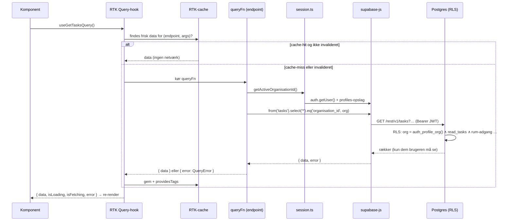
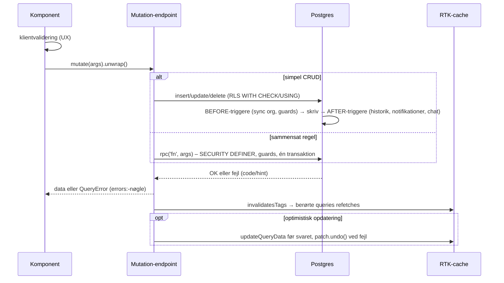
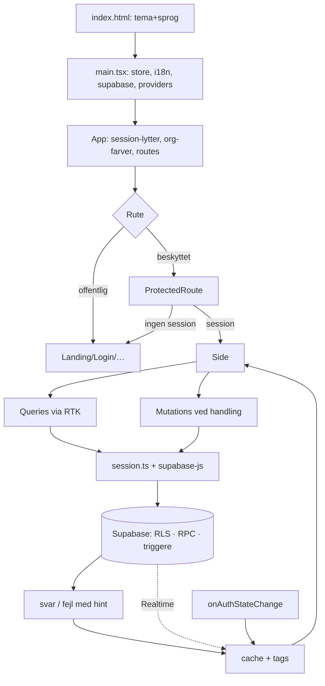

# 3. Application flow

Ponos er en **Single Page Application** uden egen server, så "en request" er her en brugerhandling i browseren, der bliver til et eller flere HTTP-kald direkte til Supabase. Flowet er tilpasset det.

---

## 3.1 Hvordan applikationen starter

1. **Browseren henter `index.html`** (fra Vite dev-server eller en statisk host).
2. **Pre-hydration-scriptet** i `<head>` kører synkront:
   - `data-theme` sættes ud fra `localStorage['ponos-theme']` eller OS'ets `prefers-color-scheme`.
   - `<html lang>` sættes ud fra `localStorage['ponos-language']` eller `navigator.language` (fallback `da`).
3. **`/src/main.tsx` indlæses som ES-modul.** Ved import af modulerne sker der side effects:
   - `src/i18n/config.ts`: `i18n.use(initReactI18next).init(...)` med dansk bundlet; er sproget ikke dansk, startes `loadLanguage(lang)` asynkront (lazy chunk).
   - `src/store/store.ts`: `configureStore(...)` + `setupListeners(store.dispatch)`.
   - `src/lib/supabase.ts` (importeres transitivt af API-filerne): `createClient(url, anonKey)` – advarer hvis env-vars mangler.
   - Alle `*Api.ts`-filer kalder `supabaseApi.injectEndpoints(...)` ved import og registrerer dermed deres endpoints.
4. **`createRoot(...).render(<StrictMode><Provider><I18nextProvider><BrowserRouter><App/>…)`**.

## 3.2 Hvordan configuration indlæses

| Konfiguration | Hvornår | Hvordan |
|---|---|---|
| Supabase URL/nøgle | Build-tid | Vite erstatter `import.meta.env.VITE_*` med værdier fra `.env.local` |
| Sprog | Første script + i18n-init | `<html lang>` → `getDocumentLanguage()` |
| Tema | Første script + `themeSlice` initialState | `data-theme` → `getInitialTheme()` |
| Organisationens farver | Runtime efter login | `useOrganisationTheme()` → `getMyOrganisation` → CSS-variabler |
| Brugerens rettigheder | Runtime efter login | `getMyPrivileges` (cache) |

## 3.3 Hvordan dependencies initialiseres

Der er ingen DI-container. "Dependencies" leveres på tre måder:
- **Modul-singletons:** `supabase`-klienten, `store`, `i18n` – importeres direkte, hvor de bruges.
- **React Context via providers** (`main.tsx`): Redux-store (→ `useSelector`, RTK-hooks), i18n (→ `useTranslation`), router (→ `useNavigate`, `useSearchParams`).
- **Endpoint-injektion:** hver feature-fil udvider det fælles `supabaseApi` (`injectEndpoints`) og eksporterer auto-genererede hooks (`useGetTasksQuery` …).

## 3.4 Hvordan en "request" kommer ind

Tre kilder:
1. **Navigation** (link, `navigate()`, F5, delt link) → React Router matcher en rute i `App.tsx` → evt. `ProtectedRoute` → sidekomponenten mountes → dens query-hooks starter.
2. **Brugerhandling** (klik/submit) → event-handler → mutation-trigger (`const [mutate] = useXMutation(); await mutate(args).unwrap()`).
3. **Push fra serveren** (Realtime) → `postgres_changes`-event → `updateCachedData` eller `invalidateTags` i et `onCacheEntryAdded`-abonnement.

Desuden: **auth-hændelser** (`onAuthStateChange`) og **fokus/reconnect** (kun statistik har `refetchOnFocus`).

## 3.5 Hvordan requesten behandles (query)

- **Deduplikering:** to komponenter med samme `(endpoint, args)` deler én request og ét cache-entry.
- **Levetid:** et cache-entry uden abonnenter fjernes efter 60 sek (RTK-default; `keepUnusedDataFor` ændres ikke i koden).

## 3.6 Hvordan business logic udføres (mutation)

**Hvor reglerne ligger:**
- **Databasen:** isolation, privilegier, invarianter (én admin, faste roller, låste enheder), workflows (accept → medlemskab, godkend → afrapportér → afslut), afledte data (historik, notifikationer, chats).
- **Klienten:** UX-validering, visnings-logik, orkestrering af multi-trin-handlinger og nogle regler, der (endnu) ikke er håndhævet server-side (se `16-teknisk-gaeld.md`).

## 3.7 Hvordan data hentes eller gemmes

- **Læsning:** PostgREST-`GET` med `select`, filtre og sortering; enkelte embeds; profiler i batch (`fetchProfilesByIds`); aggregater via RPC (statistik, samtaleliste, ventende godkendelser).
- **Skrivning:** PostgREST-`POST/PATCH/DELETE` for simple rækker; RPC for alt, der skal være atomisk eller kræver forhøjede rettigheder.
- **Mapping:** rækker → camelCase-domæneobjekter i endpointet (undtagen `Task`).
- **Klient-cache:** RTK Query (in-memory). **Persistens i browseren:** kun session (supabase-js), tema, sprog og én widget-fane i `localStorage`.

## 3.8 Hvordan "response" returneres til brugeren

1. Hook-tilstanden ændres (`isLoading → false`, `data`/`error` sat).
2. Komponenten re-renderer (React Compiler sørger for minimal genberegning).
3. Loading: tekst/`Spinner`; tom: `EmptyState`; fejl: `<Alert>{readableError(error)}</Alert>`; succes: data, evt. en succes-`Alert` ("Gemt").
4. Tekster slås op i i18n på brugerens sprog; datoer/tal formateres med `Intl` og aktuelt sprog (`utils/formatDate.ts`).
5. Andre brugere ser ændringen: **med det samme** for beskeder/notifikationer (Realtime); **ved næste refetch** for alt andet (navigation, invalidering, fokus på statistik, token-refresh).

---

## 3.9 Samlet livscyklus i ét billede

