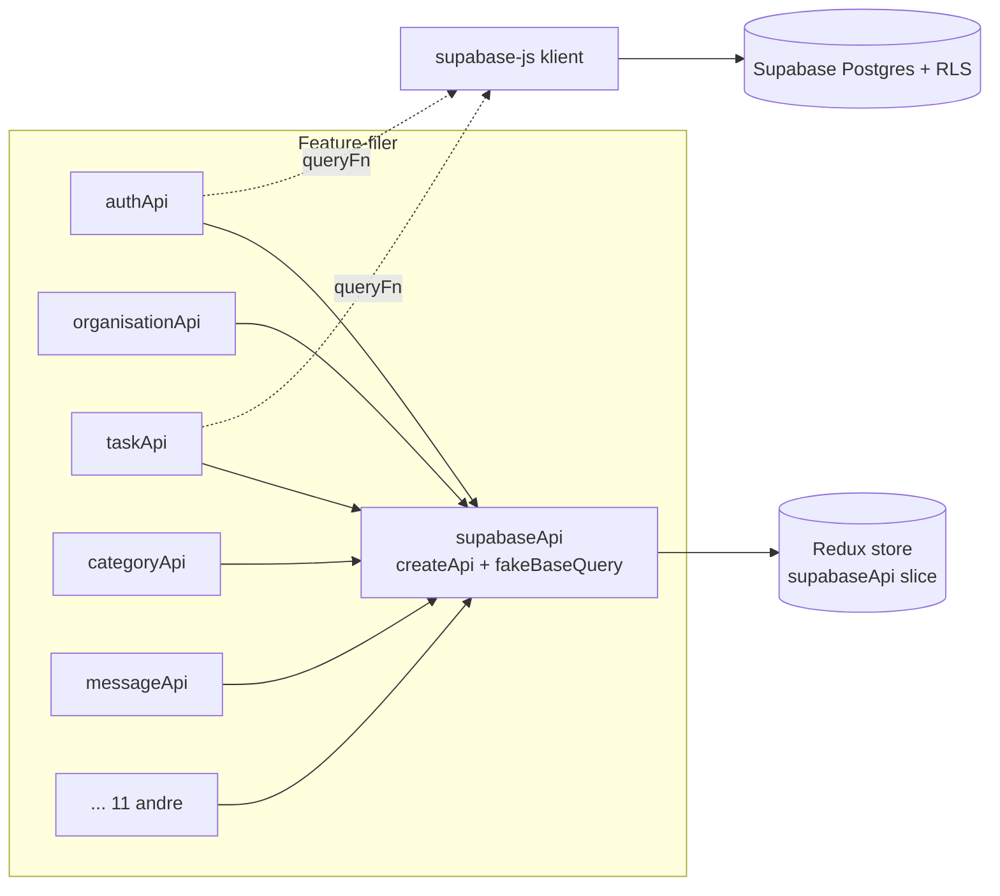
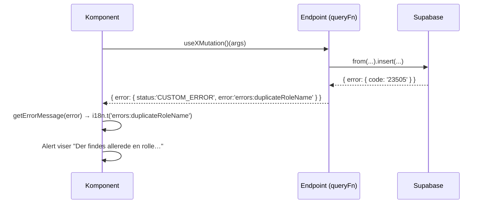
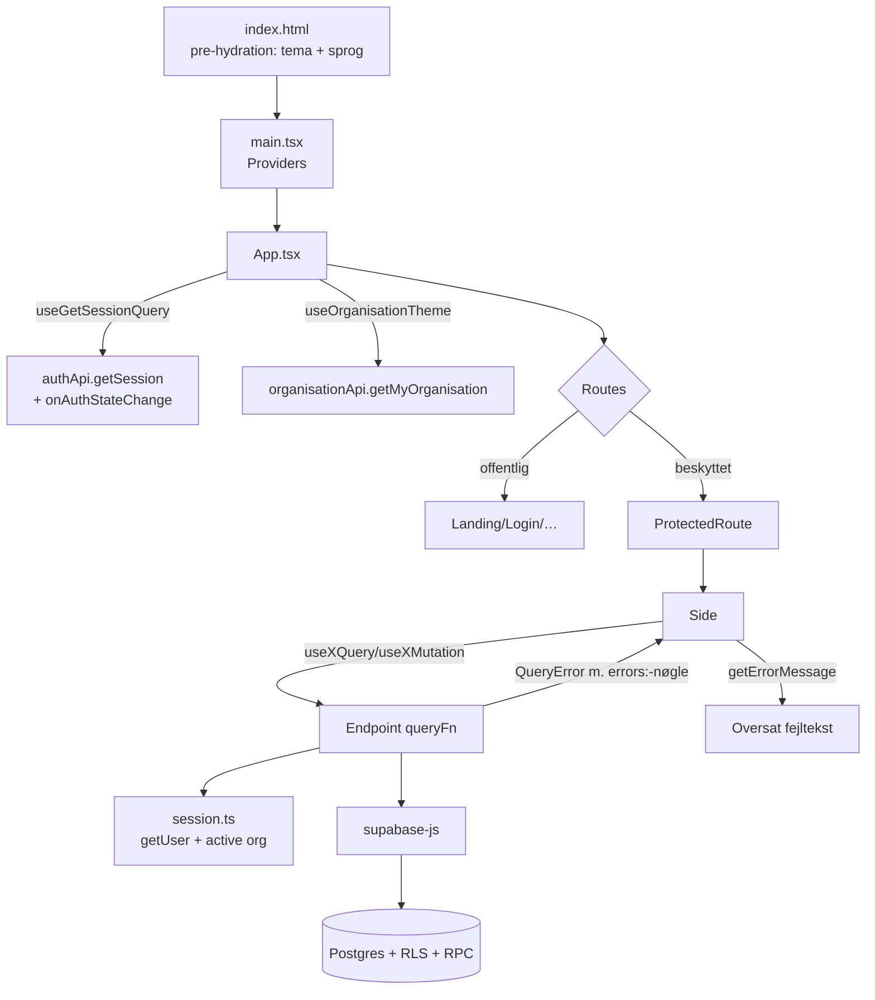

# 4.1 Kodegennemgang – Infrastruktur (opstart, store, API-kerne, fejl)

Denne fil dækker "skelettet", som alle features hænger på. Læs den før de andre domænefiler i `04-kode/`.

> **Konvention i hele dokumentationen**
> - **Observeret** = fakta læst direkte i koden/skemaet.
> - **Anbefaling** = forfatterens vurdering/forslag.
> - **Uklart** = kan ikke afgøres ud fra repoet; det står hvad der mangler.

---

## Fil: `index.html`

**Formål.** HTML-skal for Vite-SPA'en. Indeholder `<div id="root">` og loader `/src/main.tsx` som ES-modul.

**Ansvar ud over det oplagte – et *pre-hydration script*:** Et lille inline-script kører *før* React monterer og:

1. Læser `localStorage['ponos-theme']` (ellers `prefers-color-scheme`) og sætter `data-theme="dark|light"` på `<html>`.
2. Læser `localStorage['ponos-language']` (ellers `navigator.language`, primær-subtag) og sætter `<html lang>`; ukendt sprog → `da`.

**Hvorfor:** for at undgå "flash" af forkert tema/sprog i første frame. `themeSlice` og `languageSlice` læser derefter værdien fra DOM'en i stedet for at gentage logikken (`getInitialTheme()` i `src/store/slices/themeSlice.ts`, `getDocumentLanguage()` i `src/i18n/languages.ts`).

> **Observeret:** Sproglisten `SUPPORTED` er dubleret her og i `src/i18n/languages.ts` (`LANGUAGES`) – scriptet kan ikke importere fra `src/`. Det er dokumenteret i begge filer, men er en manuel synkroniseringsforpligtelse.
>
> **Observeret:** Google Fonts (Inter) indlæses fra `fonts.googleapis.com` – en ekstern afhængighed ved hver sideindlæsning.

---

## Fil: `src/main.tsx` – application entry point

```tsx
createRoot(document.getElementById('root')!).render(
  <StrictMode>
    <Provider store={store}>
      <I18nextProvider i18n={i18n}>
        <BrowserRouter>
          <App />
        </BrowserRouter>
      </I18nextProvider>
    </Provider>
  </StrictMode>,
)
```

**Ansvar:** Komponerer de globale *providers* (React Context-baseret dependency injection):

| Provider | Hvad den gør tilgængelig | Kilde |
|---|---|---|
| `Provider` (react-redux) | Redux-store inkl. RTK Query-cache | `src/store/store.ts` |
| `I18nextProvider` | `useTranslation()` i alle komponenter | `src/i18n/config.ts` |
| `BrowserRouter` | `useNavigate`, `useLocation`, `<Routes>` | react-router-dom v7 |

**Side effects ved import:** `import i18n from './i18n/config'` *initialiserer* i18next som side effect (kalder `i18n.init(...)` på modulniveau). `import './index.css'` indlæser Tailwind + tema-variabler.

> **Observeret:** `StrictMode` er slået til → i udvikling køres effects to gange (mount → unmount → mount). Det er vigtigt for realtime-abonnementerne i `messageApi`/`notificationApi`, som derfor bruger unikke kanalnavne (se `04-kode/06-beskeder-notifikationer.md`).

---

## Fil: `src/App.tsx` – layout og routing

**Formål:** Rod-komponenten. Definerer layout (Header, PendingRequestBanner, `<main>`, Footer) og alle ruter.

**Vigtige ting den gør ved hver render:**

1. `useOrganisationTheme()` (`src/store/hooks/orgHook.ts`) – henter aktiv organisation og skriver dens farver som CSS-variabler på `<html>` (se `04-kode/11-i18n-og-tema.md`).
2. `useGetSessionQuery()` – **holder session-queryen i live hele appens levetid**. Det er den, der starter `supabase.auth.onAuthStateChange`-lytteren i `authApi` (se nedenfor). Uden et aktivt abonnement ville RTK Query fjerne cache-entry'et og lytteren efter 60 sek.
3. Scroll-til-top ved navigation, *undtagen* ved hash-links og browserens tilbage/frem (`navigationType === 'POP'`).
4. `FULL_WIDTH_ROUTES = ['/', '/om-os', '/kontakt', '/hjaelp']` – disse sider får ingen padding i `<main>`, fordi de selv tegner kant-til-kant-sektioner.

**Rutetabel (observeret):**

| Sti | Komponent | Beskyttet? |
|---|---|---|
| `/` | `LandingPage` | Nej |
| `/signup`, `/login`, `/glemt-adgangskode` | `SignUp`, `Login`, `ForgotPassword` | Nej |
| `/om-os`, `/kontakt`, `/hjaelp` | `AboutPage`, `ContactPage`, `HelpPage` | Nej |
| `/dashboard` | `Dashboard` | Ja |
| `/tasks`, `/tasks/mine`, `/tasks/afsluttede`, `/tasks/godkend` | `TasksPage`, `MyTasksPage`, `CompletedTasksPage`, `TaskApprovalsPage` | Ja |
| `/statistik` | `StatisticsPage` | Ja |
| `/bruger` | `ProfilePage` | Ja |
| `/datalager` | `DataLayerPage` | Ja |
| `/nyheder`, `/nyheder/:id` | `NewsPage`, `NewsDetailPage` | Ja |
| `/notifikationer` | `NotificationPage` | Ja |
| `/beskeder` | `MessagesPage` | Ja |
| `*` | `NotFoundPage` | Nej |

Beskyttede ruter er børn af `<Route element={<ProtectedRoute />}>` (*layout route*-mønstret i react-router: forælderen renderer `<Outlet/>` eller redirecter).

> **Observeret:** Ingen side indlæses lazy (`React.lazy` bruges ikke). Alle sider ligger i samme JS-chunk (se `10-performance.md`).
>
> **Observeret:** "Beskyttet" betyder kun *logget ind*. Om brugeren har en organisation eller det rette privilegie, afgøres inde i hver side/komponent (fx `useHasOrganisation`, `useHasPrivilege`) – og den reelle håndhævelse sker i databasen (RLS).

---

## Fil: `src/routes/ProtectedRoute/ProtectedRoute.tsx`

**Formål:** Route guard. Læser `useGetSessionQuery()`:

- `isLoading` (kun første fetch) → viser `t('loading')`.
- `!session` → `<Navigate to="/login" replace />` (`replace` så tilbage-knappen ikke looper).
- ellers `<Outlet />`.

**Afhængighed:** `authApi.getSession`. Fordi `onAuthStateChange` skriver direkte i samme cache-entry (`updateCachedData`), reagerer guarden øjeblikkeligt på logout i en anden fane/token-udløb uden refresh.

> **Edge case (observeret):** Guarden husker ikke den oprindelige URL. En bruger, der åbner `/nyheder/123` udlogget, lander efter login ikke på nyheden (Login navigerer fast til `/dashboard`, se `04-kode/02-auth-og-profil.md`).

---

## Fil: `src/store/store.ts`

```ts
export const store = configureStore({
  reducer: {
    [supabaseApi.reducerPath]: supabaseApi.reducer,
    theme: themeReducer,
    language: languageReducer,
  },
  middleware: (gDM) => gDM().concat(supabaseApi.middleware),
});
setupListeners(store.dispatch);
```

**Ansvar:** Opretter den ene Redux-store (Singleton på modulniveau).

- **Server-state** bor udelukkende i RTK Query-cachen under `supabaseApi`.
- **Klient-state** er kun to små slices: `theme` (`light|dark`) og `language` (sprogkode).
- `setupListeners` aktiverer `refetchOnFocus`/`refetchOnReconnect` – men kun for queries, der selv beder om det (fx statistik).
- Eksporterer `RootState`/`AppDispatch` til de typede hooks i `src/store/hooks/hooks.ts` (`useAppDispatch`, `useAppSelector`).

> **Observeret:** CLAUDE.md nævner `src/store/slices/taskSlices.ts` (gammelt `createAsyncThunk`-mønster). Filen findes ikke længere. Mappen `src/store/slices/dataLayersSlices/` indeholder **ikke** Redux-slices, men rene hjælpefunktioner til kategoritræet (se `04-kode/04-datalayer.md`).

---

## Fil: `src/lib/supabase.ts` – Supabase-klient (Singleton)

```ts
const supabaseUrl = import.meta.env.VITE_SUPABASE_URL;
const supabaseAnonKey = import.meta.env.VITE_SUPABASE_ANON_KEY;
if (!supabaseUrl || !supabaseAnonKey) console.warn('Missing Supabase env vars. …');
export const supabase = createClient(
  supabaseUrl || 'https://placeholder-project.supabase.co',
  supabaseAnonKey || 'placeholder-anon-key'
);
```

**Ansvar:** Den *eneste* forbindelse til backend. Én instans deles af alle API-filer (modul-singleton). `createClient` uden options betyder Supabase-defaults: session gemmes i `localStorage`, `autoRefreshToken: true`, `persistSession: true`, `detectSessionInUrl: true`.

**Hvad klienten bruges til:**

| Supabase-modul | Brug i Ponos |
|---|---|
| `supabase.auth` | login, signup, session, logout, skift adgangskode |
| `supabase.from(table)` | PostgREST CRUD – alle forespørgsler filtreres af RLS med brugerens JWT |
| `supabase.rpc(fn)` | Postgres-funktioner til atomisk/privilegeret logik |
| `supabase.channel(...)` | Realtime (Postgres changes) til beskeder og notifikationer |

> **Observeret – svaghed:** Mangler env-vars, starter appen alligevel mod en placeholder-URL. Fejlen viser sig først som netværksfejl i UI'et. **Anbefaling:** kast en tydelig fejl i dev (`throw`) eller vis en konfigurationsside.
>
> **Observeret:** `VITE_SUPABASE_ANON_KEY` ender i browser-bundlen. Det er Supabases design (anon-nøglen er offentlig); sikkerheden hviler helt på RLS og funktionernes egne checks (se `08-security.md`).

---

## Fil: `src/store/apis/supabaseApi.ts` – den fælles RTK Query-instans

**Formål:** Opretter ét `createApi`, som alle feature-filer udvider med `injectEndpoints`.

```ts
export const supabaseApi = createApi({
  reducerPath: 'supabaseApi',
  baseQuery: fakeBaseQuery(),
  tagTypes: TAG_TYPES,
  endpoints: () => ({}),
})
```

**Hvorfor `fakeBaseQuery`:** Der er ingen REST-base-URL; hvert endpoint bruger `queryFn` og kalder Supabase-klienten direkte. RTK Query bruges altså for **cache, deduplikering, loading/error-state og tag-invalidering** – ikke for HTTP.

**Tag-systemet (kernen i cache-invalidering):**

- `USER_SCOPED_TAGS` – 24 tags (`Profile`, `Privilege`, `Organisation`, `Role`, `Membership`, …, `Statistics`, `StatisticsSnapshot`). Alt der afhænger af *hvem der er logget ind* og *hvilken organisation der er aktiv*.
- `TAG_TYPES = ['Session', ...USER_SCOPED_TAGS]`.
- Listen invalideres samlet to steder: ved auth-skift (`authApi.getSession.onCacheEntryAdded`) og ved skift/forlad/slet organisation (`organisationApi.setActiveOrganisation/leaveOrganisation/deleteOrganisation`). Kommentaren dokumenterer en konkret bug (US-59), der opstod da de to lister drev fra hinanden – derfor én delt konstant.

**Tag-hjælpere (brug dem – re-inline dem ikke):**

| Hjælper | Returnerer | Bruges til |
|---|---|---|
| `listTags(type, rows)` | `[{type,id:'LIST'}, ...rækkernes id]` | `providesTags` på lister |
| `taskTags.list/pendingRequests/one/assignees/requests/materials` | Opgave-tags med sammensatte id'er (`${taskId}-MATERIALS`) | Undgår stavefejl i id-strenge |
| `itemUnitsTag(itemId)` | `{type:'ItemUnit', id:'ITEM-<id>'}` | Enheder på ét item |
| `itemTags(itemId)` | enheder + item + `Item/LIST` | Efter ændring af enheder |
| `taskMaterialTags(taskId, itemId)` | `itemTags` + opgavens tags | Efter reservation/frigivelse/afrapportering |



---

## Fil: `src/store/apis/apiError.ts` – fælles fejlmodel

**Formål:** Gør alle fejl til én form, så komponenter kan vise dem ens.

| Symbol | Type | Hvad |
|---|---|---|
| `QueryError` | `{ status: 'CUSTOM_ERROR'; error: string }` | Fejlformen RTK Query får. `error` er **enten** en i18n-nøgle med præfiks `errors:` **eller** en rå besked. |
| `errorCode(key)` | `QueryError` | Bygger `errors:<key>`. |
| `mapDbError(error, keys)` | `QueryError` | Oversætter Postgres-fejlkoder: `23505` (unique) → `keys.unique`, `23514` (check) → `keys.check`, `42501` (RLS-afvisning) → `permission.<keys.permission>`; ellers `error.hint` → `errors:db.<HINT>`; ellers `error.message` (rå tekst). |
| `mapPermissionError(error, actionKey)` | `QueryError` | Genvej til kun 42501. |
| `QueryFailure` | `class extends Error` | Bærer en færdig `QueryError` gennem `throw`. Eneste egentlige *klasse* i appens egen kode. |
| `toQueryError(err)` | `QueryError` | `QueryFailure` → dens fejl; `Error` → message; andet → `errors:generic`. |
| `runQuery(fn)` | `Promise<QueryResult<T>>` | try/catch-wrapper om et `queryFn`-body. |

**Hvorfor `hint`:** Databasens `raise exception … using hint = 'PASSWORD_TOO_SHORT'` giver en stabil maskinlæsbar kode, mens `message` er dansk tekst. Klienten oversætter koden via `errors:db.PASSWORD_TOO_SHORT` i alle 14 sprog; ukendt kode → databasens danske tekst vises (bedre end en generisk fejl).

---

## Fil: `src/store/apis/session.ts` – "hvem er jeg, og hvor er jeg?"

| Funktion | Returnerer | Fejl (kastes som `QueryFailure`) | Side effects |
|---|---|---|---|
| `getOptionalUserId()` | `string \| null` | Kun ved andre auth-fejl end `AuthSessionMissingError` | Netværkskald `GET /auth/v1/user` |
| `getCurrentUserId()` | `string` | `errors:loginRequired` | Netværkskald |
| `getActiveOrganisationIdOf(userId)` | `string \| null` | DB-fejl | `select active_organisation_id from profiles` |
| `getActiveOrganisationId()` | `string` | `loginRequired` / `noOrganisation` | 2 kald (auth + profiles) |
| `getMembershipRoleId(userId, orgId)` | `string \| null` | DB-fejl | `select role_id from memberships` |

**Design:** Hjælperne *kaster* i stedet for at returnere fejl, så et endpoint kan skrives lineært inde i `runQuery`:

```ts
queryFn: () => runQuery(async () => {
  const organisationId = await getActiveOrganisationId() // kaster ved fejl
  const { data, error } = await supabase.from('roles').insert(...)
  if (error) return { error: mapDbError(error, { unique: 'duplicateRoleName' }) }
  return { data }
})
```

> **Observeret – performance:** `supabase.auth.getUser()` validerer JWT'en hos Supabase Auth (netværkskald) hver gang. Det er sikkert men dyrt; næsten alle endpoints starter med 1–2 af disse kald før selve forespørgslen. Se `10-performance.md`.
>
> **Observeret – vigtig domæneregel (US-59):** En bruger kan være medlem af flere organisationer, men **alt** arbejder inden for `profiles.active_organisation_id`. RLS-hjælperen `auth_profile_org()` i databasen bruger samme kolonne, så klient og server er enige om "den aktive organisation".

---

## Fil: `src/ErrorMessage.ts` – fra fejl til tekst

`getErrorMessage(err, fallback?)`:

1. `extractRawMessage` kigger efter en streng i `err.data.error`, `err.error` eller `err.message` (dækker både RTK Query-fejl og almindelige `Error`).
2. Starter strengen med `errors:` → slås op med `i18n.t` (via `asDynamic`, fordi nøglen kendes først ved runtime).
3. Ellers returneres strengen uændret (fx en dansk Postgres-besked).
4. Intet læsbart → `fallback` eller `errors:generic`.

`readableError(err)` = samme, men `null` når der ingen fejl er (praktisk i JSX: `{readableError(error) && <Alert …/>}`).

**Hvorfor nøgler i stedet for tekst:** Endpoints kører uden for React og kan ikke kalde `useTranslation()`. Ved at gemme nøglen og først oversætte ved visning skifter en allerede vist fejl også sprog, hvis brugeren skifter sprog.



---

## Fil: `src/lib/contact.ts`

To konstanter (`CONTACT_EMAIL = 'info@ponos.dk'`, `CONTACT_LOCATION`) brugt af footer og `/kontakt`. Kommentaren siger at adressen er en **pladsholder** (bekræftet 2026-09-11).

---

## Fil: `vite.config.ts`

```ts
plugins: [react(), tailwindcss(), babel({ presets: [reactCompilerPreset()] })]
```

- `@vitejs/plugin-react` – JSX/Fast Refresh.
- `@tailwindcss/vite` – Tailwind v4 uden `tailwind.config.js`; tema-tokens ligger i `src/index.css` (`@theme { --color-primary … }`).
- `@rolldown/plugin-babel` + `reactCompilerPreset()` – **React Compiler** memoiserer automatisk komponenter/værdier. Derfor ses næsten ingen manuelle `useMemo`/`useCallback` i koden. Byggetiden domineres af denne transform (71 % af 16 s i observeret build).

Ingen `server.proxy`, ingen `define`, ingen alias – alt er defaults.

---

## Sammenfatning af infrastrukturens dataflow


