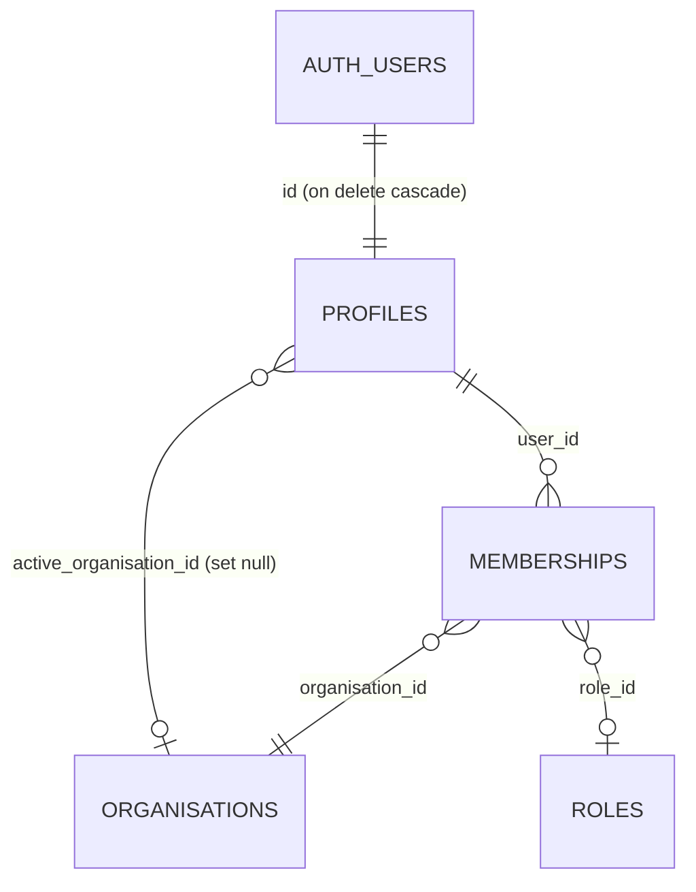
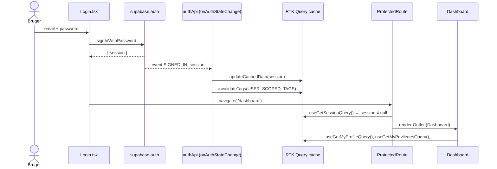

# 4.2 Kodegennemgang – Authentication, session og profil

Dækker: `src/store/apis/authApi.ts`, `src/store/apis/profileApi.ts`, `src/pages/logIn/*`, `src/routes/ProtectedRoute/ProtectedRoute.tsx`, `src/pages/profile/ProfilePage.tsx`, `src/components/profile/*`, `src/store/hooks/useNavItems.ts` (`useHasOrganisation`, `useSignOutAndRedirect`), `src/utils/validatePassword.ts` og de tilhørende databaseobjekter (`handle_new_user`, `prevent_self_role_org_change`, `profiles`-policies, `reset_password_prototype`).

---

## Overblik: hvem ejer hvad?

| Ansvar | Hvor | Bemærkning |
|---|---|---|
| Identitet (email + password-hash, JWT) | **Supabase Auth** (`auth.users`, GoTrue) | Ikke i dette repo |
| Session i browseren | `supabase-js` → `localStorage` (default-nøgle `sb-<projekt>-auth-token`) | Auto-refresh af access token |
| Session i React | `authApi.getSession` (RTK Query cache) | Opdateres live af `onAuthStateChange` |
| Applikationsprofil | `public.profiles` (1:1 med `auth.users`) | Oprettes af triggeren `on_auth_user_created` |
| "Aktiv organisation" | `profiles.active_organisation_id` | Kun ændres via RPC `set_active_organisation` |
| Rolle | `memberships.role_id` (pr. organisation) | **Ikke** på `profiles` (flyttet ved US-59) |



---

## Fil: `src/store/apis/authApi.ts`

**Formål:** Al session-håndtering i RTK Query-form.

### `getSession` (query, `Session | null`)

- **queryFn:** `supabase.auth.getSession()` – læser lokalt gemt session (ingen netværkskald, medmindre token skal refreshes).
- **providesTags:** `['Session']`.
- **`onCacheEntryAdded` (Observer-mønster):**
  1. Venter på `cacheDataLoaded`.
  2. Abonnerer på `supabase.auth.onAuthStateChange((event, session) => …)`.
  3. Ved hver hændelse (login, logout, `TOKEN_REFRESHED`, `USER_UPDATED`): skriver den nye session direkte i cachen med `updateCachedData(() => session)` **og** invaliderer alle `USER_SCOPED_TAGS`.
  4. Når cache-entry'et fjernes: `listener.subscription.unsubscribe()`.

> **Hvorfor:** Komponenter skal aldrig selv spørge "er jeg logget ind?". Én lytter holder cachen sand, og alle `useGetSessionQuery()`-forbrugere re-rendres automatisk. Invalidering af alle bruger-tags forhindrer, at data fra en tidligere bruger står på skærmen efter et brugerskift.
>
> **Observeret edge case:** `onAuthStateChange` fyrer også ved `TOKEN_REFRESHED` (ca. hver time) → **alle** bruger-tags invalideres og alle aktive queries refetches, selv om brugeren ikke har ændret sig. Se `10-performance.md`.

### `signOut` (mutation)
`supabase.auth.signOut()`. Ingen `invalidatesTags` – oprydningen sker via lytteren ovenfor.

### `resetPassword` (mutation, US-68) – **PROTOTYPE**
Kalder RPC'en `reset_password_prototype(p_email, p_first_name, p_last_name, p_new_password)`. Se sikkerhedsanalysen nedenfor.

### `changePassword` (mutation, US-69)
1. Henter email fra lokal session.
2. **Re-autentificerer** med `signInWithPassword(email, currentPassword)` – fordi `updateUser({password})` i Supabase ikke selv kræver den nuværende adgangskode. Uden dette kunne en efterladt åben browser bruges til at låse ejeren ude.
3. `supabase.auth.updateUser({ password: newPassword })`.
Fejl mappes til `errors:wrongCurrentPassword` / `errors:passwordChangeFailed`.

---

## Fil: `src/pages/logIn/Login.tsx`

**Kontrolflow:**
1. `handleSubmit` → `supabase.auth.signInWithPassword({ email: email.trim(), password })` **direkte** (ikke via `authApi`).
2. Fejl → altid samme tekst `t('login.wrongCredentials')` (afslører ikke om emailen findes).
3. Succes → `navigate('/dashboard')`. Session-cachen opdateres af `onAuthStateChange` uafhængigt af navigationen.
4. `?nulstillet=1` i URL'en viser en kvittering efter "glemt adgangskode".

> **Observeret:** Siden redirecter ikke en allerede logget ind bruger væk, og der huskes ingen "returnTo"-URL fra `ProtectedRoute`.
> **Observeret:** Kalder `supabase` direkte fra en side-komponent → afviger fra mønstret "al server-kommunikation via RTK Query" (CLAUDE.md).

## Fil: `src/pages/logIn/SignUp.tsx`

1. Klientvalidering (`validate()`): navne udfyldt, email-regex `^[^\s@]+@[^\s@]+\.[^\s@]+$`, `passwordProblem()` (min. 6 tegn + match).
2. `supabase.auth.signUp({ email, password, options: { data: { first_name, last_name } } })`.
3. Navnene havner i `auth.users.raw_user_meta_data`, hvorfra DB-triggeren `handle_new_user` opretter `profiles`-rækken (se nedenfor).
4. Ingen session i svaret (email-bekræftelse slået til) → `alert(t('signup.confirmEmail'))` + `/login`. Ellers `/dashboard`.
5. Fejltekst indeholder "already registered" → `t('signup.emailTaken')`.

> **Observeret:** Bruger browserens blokerende `alert()` i stedet for appens `Alert`-komponent.
> **Uklart:** Om "Confirm email" er slået til i Supabase-projektet kan ikke ses i repoet (det er en dashboard-indstilling). Koden håndterer begge tilfælde.

## Fil: `src/pages/logIn/ForgotPassword.tsx`

Formular (email, fornavn, efternavn, ny kode ×2) → `useResetPasswordMutation().unwrap()` → `navigate('/login?nulstillet=1', { replace: true })`. Fejl vises via `getErrorMessage`.

## Fil: `src/utils/validatePassword.ts`

`MIN_PASSWORD_LENGTH = 6`; `passwordProblem(pw, confirm)` returnerer en i18n-nøgle eller `null`. Deles af SignUp, ForgotPassword og ChangePasswordForm, så reglen kun står ét sted. Databasen håndhæver samme minimum i `reset_password_prototype` (`PASSWORD_TOO_SHORT`).

> **Anbefaling:** 6 tegn er lavt (NIST anbefaler ≥ 8). Supabase Auth har sin egen minimumsindstilling i dashboardet – **Uklart** hvad den er sat til.

---

## Fil: `src/store/apis/profileApi.ts`

### `fetchProfilesByIds(ids)` – delt hjælper (ikke et endpoint)
- Input: `Iterable<string>` → deduplikeres med `Set`.
- Én forespørgsel: `profiles.select('id, first_name, last_name, email, url_picture').in('id', uniqueIds)`.
- Output: `Map<id, ProfileRow>`. Profiler som RLS skjuler, mangler blot i mappet – kalderen afgør om rækken droppes.
- **Hvorfor ikke en PostgREST-join?** Kommentaren forklarer: joins fejler/ændrer form afhængigt af FK-opsætning, og én fejlende join ville vælte hele listen. Bruges af membership-, invitation-, rolle-, task- og beskedlister → undgår N+1.

### `getMyProfile` (query → `Profile | null`)
Dataflow (sekventielt, op til 5 round-trips):
```
getOptionalUserId()            → GET /auth/v1/user
profiles.select(...).eq(id)    → 1 række
getMembershipRoleId(...)       → memberships.role_id (aktiv org)
Promise.all([lookupName('organisations'), lookupName('roles')])
```
Returnerer camelCase-objektet `Profile` (`src/types/profile/profileType.ts`). `lookupName` sluger fejl og returnerer `null` (bevidst: et manglende navn må ikke vælte profilen).

### `updateMyProfile` (mutation)
Opdaterer kun `first_name, last_name, description, url_picture` på egen række. `invalidatesTags: ['Profile']`.

---

## Fil: `src/pages/profile/ProfilePage.tsx` (`/bruger`)

- Læsetilstand: `DetailList` med navn, email, organisation, rolle (kun hvis aktiv org), beskrivelse.
- Redigeringstilstand: lokal `form`-state; tomme valgfri felter gemmes som `null`. Fejl fra mutation vises via `readableError(mutationError)`, og formularen forbliver åben, så input ikke tabes.
- Under formularen (kun i læsetilstand): `PreferencesSection` (sprog/tema i `localStorage`), `NotificationSettingsSection` (DB-tabellen `notification_preferences`, se `04-kode/06-…`), `ChangePasswordForm`.
- Log ud via `useSignOutAndRedirect()` (`src/store/hooks/useNavItems.ts`): `await signOut()` → `navigate('/login')`.

> **Observeret:** `signOutAndRedirect` kalder `signOut()` uden `.unwrap()` → navigerer til `/login`, selv hvis logout fejlede.
> **Observeret:** `url_picture` er en fri URL, som `Avatar` (`src/components/common/Avatar.tsx`) rendrer som `` hos alle, der ser brugeren. React escaper værdien (ingen XSS), men en ekstern URL kan bruges som "tracking pixel" (lækker seerens IP/tidspunkt til en tredjepart).

## Fil: `src/store/hooks/useNavItems.ts`

- `useNavItems()` – én navigationsliste til header + footer. Udlogget: Forside + Login. Logget ind: Dashboard + (kun med aktiv organisation) Opgaver/Statistik/Datalager/Nyheder (hver kræver sit `read_*`-privilegie) + Beskeder.
- `useHasOrganisation()` – `true` når profilen har `activeOrganisationId`.
- `useSignOutAndRedirect()` – se ovenfor.

---

## Databasesiden

### Trigger `on_auth_user_created` → `handle_new_user()` (SECURITY DEFINER)
`AFTER INSERT ON auth.users`: indsætter `profiles(id, first_name, last_name, email)` fra `raw_user_meta_data` (tom streng hvis mangler). Kører med funktionsejerens rettigheder, fordi den nye bruger endnu ikke har nogen RLS-adgang.

> **Edge case (observeret i skemaet):** `profiles.email` er `UNIQUE`. Hvis en `profiles`-række allerede har emailen, fejler triggeren – og dermed hele signup'en (Supabase svarer "Database error saving new user").

### Trigger `trg_prevent_self_role_org_change` (BEFORE UPDATE på `profiles`)
Afviser at en bruger selv ændrer `active_organisation_id` (hint `CANNOT_CHANGE_ACTIVE_ORG_DIRECTLY`), medmindre den transaktions-lokale indstilling `ponos.bypass_self_role_org_change = 'true'` er sat – det gør de RPC'er, der lovligt skifter organisation (`set_active_organisation`, `create_organisation`, `leave_organisation` m.fl.). Det er et genkommende **bypass-flag-mønster** i skemaet.

### RLS på `profiles` (live-skema)

| Policy | Kommando | Regel |
|---|---|---|
| Se egen profil eller profiler i egen organisation | SELECT | `id = auth.uid()` ELLER der findes et medlemskab for profilen i `auth_profile_org()` |
| Admin kan se ansøgeres profiler i egen organisation | SELECT | `is_pending_requester_to_my_org(id)` |
| Admin kan se inviterede profiler i egen organisation | SELECT | `has_privilege_or_admin('read_invitations')` + ventende invitation i egen org |
| Bruger kan opdatere egen profil | UPDATE | `using (id = auth.uid())` |

> **Observeret – mulig sårbarhed (bør verificeres):** UPDATE-policyen begrænser kun *hvilken række*, ikke *hvilke kolonner*. Triggeren beskytter kun `active_organisation_id`. Medmindre der findes kolonne-grants (de er **ikke** med i skemaeksporten → **Uklart**), kan en bruger via `supabase.from('profiles').update({ email: '…', note_admin: '…' })` direkte fra konsollen:
> - ændre `profiles.email` (som så afviger fra `auth.users.email`). `invite_member` og `reset_password_prototype` slår op på netop `profiles.email`; og en "reserveret" email kan blokere en fremtidig signup med samme email (UNIQUE-konflikt i `handle_new_user`).
> - skrive i `note_admin`, som efter kommentaren i `profileType.ts` er "administratorens felt".
>
> Kommentaren i `src/types/profile/profileType.ts` ("rolle/organisation blokeres server-side af trigger + RLS, email hører til Supabase Auth") beskriver hensigten; håndhævelsen af email/note_admin sker reelt kun i klienten. **Anbefaling:** `revoke update on profiles from authenticated; grant update (first_name, last_name, description, url_picture) on profiles to authenticated;` eller en BEFORE UPDATE-trigger.

### RPC `reset_password_prototype` (SECURITY DEFINER, `grant … to anon`)
```sql
select id into v_user_id from public.profiles
 where lower(email) = lower(trim(p_email))
   and lower(first_name) = lower(trim(p_first_name))
   and lower(last_name)  = lower(trim(p_last_name));
…
update auth.users set encrypted_password = crypt(p_new_password, gen_salt('bf', 10)) where id = v_user_id;
```

> **Observeret – KRITISK ved enhver deployment:** Email + fornavn + efternavn er hele identitetskontrollen. Ifølge `profiles`-SELECT-policyen kan **ethvert medlem** af en organisation læse navn og email på alle andre medlemmer. Dermed kan et almindeligt medlem overtage administratorens konto: læs admins navn/email i medlemslisten → kald `/glemt-adgangskode` (eller RPC'en direkte med anon-nøglen) → log ind som admin. Funktionen har ingen egen rate limiting (om Supabase-projektet har en foran PostgREST er **uklart**), sender ingen notifikation til kontoejeren, og eksisterende sessions bevares.
>
> Projektet er bevidst om det: `docs/dbSchema.sql` §15.17 og kommentarer i `authApi.ts`/`ForgotPassword.tsx` kalder det et "PROTOTYPE-FORBEHOLD (bevidst beslutning, projektet deployes ikke)". **Anbefaling:** erstat med `supabase.auth.resetPasswordForEmail` + `verifyOtp`/`updateUser`, og fjern `grant execute … to anon`.

---

## Sekvens: login → data på skærmen


