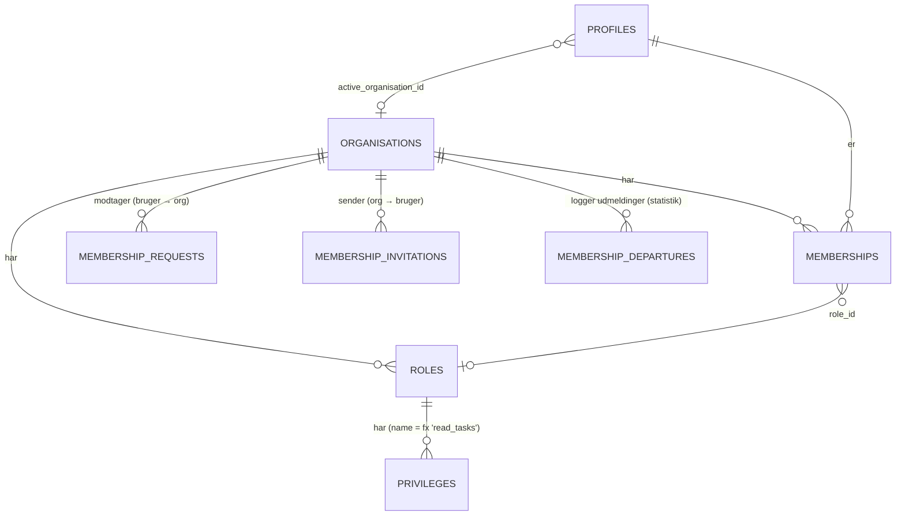
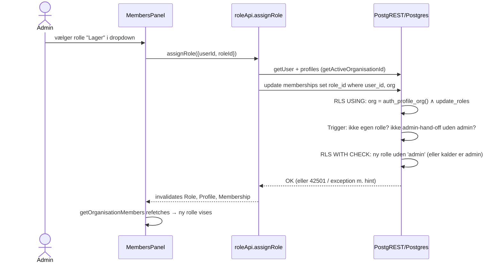

# 4.3 Kodegennemgang – Organisationer, medlemskaber, roller og privilegier

Dette er Ponos' **multi-tenant-kerne**: hvem hører til hvilken organisation, og hvem må hvad. Alle andre domæner (datalager, opgaver, nyheder, statistik, beskeder) bygger på reglerne her.

Filer: `src/store/apis/organisationApi.ts`, `membershipApi.ts`, `invitationApi.ts`, `roleApi.ts`, `privilegeApi.ts`, `src/store/hooks/useAdministrationTabs.ts`, `src/components/dashboard/{OrganisationTab, OrganisationAdminPanel, OrganisationColorsPanel, MembersPanel, InvitationsPanel, MembershipRequestsPanel, AdministrationTab, RolesPrivilegesPanel, organisationPickerComponent, colorSlot}.tsx`, `src/components/dashboard/roles/*`, `src/components/pendingRequestBanner/PendingRequestBanner.tsx` samt DB-funktioner/triggere/policies nævnt nedenfor.

---

## 1. Domænemodel



**Nøglebegreber (observeret):**

| Begreb | Betydning | Kilde |
|---|---|---|
| Organisation | Tenant. Al data har `organisation_id`. | `organisations` |
| Medlemskab | Many-to-many bruger↔organisation, **én rolle pr. medlemskab**. | `memberships` (unik `(user_id, organisation_id)`) |
| Aktiv organisation | Den org brugeren "står i". Al læsning/skrivning scopes hertil. | `profiles.active_organisation_id`, DB-funktion `auth_profile_org()` |
| Rolle | Navngivet sæt af privilegier inden for én organisation. | `roles` (unik `(organisation_id, name)`) |
| Privilegie | En tekststreng på en rolle, fx `create_tasks`. RLS spørger `has_privilege_or_admin('create_tasks')`. | `privileges` |
| `admin`-privilegiet | Supersæt – `has_privilege_or_admin(x)` er altid sand for admin. Kun rollen ved navn **"Admin"** må have det. | policies på `privileges` |
| Standardroller | `Admin` og `Medlem` oprettes af `create_organisation`. Beskyttes af triggere *ud fra deres navn*. | `create_organisation`, `prevent_*`-triggere |

### Privilegiekataloget (`src/store/apis/privilegeApi.ts`)

`PRIVILEGE_DOMAINS` grupperer de kendte privilegier pr. domæne – det er både UI-katalog (matrixen) og den kontrakt, som RLS-policies i databasen bruger:

| Domæne | Privilegier |
|---|---|
| roles | `create_roles`, `read_roles`, `update_roles`, `delete_roles` |
| organisation | `update_organisation` |
| membership_requests | `read_membership_requests`, `update_membership_requests` |
| members | `delete_members` |
| invitations | `create_invitations`, `read_invitations`, `delete_invitations` |
| news | `create_news`, `read_news`, `update_news`, `delete_news` |
| datalayer | `create_datalayer`, `read_datalayer`, `update_datalayer`, `delete_datalayer` |
| tasks | `create_tasks`, `read_tasks`, `update_tasks`, `delete_tasks`, `assign_tasks`, `view_all_task_rooms`, `view_completed_tasks` |
| task_approval | `approve_task`, `reject_task` |
| statistics | `create_statistics`, `read_statistics`, `delete_statistics` |

Plus `admin`. `Medlem` har altid præcis `read_news` + `read_tasks` (`PROTECTED_MEMBER_PRIVILEGE_NAMES`), låst af triggeren `prevent_default_role_privilege_change`.

> **Observeret – vigtigt designvalg:** Privilegier er **fri tekst** i databasen (ingen FK til et katalog, ingen CHECK). En stavefejl i en policy eller i klienten giver stille "ingen adgang". Kataloget lever kun i TypeScript. Se `16-teknisk-gaeld.md`.
>
> **Observeret – forældet kommentar:** `privilegeApi.ts` skriver om datalayer/tasks: "RLS-policies er skrevet … men IKKE kørt endnu". `docs/migrations/README.md` og live-skemaet viser, at de er kørt.

### Hvordan klienten kender egne privilegier

`privilegeApi.getMyPrivileges`: `getOptionalUserId` → `getActiveOrganisationIdOf` → `getMembershipRoleId` → `privileges.select('name').eq('role_id', roleId)` → `string[]`.

Hooks (alle bruger samme cachede query, så de koster ét kald i alt):
- `useHasPrivilege(name)` → `{ hasPrivilege, isLoading }`, sand hvis `name` **eller** `admin` findes.
- `useHasAnyPrivilege(names)` → mindst ét af navnene (bruges til at vise en hel fane).
- `adminRoleIdsOf(privileges)` → hvilke roller bærer `admin`.

> **Princip (observeret i kommentarer overalt):** Klientens tjek er *kun UX* (skjul knapper man ikke kan bruge). Den rigtige adgangskontrol er RLS/RPC. Hvis klienten "lyver", afviser databasen med 42501, som `mapDbError` oversætter.

---

## 2. Databasens adgangsfunktioner (grundstenene i al RLS)

| Funktion | Returnerer | Logik (live-skema) |
|---|---|---|
| `auth_profile_org()` | `uuid` | `select active_organisation_id from profiles where id = auth.uid()` |
| `has_privilege(p_name)` | `bool` | Findes privilegiet på brugerens rolle **i den aktive organisation** (profiles ⋈ memberships ⋈ privileges) |
| `has_privilege_or_admin(p_name)` | `bool` | `has_privilege(p_name) or has_privilege('admin')` |
| `role_has_privilege(role_id, name)` | `bool` | Findes privilegiet på en bestemt rolle |
| `is_organisation_admin(org_id)` | `bool` | Har brugeren en rolle **med navnet** 'admin' (case-insensitivt) i org'en. Bruges kun i 3 beskedpolicies. |

Alle er `STABLE SECURITY DEFINER SET search_path = public`:
- `SECURITY DEFINER` → de kan læse `profiles/memberships/privileges` uden selv at blive ramt af RLS (undgår rekursion i policies).
- `SET search_path` → beskytter mod *search_path hijacking* (god praksis for security definer).
- `STABLE` → Postgres kan genbruge resultatet inden for én forespørgsel.

> **Observeret – inkonsistens:** "Admin" defineres to måder: privilegiebaseret (`has_privilege('admin')`, brugt næsten overalt) og navnebaseret (`is_organisation_admin`: rollenavn = 'admin'). Da `admin`-privilegiet kun må ligge på rollen "Admin", giver de i praksis samme svar – men det er to sandheder, der skal holdes i sync.

---

## 3. Fil: `src/store/apis/organisationApi.ts`

| Endpoint | Type | Supabase-kald | Tags | Server-side regel |
|---|---|---|---|---|
| `getMyOrganisation` | query | `getOptionalUserId` → `getActiveOrganisationIdOf` → `organisations.select(ORG_COLUMNS).eq(id).maybeSingle()` | provides `Organisation` | SELECT-policy |
| `searchOrganisations(term)` | query | `ilike('name', %escaped%)`, `order('name')`, `limit(20)` | provides `Organisation` | Policy "Alle autentificerede kan se organisationsliste" (`using (true)`) |
| `updateMyOrganisation` | mutation | `organisations.update({name, color, header_color, …}).eq(id)` | inv. `Organisation` | `update_organisation`; `23505` → `duplicateOrganisationName`, `23514` → `invalidOrganisationColor` |
| `createOrganisation` | mutation | RPC `create_organisation(p_name)` | inv. `Organisation, Profile, Privilege, Membership` | se nedenfor |
| `getMyMemberships` | query | RPC `get_my_memberships()` | provides `Membership` | security definer (ser rollenavne i ikke-aktive orgs) |
| `setActiveOrganisation` | mutation | RPC `set_active_organisation` | inv. **alle** `USER_SCOPED_TAGS` | validerer medlemskab |
| `leaveOrganisation` | mutation | RPC `leave_organisation` | inv. alle | blokerer eneste admin |
| `deleteOrganisation` | mutation | RPC `delete_organisation` | inv. alle | kun admin af *den* org |
| `addSavedOrganisationColor` / `removeSavedOrganisationColor` | mutation | `updateSavedColors(change)` (læs → beregn → skriv) | inv. `Organisation` | `update_organisation` |

Detaljer:

- **ILIKE-escaping:** `searchTerm.replace(/[\\%_]/g, c => '\\' + c)` – forhindrer at brugerens `%`/`_` tolkes som wildcards. (PostgREST parameteriserer i øvrigt værdien; der er ingen SQL-injection-risiko.)
- **`updateSavedColors`:** normaliserer til store bogstaver, dedup'er, beholder højst `MAX_SAVED_COLORS = 12` (de nyeste). Returnerer uændret liste uden skrivekald, hvis intet ændrede sig.
  > **Observeret – race condition:** Læs-ændr-skriv fra klienten. To administratorer, der gemmer en farve samtidig, kan overskrive hinandens ændring (*lost update*). En RPC med `array_append` eller `update … set saved_colors = …` i én sætning ville være atomisk.
- **`useActiveMembership()`** (eksporteret fra samme fil): finder `isActive` i `getMyMemberships` → `{ isAdmin, roleName, memberCount, … }`.

### RPC `create_organisation(p_name)` – atomisk bootstrap (US-58/US-60)

```
auth.uid() null? → NOT_LOGGED_IN_CREATE_ORG
navn tomt?       → ORG_NAME_REQUIRED
insert organisations(name)                       -- unik → 23505
insert roles('Admin') ; insert privileges('admin')
insert roles('Medlem')
set_config('ponos.bypass_admin_protection','true',true)   -- ellers blokerer trigger
insert privileges('read_news'), ('read_tasks') på Medlem
set_config('ponos.bypass_admin_protection','false',true)
insert memberships(user, org, Admin-rolle)
set_config('ponos.bypass_self_role_org_change','true',true)
update profiles set active_organisation_id = org   -- ny org bliver altid aktiv
return organisation
```

**Hvorfor en RPC:** Klienten kan ikke selv gøre det – `roles`-insert kræver allerede `create_roles` i org'en (høne-og-æg), og triggeren `trg_prevent_self_role_org_change` blokerer at man selv sætter sin aktive org. En `SECURITY DEFINER`-funktion i én transaktion løser begge og garanterer "alt eller intet".

> **Bypass-flag-mønstret:** `set_config(name, 'true', true)` sætter en *transaktions-lokal* indstilling, som beskyttelsestriggere tjekker med `current_setting(name, true)`. Det er sikkert, fordi klienter ikke kan kalde `set_config` direkte via PostgREST (funktionen ligger i `pg_catalog`, som ikke er eksponeret) – kun inde fra RPC'er.

> **Observeret – sideindgang:** Live-policyen **"Opret organisation (bootstrap)"** tillader `insert into organisations` med `with check (true)` for enhver autentificeret bruger. Man kan altså oprette en organisation **uden** roller og medlemskab direkte via `supabase.from('organisations').insert(...)`. Konsekvens: forældreløse organisationer og "squatting" af navne (navnet er UNIQUE). Appen selv bruger kun RPC'en. **Anbefaling:** fjern policyen.

### RPC'er for skift/forlad/slet (uddrag af logik)

| RPC | Guards | Effekt |
|---|---|---|
| `set_active_organisation(org)` | logget ind; medlem af org | bypass-flag → `profiles.active_organisation_id = org` |
| `leave_organisation(org)` | logget ind; medlem; hvis admin: der skal være en anden admin (`ONLY_ADMIN_CANNOT_LEAVE`) | sletter medlemskab; hvis org var aktiv → næste medlemskab (ældste `created_at`) eller `null`; returnerer ny aktiv org |
| `delete_organisation(org)` | logget ind; medlem; rolle har `admin` | bypass-flag ×2 → `delete from organisations` (alt kaskaderer via FK) → evt. ny aktiv org |
| `get_my_memberships()` | `auth.uid()` | én række pr. medlemskab med rollenavn, `is_active`, `is_admin`, `member_count` (korreleret subquery pr. række) |

> **Observeret:** Da en organisation højst kan have **én** admin (se §6), kan en admin i praksis aldrig forlade sin org uden først at bruge "Giv admin-rollen videre". Det er konsistent med `ONLY_ADMIN_CANNOT_LEAVE`, men betyder at `v_other_admins` i `leave_organisation` altid er 0 for en admin.

---

## 4. Fil: `src/store/apis/membershipApi.ts` (bruger → organisation)

| Endpoint | Kald | Bemærkning |
|---|---|---|
| `getMyPendingRequest` | `membership_requests.select('organisation_id, organisations(name)').eq(user_id).eq(status,'Pending').maybeSingle()` | PostgREST-join på org-navn. `maybeSingle` antager højst én ventende anmodning pr. bruger. |
| `requestMembership({organisationId})` | `insert({user_id, organisation_id})` | Status = DB-default `Pending`. `23505` → `duplicateMembershipRequest`. Policy: `with check (user_id = auth.uid())`. |
| `getPendingMembershipRequests` | `select … eq(status,'Pending')` + `fetchProfilesByIds` | **Ingen org-filter i koden** – RLS returnerer egne anmodninger + (med `read_membership_requests`) anmodninger til aktiv org. |
| `reviewMembershipRequest({requestId, decision})` | `update({status}).eq(id).eq(status,'Pending').select('id')` | 0 rækker ramt → `errors:requestAlreadyHandled` (RLS-afvisning eller allerede behandlet). Optimistisk samtidighedskontrol via `eq('status','Pending')`. |

**Trigger `trg_membership_request_status_change` → `handle_membership_request_status_change()` (BEFORE UPDATE):**
- `Accepted`: sætter `reviewed_at/reviewed_by`, indsætter `memberships(user, org, rolle 'Medlem')` (`on conflict do nothing`), og sætter ansøgerens aktive org **hvis den var null**.
- `Rejected`: sætter kun `reviewed_*`.

> **Observeret – mulig edge case:** `getMyPendingRequest` bruger `.maybeSingle()`. Unik-indekset forhindrer kun dubletter **pr. organisation**; har en bruger ventende anmodninger til to organisationer, returnerer PostgREST en fejl (flere rækker) i stedet for data. **Uklart** om UI'et forhindrer to samtidige anmodninger (`OrganisationTab` viser "afventer"-tilstand, når der findes én).

---

## 5. Fil: `src/store/apis/invitationApi.ts` (organisation → bruger, US-67)

Spejlbillede af anmodninger:

| Endpoint | Kald | Server-side |
|---|---|---|
| `getMyPendingInvitations` | `membership_invitations.select('…, organisations(name)').eq(invited_user_id).eq(status,'Pending')` | Policy "Se organisation man er inviteret til" gør org-navnet læsbart før man er medlem |
| `getSentInvitations` | ventende invitationer (RLS: aktiv org + `read_invitations`) + `fetchProfilesByIds` | Policy "Admin kan se inviterede profiler" |
| `inviteMember({email})` | RPC `invite_member(p_email)` | Kræver `create_invitations`; slår bruger op på `profiles.email` (præcis, case-insensitiv); afviser eksisterende medlem; `on conflict … do nothing` + `if not found` → `USER_ALREADY_INVITED` |
| `cancelInvitation` | `delete().eq(id)` | `delete_invitations` + status Pending |
| `respondToInvitation` | `update({status}).eq(id).eq(status,'Pending').select('id')` | Kun modtageren (`invited_user_id = auth.uid()`); triggeren opretter medlemskab |

Ekstra triggere på `membership_invitations` (live): `trg_notify_membership_invitation` (opretter notifikation til modtageren) og `trg_sync_membership_invitation_notification` (markerer notifikationen læst ved svar/sletning). Derfor invaliderer `respondToInvitation` også `Notification`.

> **Observeret – privacy:** `invite_member` svarer `NO_USER_WITH_EMAIL` vs. `USER_ALREADY_MEMBER` → en bruger med `create_invitations` kan afprøve om en given email har en Ponos-konto (*user enumeration*). Bevidst for UX, men værd at kende.

---

## 6. Fil: `src/store/apis/roleApi.ts`

Konstanter: `ADMIN_ROLE_NAME = 'Admin'`, `MEMBER_ROLE_NAME = 'Medlem'` – skal matche navnene, triggerne tjekker.

| Endpoint | Kald | Tags | Bemærkning |
|---|---|---|---|
| `getOrganisationRoles` | `roles.select('id, name').order('name')` | `Role` | RLS: aktiv org |
| `createRole({name})` | `insert({organisation_id, name})` | inv. `Role` | `create_roles`; `23505` → `duplicateRoleName` |
| `createRoleWithPrivileges` | RPC `create_role_with_privileges(p_name, p_privilege_names[])` | inv. `Role, Privilege` | Atomisk; **kun privilegier man selv har**, aldrig `admin` |
| `updateRole` | `update({name})` | inv. `Role` | `update_roles`; triggere blokerer omdøb af Admin/Medlem |
| `deleteRole(id)` | `delete()` | inv. `Role, Privilege, Profile, Membership` | `delete_roles`; trigger `reassign_members_before_role_delete` flytter medlemmer til `Medlem` |
| `getOrganisationMembers` | `memberships(eq org)` → parallelt `fetchProfilesByIds` + `roles(eq org)` | `Role` | Sorteret på fornavn klientside |
| `assignRole({userId, roleId})` | `memberships.update({role_id}).eq(user_id).eq(org)` | inv. `Role, Profile, Membership` | `42501` → `permission.assignRole` |
| `removeMember(userId)` | RPC `remove_member` | samme | `delete_members`; kun admin kan fjerne admin |
| `transferAdminRole({userId})` | RPC `transfer_admin_role` | samme | Atomisk: modtager → Admin, kalder → Medlem |

> **Observeret – forældet kommentar:** `deleteRole` siger medlemmer "mister rollen (memberships.role_id … on delete set null)". Live-triggeren `reassign_members_before_role_delete` sætter dem i stedet til `Medlem`.
>
> **Observeret – edge case:** `reassign_members_before_role_delete` opdaterer `memberships` som den kaldende bruger. Har kalderen *selv* den rolle, der slettes, rammer opdateringen `trg_prevent_self_membership_role_change` (`CANNOT_ASSIGN_OWN_ROLE`), og sletningen fejler. Man kan altså ikke slette sin egen rolle.

### Beskyttelsestriggere (live-skema)

| Trigger (tabel) | Hvad den forhindrer | Hint |
|---|---|---|
| `trg_prevent_admin_role_change` (roles) | Omdøb/slet af rollen "Admin", hvis den bærer `admin` | `ADMIN_ROLE_LOCKED_*` |
| `trg_prevent_default_role_change` (roles) | Omdøb/slet af "Medlem" | `MEMBER_ROLE_LOCKED_*` |
| `trg_reassign_members_before_role_delete` (roles) | – flytter medlemmer til Medlem før sletning | – |
| `trg_prevent_admin_privilege_change` (privileges) | Slet/omdøb af `admin` på rollen "Admin" | `ADMIN_PRIVILEGE_LOCKED_*` |
| `trg_prevent_default_role_privilege_change` (privileges) | Nye privilegier på Medlem; fjern/omdøb `read_news`/`read_tasks` | `MEMBER_ROLE_*` |
| `trg_prevent_self_membership_role_change` (memberships) | At ændre sin **egen** rolle | `CANNOT_ASSIGN_OWN_ROLE` |
| `trg_prevent_non_admin_role_change_on_admin_membership` (memberships, `UPDATE OF role_id`) | Ikke-admin ændrer en admins rolle; **mere end én admin** pr. org | `ADMIN_REQUIRED_CHANGE_ADMIN_ROLE`, `ORG_ALREADY_HAS_ADMIN` |
| `trg_record_membership_departure` (memberships, AFTER DELETE) | – logger `left/removed/deleted` i `membership_departures` (anonymt, til statistik) | – |

Alle respekterer `ponos.bypass_admin_protection` (sat af `create_organisation`, `delete_organisation`, `transfer_admin_role`).

### RLS på roller/privilegier/medlemskaber (live, forenklet)

| Tabel | SELECT | INSERT | UPDATE | DELETE |
|---|---|---|---|---|
| `roles` | aktiv org | aktiv org + `create_roles` | aktiv org + `update_roles` | aktiv org + `delete_roles` |
| `privileges` | rolle i aktiv org **og** (`read_roles` eller egen rolle) | rolle i aktiv org + `update_roles` + (`name <> 'admin'` eller (admin og rollen hedder "Admin")) | samme | rolle i aktiv org + `update_roles` |
| `memberships` | egne eller i aktiv org | **ingen policy** (kun via triggere/RPC) | aktiv org + `update_roles` + escalation-guard (ny rolle må ikke bære `admin`, medmindre man er admin) | **ingen policy** (kun via RPC) |

> **Observeret – mulig privilegie-eskalering (bør vurderes):** `create_role_with_privileges` håndhæver "du kan kun give privilegier, du selv har". Men INSERT-policyen på `privileges` kræver kun `update_roles` (+ ikke-`admin`). En bruger med `update_roles` kan derfor via `createPrivilege` (eller direkte `supabase.from('privileges').insert`) give **sin egen nuværende rolle** et vilkårligt ikke-admin-privilegie, fx `delete_members` eller `delete_datalayer`. Triggerne forhindrer kun, at man skifter *sin rolle*, ikke at man udvider den. `update_roles` er altså reelt "alle privilegier undtagen admin". **Anbefaling:** samme "kun egne privilegier"-regel i policyen, eller forbyd ændring af den rolle, man selv har.

---

## 7. UI-komponenter

### `useAdministrationTabs()` (`src/store/hooks/useAdministrationTabs.ts`)
Én funktion afgør hvilke underfaner Administration-fanen viser – hver gated af sit eget privilegie (Roller ← et vilkårligt `*_roles`; Medlemmer ← `update_roles` eller `delete_members`; Invitationer; Anmodninger; Organisation ← `update_organisation` **eller** `isAdmin`; Farver ← `update_organisation`; Godkendelser ← `approve_task`/`reject_task`; Afsluttede ← `view_completed_tasks`). Dashboardet bruger samme liste til at afgøre om fanen overhovedet vises → de kan ikke drive fra hinanden (kommentaren nævner, at de gjorde det før).

### `AdministrationTab.tsx`
Renderer `SideNavLayout` med fanerne ovenfor; valgt fane *udledes* ved render (falder tilbage til første synlige) i stedet for en effect.

### `OrganisationTab.tsx` (498 linjer, tilgængelig for alle)
Underfaner: "Organisation" (navn, admin-badge, medlemstal), "Mine organisationer" (skift via `setActiveOrganisation`, forlad via `leaveOrganisation` + `InlineConfirm`), "Invitationer" (`respondToInvitation`), "Anmod om medlemskab" (`OrganisationPicker` + `requestMembership`), "Opret organisation". Deep-link `?section=invitations` fra notifikationer vinder over lokalt valg (afledt, ikke effect).

### `OrganisationPicker` (`organisationPickerComponent.tsx`)
Debounced server-søgning (`useSearchOrganisationsQuery(debouncedTerm, { skip: … })`), først efter `MIN_SEARCH_LENGTH` tegn → klienten henter aldrig hele organisationslisten.

### `OrganisationAdminPanel.tsx`
"Rediger navn" kræver `update_organisation`; "Slet organisation" kræver kun `isAdmin` – hver handling er **gatet uafhængigt** inde i panelet, så det privilegie, der fik panelet til at blive vist, ikke stille kommer til at styre en anden handling. Sletning kræver at brugeren skriver org-navnet præcist + afkrydser en bekræftelse.

### `OrganisationColorsPanel.tsx` + `colorSlot.tsx`
Fem farver (accent, header, footer, header-tekst, footer-tekst) med live preview i lys/mørk tilstand via `buildOrgPalette` (se `04-kode/11-i18n-og-tema.md`). Gemte farver (`saved_colors`) som paletter; sletning bekræftes via `ConfirmDialog`. DB-constraint `organisations_color_hex_check` validerer hex-formatet.

### `MembersPanel.tsx`
Medlemsliste med søgning (egen række altid øverst). Pr. medlem: rolle-dropdown (`update_roles`) og "Fjern" (`delete_members`) – uafhængigt gatet. Vælges en admin-bærende rolle, er det et **hand-off** → `InlineConfirm` → `transferAdminRole` (fordi der kun må være én admin). "Fjern" skjules for admins, hvis man ikke selv er fuld admin (spejler `remove_member`'s guard).

### `InvitationsPanel.tsx`, `MembershipRequestsPanel.tsx`
Lister + accept/afvis/fortryd med `InlineConfirm`. Listerne opdaterer sig selv via tag-invalidering.

### Privilegie-matricen (`roles/PrivilegeMatrix.tsx`, `MatrixRow.tsx`, `MatrixCell.tsx`, `RoleColumnHeader.tsx`, `privilegeLocking.ts`)
- **Roller = kolonner, privilegier = rækker** grupperet pr. domæne (`PRIVILEGE_DOMAINS`) + "Andre" for ukendte navne fra databasen.
- `byRoleAndName: Map<roleId, Map<name, Privilege>>` bygges med `useMemo` for O(1) opslag pr. celle.
- **Cellen er selve mutationen**: afkrydsning → `createPrivilege`; fjern → `deletePrivilege`. Fejl vises lokalt i cellen.
- `cellLockState(...)` (ren funktion) spejler databasens triggere, så UI'et ikke tilbyder "dømte" handlinger: Admin-kolonnen låst (har alt), Medlems faste privilegier låst, Medlem kan ikke udvides, `admin`-rækken kun for fuld admin. Returnerer en i18n-*nøgle* (`reasonKey`), fordi modulet ikke kan kalde `useTranslation`.
- For ikke-Admin-roller er `admin`-rækken en "Vælg alle / Fjern alle"-knap, der opretter/sletter alle `NON_ADMIN_KNOWN_PRIVILEGE_NAMES` (én mutation pr. privilegie).
- Ny rolle (`handleCreateRole`): `createRole` → derefter `Promise.allSettled(memberPrivilegeNames.map(createPrivilege))` for at kopiere Medlems basis.

> **Observeret:** Oprettelse i matricen er **ikke atomisk** (rolle først, privilegier bagefter; fejl i `allSettled` ignoreres stille), mens `QuickCreateRoleModal` bruger den atomiske RPC. To veje til samme resultat med forskellig garanti.
>
> **Observeret:** `PrivilegeMatrix` bruger manuelle `useMemo`, selv om React Compiler er slået til – harmløst, men inkonsistent med resten af koden.

### `QuickCreateRoleModal.tsx`
Opret rolle fra opgaverum-flowet med skabeloner `ROLE_TEMPLATES` (`participant` = Medlems basis, `leader` = + opgavestyring/godkendelse). Viser kun privilegier man selv har. Kalder `createRoleWithPrivileges`.

### `PendingRequestBanner.tsx`
Under headeren: viser egen ventende anmodning → ellers ventende invitation → ellers (uden org) en genvej til at anmode. Skjuler sig, mens dashboardets Organisation-fane er åben (`resolveDashboardTab` i `src/utils/dashboardTab.ts`).

---

## 8. End-to-end: en admin giver et medlem en ny rolle


