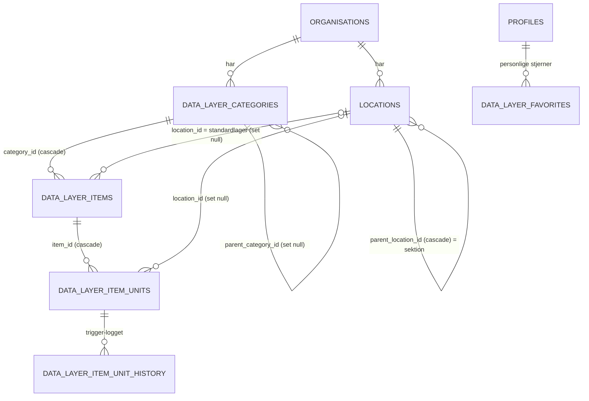
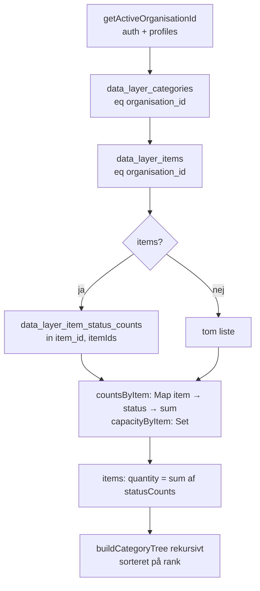
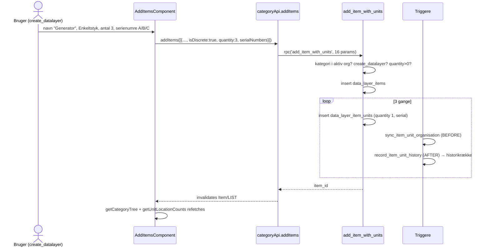

# 4.4 Kodegennemgang – Datalager ("Hvad har vi?")

Dækker: `src/store/apis/categoryApi.ts`, `src/store/apis/dataLayerFavoriteApi.ts`, `src/store/slices/dataLayersSlices/{aggregatedItems,itemPlacements}.ts`, `src/types/dataLayer/datalayerTypes.ts`, `src/utils/{itemUnitForm,locationForm,locationPathLabel,numberInput}.ts`, `src/store/hooks/useDeleteMany.ts`, `src/pages/dataLayer/DataLayerPage.tsx` (`/datalager`), `src/components/dataLayer/**` og databaseobjekterne for kategorier, items, enheder og lokationer.

> Domæneejer ifølge `docs/`: Studerende 2. Statistikkens lagerhistorik (`data_layer_item_unit_history`) blev tilføjet af en anden studerende som "kun tilføjelse".

---

## 1. Datamodellen – den vigtigste ting at forstå

Datalageret skelner mellem **hvad** en ting er (item) og **de konkrete eksemplarer/mængder** (enheder):



| Tabel | Rolle | Vigtige kolonner/constraints (live) |
|---|---|---|
| `data_layer_categories` | Træ af kategorier | `parent_category_id` (self-FK, **ON DELETE SET NULL**), `rank` (sortering blandt søskende) |
| `data_layer_items` | "Varetypen" | `name`, `unit_of_measurement` (default `'stk'`), `packaging`, `package_size` (>0), `location_id` (standardlager) |
| `data_layer_item_units` | Fysiske enheder **eller** batches | `quantity` (numeric), `status` (`e_item_status`), `serial_number`, `contents_total/remaining`, `contents_{empty,partial,full}_status` |
| `locations` | Lagre og sektioner (2 niveauer) | `parent_location_id` (self-FK, **cascade**); triggeren `validate_location_parent` sikrer max 2 niveauer og samme org |
| `data_layer_item_unit_history` | SCD2-historik (status + lager over tid) | `valid_from`, `valid_to` – fyldes af trigger, bruges af statistik |
| `data_layer_favorites` | Brugerens stjernemarkeringer | CHECK `num_nonnulls(category_id, location_id) = 1` |
| View `data_layer_item_status_counts` | Sum af `quantity` pr. (item, status) + `has_capacity_units` | Står i `docs/dbSchema.sql` §9a. **Uklart:** views er ikke med i live-eksporten, så den nøjagtige live-definition kan ikke verificeres herfra. |

### Tre måder at tælle på ("item kinds")

`ItemKind = 'discrete' | 'measured' | 'container'` (`datalayerTypes.ts`). Afgøres af `isDiscrete` + `contentsTotal` ved oprettelse:

| Art | Eksempel | Enheds-rækker | `quantity` betyder |
|---|---|---|---|
| **Enkeltstyk** (`isDiscrete = true`) | 40 borde, evt. med serienumre | N rækker à `quantity = 1` | 1 stk. (CHECK `serial_requires_single_quantity`) |
| Enkeltstyk + indhold | 5 × 12-pack sodavand | 5 rækker, hver `contents_total = contents_remaining = 12` | 1 pakke; indholdet spores i `contents_remaining` |
| **Mængde** (`isDiscrete = false`) | 500 kg grus | 1 batch-række `quantity = 500` | mængde i `unit_of_measurement` |
| Mængde + `package_size` | 3 big bags à 500 kg | 3 rækker à `quantity = 500` | mængde pr. emballage |
| **Beholder** (`!isDiscrete` + `contentsTotal`) | 2 dieseltanke à 200 L | 2 rækker, `contents_total = 200`, `quantity = startniveau` | **niveau** i beholderen (må være 0) |

> **Hvorfor så mange varianter?** `docs/migrations/README.md` viser en lang række iterationer 2026-09-23 (pakker, kapacitet, "Skal tømmes/fyldes op"). Den samlede regel er, at status-fordeling og mængder altid **afledes** af enhedsrækkerne (projektprincip: statistik må aldrig indtastes manuelt).

### Automatisk status ud fra indhold (`sync_status_from_contents`, BEFORE UPDATE OF `contents_remaining, quantity`)

```
hvis contents_total og contents_remaining:   (Enkeltstyk + indhold)
   remaining <= 0           → contents_empty_status   (hvis sat)
   remaining < total        → contents_partial_status (hvis sat)
   ellers                   → contents_full_status    (hvis sat)
hvis contents_total og ikke remaining:       (Beholder; niveau = quantity)
   samme tre grene, men på quantity
```

Eksempel: en skraldespand kan have `empty → Available`, `full → NeedsEmptying`; en dieseltank `empty → NeedsRefilling`.

---

## 2. Fil: `src/store/apis/categoryApi.ts`

### Læsning

**`getCategoryTree`** (query → `DataLayerCat[]`) – sidens hovedkilde. Dataflow:



- `buildCategoryTree(raw, items, parentId)` filtrerer rå rækker pr. forælder og kalder sig selv rekursivt → nested `DataLayerCat { items, subCategories }`. Kompleksitet ≈ O(C² + C·I) (hver node filtrerer hele listen) – fint ved hundredvis, ikke ved titusindvis.
- `providesTags`: `Category/LIST`, `Item/LIST` + ét tag pr. kategori og item (`flattenCategoryIds`) → både finkornet og liste-invalidering virker.

> **Observeret – potentiel fejl ved stor datamængde:**
> 1. `.in('item_id', itemIds)` sender alle item-id'er i URL'en (GET). Med flere hundrede items (36 tegn pr. UUID) nærmer URL'en sig typiske grænser (8–16 KB) hos proxy/gateway. **Uklart** hvor grænsen ligger i Supabase-projektet.
> 2. PostgREST har en `max_rows`-grænse (Supabase-default 1000). `getCategoryTree` (items), `getUnitLocationCounts` og `getAvailableUnitLocations` henter **alle** rækker og aggregerer i klienten – over grænsen afkortes resultatet **stille**, og tallene bliver forkerte. Seed-data har 837 enheder (`docs/seed/README.md`), altså tæt på. **Uklart** hvad `max_rows` er sat til.
> **Anbefaling:** aggregér server-side (view/RPC filtreret på `organisation_id`), som statistikken allerede gør.

**`getAvailableUnitLocations`** – alle `Available`-enheder i org'en, summeret pr. (item, lager) i en `Map`. Bruges af opgavernes materialevælger. Deler `Item/LIST`-tagget.

**`getUnitLocationCounts`** – alle enheder (alle statusser) summeret pr. (item, lager, status). Bruges af `/datalager` til at vise "hvad ligger hvor".

**`getItemUnits(itemId)`** – rå enheder for ét item (detaljevisningen), tags `itemUnitsTag(itemId)` + ét pr. enhed.

**`getItemLocations`** – alle lokationer i org'en (`listTags('ItemLocation', …)`).

### Skrivning

| Mutation | Implementering | Privilegie (RLS/RPC) | Invaliderer |
|---|---|---|---|
| `addCategory` | insert m. `organisation_id`, `rank` | `create_datalayer` | `Category/LIST` |
| `updateCategory` | update `title/rank/parent_category_id` | `update_datalayer` | `Category/<id>` |
| `deleteCategory` | delete | `delete_datalayer` | `Category/LIST` |
| `addItem` | RPC `add_item_with_units` (16 parametre) | `create_datalayer` (tjekkes i RPC) | `Item/LIST` |
| `addItems` | **sekventiel løkke** af samme RPC | samme | `Item/LIST` |
| `updateItem` | update af **hvidlistede** felter (aldrig `quantity`/`statusCounts`, som er afledte) | `update_datalayer` | `Item/<id>` |
| `deleteItem` | delete (kaskaderer enheder) | `delete_datalayer` | `Item/LIST` |
| `addItemUnits` | **klienten bygger rækkerne** og laver ét bulk-insert | `create_datalayer` | `itemTags(itemId)` |
| `updateItemUnit` | update serienr/status/lager/indhold/niveau | `update_datalayer` | enheden + `itemTags` |
| `deleteItemUnit` | delete | `delete_datalayer` | `itemTags` |
| `reserveItemUnits` | RPC `reserve_item_units` | `update_tasks` | `taskMaterialTags` |
| `releaseItemUnits` | RPC `release_item_units` | `update_tasks` | `taskMaterialTags` |
| `changeTaskMaterialStatus` | RPC `update_task_material_status` | `update_tasks` (se opgaver) | `taskMaterialTags` |
| `addLocation` / `updateLocation` / `deleteLocation` | insert/update/delete | `create/update/delete_datalayer` | `ItemLocation/*` |

Fejl mappes med `mapPermissionError(error, '<handling>')` → `errors:permission.<handling>` ved 42501; `ITEM_UNIT_KEYS = { unique: 'duplicateSerialNumber' }` ved 23505.

> **Observeret – duplikeret forretningslogik:** `addItemUnits` genskaber i TypeScript den samme "hvor mange rækker med hvilke værdier"-logik som `add_item_with_units` i SQL (diskret/beholder/pakke/batch). To implementeringer af samme regel kan drive fra hinanden. Desuden opbygges `Array.from({ length: quantity })` i browseren – en tastefejl som 100000 giver 100.000 rækker i ét insert.
>
> **Observeret – ikke-atomisk:** `addItems` stopper ved første fejl, men de allerede oprettede items er committed. Brugeren ser en fejl, selv om en del af rækkerne blev gemt.

### RPC `add_item_with_units` (live, SECURITY DEFINER)
1. Slår kategoriens org op; afviser hvis ≠ `auth_profile_org()` (`CATEGORY_NOT_FOUND`).
2. Kræver `create_datalayer` (`42501`, `NO_PRIV_CREATE_DATALAYER`).
3. `p_quantity > 0` (`INVALID_QUANTITY`).
4. Indsætter item → løkke `for v_i in 1..p_quantity::int` efter arten (se tabellen i §1).
5. Returnerer item-id.

> **Edge cases:** `p_quantity::int` afrunder (2,5 → 3 for diskrete). `p_location_id` valideres ikke mod organisationen (kun FK) – et item kan i princippet pege på en anden orgs lokation, hvis man kender dens UUID (lav konsekvens, da den ikke kan læses).

### Reservation til opgaver (`reserve_item_units`, live)

```
guards: aktiv org; quantity > 0; opgaven i org; item i org; update_tasks
insert task_materials(task, item, quantity) → v_task_material_id
for hver Available-enhed for item (evt. kun på p_location_id), ældste først,
    FOR UPDATE SKIP LOCKED:
      take = min(enhed.quantity, rest)
      unit = split_unit_if_needed(enhed, take)     -- deler batch op
      status = 'InUse' hvis opgaven er InProgress, ellers 'Reserved'
      insert task_material_units(task_material, unit)
hvis rest > 0 → exception INSUFFICIENT_AVAILABLE_QUANTITY (alt rulles tilbage)
```

`FOR UPDATE SKIP LOCKED` er et klassisk kø-mønster: to samtidige reservationer venter ikke på hinanden og kan ikke tage samme enhed. Bivirkning: låste enheder tælles ikke med, så man kan få "ikke nok lager" under samtidig belastning.

### Guard-trigger `prevent_direct_status_change_on_reserved_unit`
En enhed, der er linket i `task_material_units`, kan ikke få ændret status direkte (`UNIT_LOCKED_BY_TASK_RESERVATION`), medmindre `ponos.bypass_unit_status_guard = 'on'` (sat af opgave-RPC'erne). Dermed kan man ikke "snyde" en reservation fra datalagersiden.

> **Observeret – autorisationshul i intern hjælper:** `split_unit_if_needed(p_unit_id, p_needed)` er `SECURITY DEFINER`, tjekker kun at enheden tilhører kalderens aktive org, og har `EXECUTE` til `anon`/`authenticated` (live-grants). Ethvert medlem – også uden `update_datalayer` – kan altså via `supabase.rpc('split_unit_if_needed', …)` splitte enheder i sin organisation. Mængden bevares, men data/historik ændres uden privilegie. `p_needed` valideres ikke (negative værdier afvises kun indirekte af CHECK-constraints). **Anbefaling:** `revoke execute … from anon, authenticated` på interne hjælpere.

### Øvrige triggere

| Trigger | Funktion | Effekt |
|---|---|---|
| `trg_sync_item_organisation` (items, BEFORE INSERT/UPDATE OF category_id) | `sync_item_organisation` | `organisation_id` kopieres fra kategorien → kan ikke afvige |
| `trg_sync_item_unit_organisation` (units, BEFORE INSERT/UPDATE OF item_id) | `sync_item_unit_organisation` | `organisation_id` kopieres fra item'et |
| `trg_record_item_unit_history` (units, AFTER INSERT/DELETE/UPDATE OF status, item_id, organisation_id, location_id) | `record_item_unit_history` | Lukker åben historikrække (`valid_to = now()`) og åbner en ny |
| `trg_validate_location_parent` (locations) | `validate_location_parent` | Max 2 niveauer, ikke sin egen forælder, samme org |

> Denormaliseringen af `organisation_id` (kopieret fra forælder via trigger) er et bevidst valg: RLS-policies kan så skrive `organisation_id = auth_profile_org()` direkte på hver tabel uden joins – enklere og hurtigere policies. Da `WITH CHECK` evalueres efter BEFORE-triggere, kan man ikke indsætte et item i en anden orgs kategori.

### RLS (live) – samme mønster for `locations`, `data_layer_categories`, `data_layer_items`, `data_layer_item_units`

| Kommando | Regel |
|---|---|
| SELECT | `organisation_id = auth_profile_org() AND has_privilege_or_admin('read_datalayer')` |
| INSERT | … `create_datalayer` |
| UPDATE | … `update_datalayer` (USING + WITH CHECK) |
| DELETE | … `delete_datalayer` |

`data_layer_item_unit_history`: kun SELECT, med `read_datalayer` **eller** `read_statistics`. `data_layer_favorites`: egne rækker + aktiv org + `read_datalayer`; INSERT tjekker desuden at målet (kategori/lokation) tilhører aktiv org.

---

## 3. Fil: `src/store/apis/dataLayerFavoriteApi.ts`

`getDataLayerFavorites`, `addDataLayerFavorite`, `removeDataLayerFavorite`. Tilføj/fjern bruger **optimistisk opdatering** (`onQueryStarted` + `updateQueryData`, rulles tilbage med `patch.undo()` ved fejl). Sletning sker på *målet* (`.eq('category_id', id)`), ikke rækkens id, så "fjern" også virker på en endnu-ikke-bekræftet optimistisk række.

---

## 4. Rene hjælpemoduler

### `src/store/slices/dataLayersSlices/aggregatedItems.ts`
> Navnet er misvisende: det er **ikke** en Redux-slice, men rene funktioner over kategoritræet.

| Funktion | Gør |
|---|---|
| `getAggregatedItems(category, ancestors)` | Alle items i kategorien og dens underkategorier, beriget med `sourceCategoryTitle` (sti) og `isFromSubCategory` |
| `flattenAllItems(tree)` | Alle items i hele træet |
| `getDescendantCategories(cat)` | Kategorien + alle efterkommere |
| `findCategoryInTree`, `getCategoryPath`, `findSiblings`, `flattenWithPath`, `searchItemsGlobal` | Opslag/søgning i træet (bruges også af opgavernes `TaskItemPicker`) |

### `src/store/slices/dataLayersSlices/itemPlacements.ts`
Placering er **pr. enhed**, så et item kan ligge flere steder.
- `buildPlacementIndex(counts, items)` → `Map<itemId, ItemPlacement[]>` (mængde + status pr. lager). Item uden enheder falder tilbage til sit `location_id`.
- `scopeItemToLocations(item, placements, locationIds)` → item'et med tal *kun* for de valgte lagre (bruges i lager-visningen; et lager inkluderer sine sektioner).

### `src/utils/locationPathLabel.ts`
`PATH_SEPARATOR = ' › '`, `joinPath`, `locationPathLabel(location, locations)` → "Lager › Sektion".

### `src/utils/itemUnitForm.ts`, `src/utils/numberInput.ts`, `src/utils/locationForm.ts`
Formularhjælpere: talfelter holdes som *tekst* mens man skriver (så feltet kan være tomt), valideres og konverteres ved submit.

### `src/store/hooks/useDeleteMany.ts`
`deleteAll(ids)` → `Promise.all(ids.map(remove))` med fælles `isDeleting`/`error`. Bruges til slet kategori(er) og slet items.
> **Observeret:** Én HTTP-request pr. id, og hver fuldført mutation invaliderer `Item/LIST`/`Category/LIST`. Ved delvis fejl er nogle slettet og andre ikke. Én `.delete().in('id', ids)` ville være både atomisk og billigere.

---

## 5. Fil: `src/pages/dataLayer/DataLayerPage.tsx` (`/datalager`, 984 linjer)

**Ansvar:** Hele datalager-oplevelsen: venstrepanel med fanerne *Lager* (standard) og *Kategorier* (træer med favoritter øverst), højrepanel med item-liste, chips, søgning, filtre, multi-vælg-sletning og modaler.

**State (≈ 20 `useState`)**: søgning, udvidede noder, modaler (opret/rediger/slet for kategori og lager, tilføj items, item-detalje), multivalg, filtre (status, enhed).

**URL som state:** fane og valgt kategori/lager læses fra `useSearchParams` (`?tab=categories|locations`, `?catId=`, `?locId=`; `updateParams` ændrer kun de givne nøgler), så F5, tilbage-knap og delte links virker. Valgt kategori *udledes* fra træet ved hver render (altid frisk efter refetch).

**Afledte data (memoiseret):** `aggregatedItems` → `placementIndex` (`buildPlacementIndex`) → `itemsAtSelectedLocation` (`scopeItemToLocations`) → filtrering (status: et item matcher hvis *én* af dets enheder har statussen; OR inden for en filtersektion, AND mellem sektioner) → chips (`summarizeByCategory/Location`).

**Rettigheder:** `useHasPrivilege` for `create/read/update/delete_datalayer` styrer knapper; favoritter hentes kun med `read_datalayer` (`skip: !canRead`).

**Flyt kategori op/ned (`handleMoveCategory`):** bytter plads i søskendelisten, beregner nye `rank` (1..n) og sender kun de ændrede som parallelle `updateCategory`-kald.
> **Observeret:** Parallelle, ikke-atomiske rank-opdateringer – fejler én, kan to kategorier ende med samme rank.

> **Observeret – kodekvalitet:** Siden er en "god component" (984 linjer, ~20 state-variabler, to `eslint-disable-next-line react-hooks/exhaustive-deps`). Den har dog allerede uddelegeret en del til `ItemListPanel`, `TreeRow`, `FavoritesSection` m.fl. Næste naturlige skridt ville være custom hooks (`useDataLayerSelection`, `useDataLayerFilters`).

---

## 6. Komponenter (`src/components/dataLayer/**`)

| Komponent | Ansvar | Endpoints |
|---|---|---|
| `TreeRow.tsx` | Fælles trærække (chevron, ikon, navn, stjerne, handlinger) for begge træer | – |
| `category/CategoriTreeNodeComponent.tsx` | Rekursiv kategori-node | – |
| `category/addCategoryComponent.tsx` | Opret (under)kategori | `useAddCategoryMutation` |
| `category/editCategoryComponent.tsx` | Omdøb/flyt; forhindrer flytning ind under sig selv/efterkommere (`getDescendantCategories`) | `useUpdateCategoryMutation` |
| `category/deleteCategoryComponent.tsx` | Vælg hvilke underkategorier der slettes med; viser antal items der forsvinder. Ikke-valgte underkategorier bliver rod-kategorier (FK `ON DELETE SET NULL`) | `useDeleteCategoryMutation` via `useDeleteMany` |
| `item/ItemListPanel.tsx` | Overskrift, chips, søgning, vælg-til-sletning, liste – fælles for begge faner | – |
| `item/addItemsComponent.tsx` | Opret flere items i én modal (én række pr. item) | `useAddItemsMutation` |
| `item/ItemUnitFields.tsx` | "Hvordan tælles dette item"-felterne (art, serienumre, indhold, automatiske statusser) | – |
| `item/itemsDetailComponent.tsx` (664 linjer) | Detalje: rediger item, liste over enheder (status, lager, niveau), tilføj enheder (restock), slet | `getItemUnits`, `addItemUnits`, `updateItemUnit`, `deleteItemUnit`, `updateItem`, `deleteItem` |
| `item/deleteItemComponent.tsx` | Bekræft sletning af markerede items | `useDeleteItemMutation` via `useDeleteMany` |
| `item/ItemStatusSelect.tsx` | Dropdown over alle statusser (afløste 11 håndskrevne lister) | – |
| `itemStatusBadgesComponent.tsx` | Viser flere statusser pr. item (fx 10 Available + 3 Reserved) | – |
| `summaryChipsComponent.tsx` | Klikbare oversigts-chips | – |
| `filterPanelComponent.tsx`, `globalSearchComponent.tsx` | Filter (status/enhed) og global søgning på tværs af kategorier/lagre | – |
| `favorites/favoritesSectionComponent.tsx` | Stjernemarkerede kategorier/lagre øverst | (favorit-API via siden) |
| `warehouse/*` | Lager-træ, opret/rediger/slet lager/sektion, lokationsvælger (`locationsPickerComponent` kan "opret og vælg"), tags | `useAdd/Update/DeleteLocationMutation`, `useGetItemLocationsQuery` |

> **Observeret:** `src/types/dataLayer/datalayerTypes.ts` indeholder ud over typer også *runtime*-kode: `formatItemQuantity()`, `ALL_ITEM_STATUSES`, `ITEM_STATUS_STYLES` (Tailwind-klasser) og danske forslagslister (`UNIT_OF_MEASUREMENT_SUGGESTIONS = ['stk', 'dåse', …]`), som ikke går gennem i18n.

---

## 7. End-to-end: opret et item med 3 serienummererede enheder


