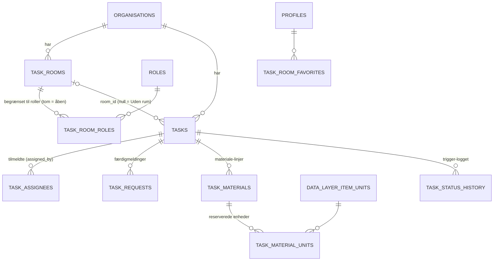
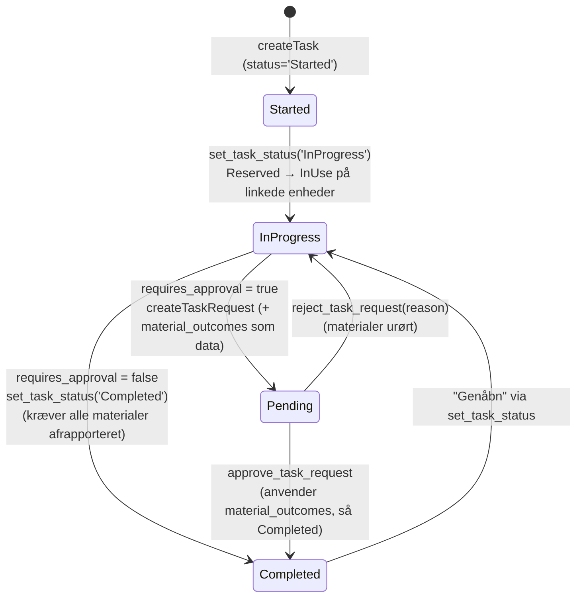
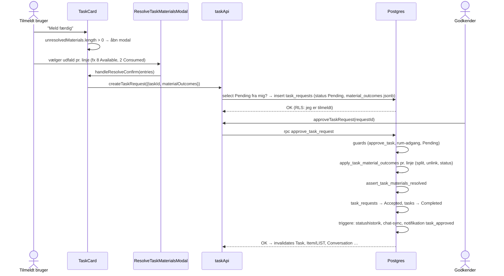

# 4.5 Kodegennemgang – Opgaver ("Hvem gør hvad?")

Dækker: `src/store/apis/taskApi.ts` (938 linjer – appens største API-fil), `src/store/apis/taskRoomFavoriteApi.ts`, hooks (`useTaskBoard`, `useTaskFilters`, `useTaskPermissions`, `useApplyMaterialOutcomes`, `useTaskRoomFavorites`), utils (`taskDisplay`, `taskFilters`, `taskMaterials`, `splitFavoriteRooms`), `src/types/Task/Task.ts`, `src/components/Task/**`, `src/pages/Task/**` samt de tilhørende DB-objekter.

> Domæneejer ifølge `docs/`: Studerende 3.

---

## 1. Domænemodel



| Begreb | Forklaring |
|---|---|
| **Status** (`e_task_status`) | `Started` ("Tilgængelig") → `InProgress` ("I gang") → `Completed`. Kun de to første har kolonner på tavlen (`OPEN_TASK_STATUSES`). |
| **Prioritet** (`e_task_priority`) | `Low/Medium/High/Critical` eller `null`. |
| **Rum** (`task_rooms`) | Gruppering af opgaver. Kan begrænses til roller via `task_room_roles`; adgang afgøres af `can_access_task_room(room_id)`. |
| **Tilmelding** (`task_assignees`) | `assigned_by = user_id` → selv-tilmeldt (kan afmelde sig mens `Started`); ellers tildelt af en leder (`assign_tasks`). Triggeren `set_task_assignee_assigned_by` tvinger `assigned_by = auth.uid()`. |
| **Godkendelse** (`requires_approval`, default `true`) | Tilmeldte "melder færdig" (`task_requests`, `Pending`) → en godkender (`approve_task`/`reject_task`) godkender (→ `Completed`) eller afviser med begrundelse. |
| **Materialer** | `task_materials` (item + mængde) ↔ `task_material_units` (de konkrete enheder, der er reserveret). En linje er *afrapporteret*, når den ikke længere har linkede enheder. |
| `task_participants` | Tabel med policies, men **ikke brugt** i `src/` (søgning giver ingen træf). **Uklart** om den er forældet. |

> **Observeret:** `Task`-typen (`src/types/Task/Task.ts`) bruger databasens `snake_case` direkte (`room_id`, `max_assignees` …) og fyldes med `select('*') as Task`, mens næsten alle andre domæner mapper til `camelCase`. Inkonsistent konvention, og `as Task` er en ukontrolleret typeantagelse.

---

## 2. Statusmaskine og materialer



*(`Pending` er ikke en opgavestatus, men en `task_requests`-række, mens opgaven står `InProgress`.)*

**Materialernes livscyklus:**

| Trin | Hvad sker | Hvor |
|---|---|---|
| Reservér | `Available` → `Reserved` (eller `InUse` hvis opgaven er i gang); enheder splittes efter behov | `reserve_item_units` |
| Påbegynd | Alle `Reserved` → `InUse` (med bypass af guard-triggeren) | `set_task_status('InProgress')` |
| Undervejs | Del af en linje skiftes fx `InUse` → `Damaged`, linket bevares | `update_task_material_status` (kun mens `InProgress`) |
| Frigiv | Linjen slettes; brugeren vælger slutstatus pr. mængde (aldrig `Reserved/InUse`) | `release_item_units` |
| Afrapportér | Udfald pr. mængde (fx 8 `Available`, 1 `Damaged`, 3 `Consumed`); summen skal matche den reserverede mængde | `resolve_task_material_units` → `apply_task_material_outcomes` |
| Slet opgave/linje | Trigger `release_units_on_task_material_delete`: kun `Reserved/InUse` → `Available` | trigger på `task_materials` |
| Afslut | `assert_task_materials_resolved` blokerer `Completed`, hvis nogen linje stadig har linkede enheder (`MATERIALS_NOT_RESOLVED`) | `set_task_status`, `approve_task_request` |

> **Hvorfor gemmes udfald som data ved godkendelse?** Kommentarerne (og `docs/migrations/README.md`, 2026-09-23) beskriver en rettet bug: Materialerne blev tidligere afrapporteret allerede ved "Meld færdig". Blev anmodningen afvist, havde materialerne fået en status, der aldrig skete. Nu gemmes valget i `task_requests.material_outcomes` (jsonb) og udføres først i `approve_task_request`.

---

## 3. Fil: `src/store/apis/taskApi.ts`

### Queries

| Endpoint | Kald | Tags | Bemærkning |
|---|---|---|---|
| `getTasks` | `tasks.select('*').eq(org)` | `listTags('Task')` | RLS filtrerer rum-adgang og afsluttede (se §5) |
| `getCompletedTasks` | tasks `Completed` → parallelt assignees + materials (`.in(task_id)`) → parallelt profiler, item-navne, rum-navne | `Task/LIST` | Batch-mønster (ingen N+1), men `.in()` med alle afsluttede opgaver |
| `getOpenTaskAssigneeNames` | åbne opgaver → assignees → `fetchProfilesByIds` | `MyTasks`, `Task/LIST` | Navne til søgefeltet |
| `getRooms` | `task_rooms.select('*, task_room_roles(role_id)')` | `listTags('TaskRoom')` | `toRoom` flader rollerne ud til `role_ids` |
| `getTaskAssignees(taskId)` | `task_assignees.eq(task_id)` | `taskTags.assignees(id)` | **pr. opgave** |
| `getTaskRequests(taskId)` | `task_requests.eq(task_id)` nyeste først | `taskTags.requests(id)` | **pr. opgave** |
| `getTaskMaterials(taskId)` | materials → parallelt items + `task_material_units(data_layer_item_units(...))` → lokationer → forældrelokationer | `taskTags.materials(id)` | **pr. opgave**, 2–4 sekventielle runder |
| `getMyTaskIds` | `task_assignees.select('task_id').eq(user_id)` | `MyTasks` | Ingen org-filter i koden (RLS: kun opgaver i aktiv org) |
| `getPendingTaskRequests` | RPC `get_pending_task_requests()` | `taskTags.pendingRequests` | Security definer; filtrerer rum-adgang; inkl. `rejection_count` |
| `getTaskRequestDetails(id)` | RPC `get_task_request_details` → jsonb | `taskTags.pendingRequests` | Godkender behøver ikke `read_tasks` |

> **Observeret – N+1 på opgavetavlen (vigtigt):** `TaskCard.tsx` kalder `useGetTaskAssigneesQuery(task.id)`, `useGetTaskRequestsQuery(task.id)` og `useGetTaskMaterialsQuery(task.id)` **for hvert kort, uanset om detaljerne er åbne**. Med 70 åbne opgaver (seed-data) giver det ≥ 210 HTTP-requests ved indlæsning af `/tasks` (+ 1–3 ekstra pr. kort for materialer), og *hver* af dem starter desuden med `getUser`-kald, hvor `runQuery`/`session.ts` bruges. Se `10-performance.md` for forslag (batch-endpoints som `getCompletedTasks` allerede gør, eller lazy-hentning når kortet åbnes).

### Mutations

| Endpoint | Kald | Server-side | Invaliderer |
|---|---|---|---|
| `createTask` | `tasks.insert({…, status:'Started'})` | `create_tasks` + `can_access_task_room(room_id)` | `Task/LIST` |
| `updateTask` | `update(...).eq(id).eq(org)` | `update_tasks` (+ rum-adgang i WITH CHECK) | `Conversation`, opgaven, liste |
| `updateTaskStatus` | RPC `set_task_status` → derefter `select('*').maybeSingle()` (null hvis ikke længere synlig) | tilmeldt **eller** `update_tasks` | opgaven, liste, `Conversation` |
| `createRoom` / `updateRoom` | RPC `create_task_room` / `update_task_room` (rum + roller atomisk) | `create_tasks` / `update_tasks` + rum-adgang; roller skal tilhøre org | `TaskRoom`, (`Task/LIST`, `MyTasks`), `Conversation` |
| `deleteRoom({roomId, taskIdsToDelete})` | **3 klient-trin**: slet valgte opgaver → flyt resten til "Uden rum" → slet rum | `delete_tasks`, `update_tasks`, `delete_tasks` | bredt inkl. `Item/LIST` |
| `deleteTask` | `delete().eq(id).eq(org)` | `delete_tasks` | bredt inkl. `Item/LIST` (trigger frigiver materialer) |
| `createTaskRequest({taskId, materialOutcomes})` | Tjek for eksisterende `Pending` fra mig → ellers insert | Policy: man skal være tilmeldt | pendingRequests, requests, opgaven, liste |
| `approveTaskRequest` / `rejectTaskRequest` | RPC'er | `approve_task` / `reject_task` + rum-adgang; afvisning kræver begrundelse (≤ 500 tegn) | se kode |
| `assignToTask({taskId, userId})` | `task_assignees.insert` | selv: altid i org; andre: `assign_tasks` | `assignmentTags` (`Conversation`, `MyTasks`, liste, assignees) |
| `unassignFromTask` | delete hvor `user_id = assigned_by = mig` | kun mens opgaven er `Started` | samme |
| `removeAssigneeFromTask` | delete på (task, user) | `assign_tasks` | samme |
| `resolveTaskMaterialUnits` | RPC `resolve_task_material_units` | `update_tasks` | `taskMaterialTags` |

> **Observeret – ikke-atomisk `deleteRoom`:** Tre separate requests. Fejler trin 2 eller 3, er de valgte opgaver allerede slettet, mens rummet består. En RPC ville gøre det til én transaktion.
>
> **Observeret – race i `createTaskRequest`:** "Findes der allerede en Pending? ellers insert" sker i klienten, og `task_requests` har **intet unikt indeks** på ventende anmodninger (kun primærnøglen). To hurtige klik/to faner kan oprette to ventende anmodninger for samme opgave.

---

## 4. Databasesiden – RPC'er og triggere

### `set_task_status(p_task_id, p_status)` (SECURITY DEFINER)
```
aktiv org? opgaven i org?
tilmeldt ELLER update_tasks?             → ellers NO_PRIV_SET_TASK_STATUS
p_status = 'Completed' → assert_task_materials_resolved
update tasks set status, finished_at = (Completed ? now() : null)
p_status = 'InProgress' → bypass guard; Reserved → InUse på opgavens enheder
```

> **Observeret – forretningsregel håndhæves kun i klienten (vigtigt):** `set_task_status` tjekker **ikke** `tasks.requires_approval`. Grenen "kræver godkendelse → opret anmodning i stedet" findes kun i `TaskCard.proceedToComplete`. En tilmeldt bruger kan derfor via `supabase.rpc('set_task_status', { p_task_id, p_status: 'Completed' })` afslutte en godkendelsespligtig opgave uden om godkenderen (materialerne skal dog være afrapporteret, hvilket kræver `update_tasks` – eller ingen materialer). Funktionen validerer heller ikke overgange (fx `Completed → Started`). **Anbefaling:** afvis `Completed` i RPC'en, når `requires_approval` er sand og kalderen ikke er godkender.
>
> **Observeret – `max_assignees` håndhæves ikke server-side:** Kolonnen bruges kun i klienten (`isFull` i `TaskCard`) og i triggeren `notify_task_updated`. Insert-policyerne på `task_assignees` tjekker ikke antallet, så grænsen kan overskrides ved samtidige tilmeldinger eller direkte kald.
>
> **Observeret – rum-begrænsning ved selvtilmelding:** Policyen "Tilmeld sig selv til opgaver i egen organisation" kræver kun at opgaven er i aktiv org – ikke `can_access_task_room` eller opgavestatus. Kender en bruger UUID'et på en opgave i et rolle-låst rum (fx fra et link), kan vedkommende tilmelde sig og bliver derefter synlig for opgaven via `is_task_assignee` i SELECT-policyen.

### `approve_task_request(p_request_id)` (uddrag)
Guards: aktiv org, `approve_task` (42501), anmodningen findes i org **og** `can_access_task_room`, status `Pending`. Derefter: anvend gemte `material_outcomes` (`apply_task_material_outcomes`) → `assert_task_materials_resolved` → sæt alle ventende anmodninger for opgaven `Accepted` → `skip_task_completed_notify` (undgår dobbelt-notifikation) → opgaven `Completed` → indsæt `task_approved`-notifikation(er).

### `reject_task_request(p_request_id, p_reason)`
Guards som ovenfor + begrundelse påkrævet/≤ 500 tegn. Sætter `Rejected`, `rejection_reason`, og sender `task_rejected`-notifikation med begrundelsen. Materialer røres ikke.

### `apply_task_material_outcomes(p_task_material_id, p_outcomes jsonb)` – intern kerne
Låser linkede enheder (`FOR UPDATE`), kræver at summen af udfald = linket mængde (`OUTCOME_QUANTITY_MISMATCH`), validerer hver status mod enum'en, og for hver udfaldsgruppe: split enhed → fjern link → sæt status.

> **Observeret – potentiel sårbarhed (bør verificeres):** Funktionen er `SECURITY DEFINER`, har **ingen** egen org- eller privilegie-kontrol og har `EXECUTE` til både `anon` og `authenticated` (live-grants). Den eneste kontrol er indirekte, via `split_unit_if_needed`, der sammenligner `v_unit.organisation_id <> auth_profile_org()`. For en **udlogget** kalder er `auth_profile_org()` `NULL`, sammenligningen giver `NULL`, og `IF NULL THEN` er falsk – så kontrollen springes over. Konsekvens: Den, der kender et `task_material_id` (en UUID, ikke en hemmelighed), kan med den offentlige anon-nøgle ændre status på de reserverede enheder (fx alt til `Missing`). Den nødvendige mængde lækkes af fejlteksten (`… matcher ikke den reserverede mængde (%)`). Et indlogget medlem af samme org kan gøre det samme uden `update_tasks`. **Anbefaling:** `revoke execute on function apply_task_material_outcomes, split_unit_if_needed from anon, authenticated` (de kaldes kun internt), og brug `is distinct from` i org-sammenligninger.

### Rum-adgang: `can_access_task_room(p_room_id)`
Sand hvis: `room_id is null` (Uden rum) **eller** `view_all_task_rooms`/admin **eller** rummet har ingen roller (åbent) **eller** brugerens rolle i aktiv org er blandt rummets roller. `member_can_access_room(user, room)` er samme regel for en *anden* bruger (bruges til notifikationer og chat).

### Triggere på opgave-tabellerne (live)

| Trigger | Hvornår | Effekt |
|---|---|---|
| `trg_record_task_status_history` | tasks: INSERT/DELETE/UPDATE OF status | SCD2-historik i `task_status_history` (statistik: "I gang", ventetid) |
| `trg_notify_task_completed` | tasks: UPDATE OF status | Notifikation ved afslutning (springes over med `ponos.skip_task_completed_notify`) |
| `trg_notify_task_updated` | tasks: UPDATE OF title, description, datoer, priority, max_assignees, room_id | Notifikation til tilmeldte |
| `trg_notify_task_created_in_favorite_room` | tasks: AFTER INSERT WHEN room_id not null | Notifikation til brugere med rummet som favorit og adgang |
| `trg_task_conversation_changes` | tasks: UPDATE OF title, status | Synkroniserer opgavens auto-chat (navn/lukning) |
| `trg_set_task_assignee_assigned_by` | task_assignees: BEFORE INSERT | `assigned_by := auth.uid()` |
| `trg_notify_task_assigned` | task_assignees: AFTER INSERT | Notifikation til den tilmeldte |
| `trg_sync_task_conversation` | task_assignees: AFTER INSERT/DELETE | Opgave-chat oprettes ved 2+ tilmeldte; deltagere følger tilmeldte |
| `trg_release_units_on_task_material_delete` | task_materials: BEFORE DELETE | Reserved/InUse → Available |

### RLS (live, forenklet)

| Tabel | SELECT | INSERT | UPDATE | DELETE |
|---|---|---|---|---|
| `tasks` | org ∧ `read_tasks` ∧ (rum-adgang ∨ tilmeldt) ∧ (ikke Completed ∨ `view_completed_tasks` ∨ tilmeldt) | org ∧ `create_tasks` ∧ rum-adgang | org ∧ `update_tasks` (+ rum-adgang i CHECK) | org ∧ `delete_tasks` |
| `task_assignees` | egne rækker, eller `read_tasks` | selv (`user_id = assigned_by = mig`), eller `assign_tasks` | – | selv mens `Started`, eller `assign_tasks` |
| `task_requests` | `read_tasks` eller godkender | `requested_by = mig` ∧ tilmeldt | – (kun RPC) | – |
| `task_materials` | `read_tasks` | – (kun RPC) | – | `update_tasks` |
| `task_material_units` | `read_tasks` | – | – | – |
| `task_rooms` | org ∧ `read_tasks` ∧ rum-adgang | `create_tasks` | `update_tasks` ∧ rum-adgang | `delete_tasks` ∧ rum-adgang |
| `task_room_roles` | rum man kan se | – (kun RPC) | – | – |

---

## 5. Hooks og utils

- **`useTaskBoard({ onlyMine, selectedRoomId })`** – samler tasks, rum, mine opgave-id'er og tilmeldtes navne; filtrerer på søgning (titel/rum/tilmeldte), rum, status, prioritet og "kun mine"; sorterer med `compareTasks(sortBy)`; returnerer `available` (`Started`) og `inProgress`. `?task=`/`?taskId=` i URL'en åbner en opgaves popup og vises *uanset* filtre.
- **`useTaskFilters()`** – søg/filter/sortering-state + "antal aktive filtre" (sortering tæller ikke).
- **`useTaskPermissions()`** – de fem opgaveprivilegier samlet (`canRead/Create/Update/Delete/Assign`).
- **`useApplyMaterialOutcomes(taskId)`** – `release(entries)`/`resolve(entries)`: én RPC pr. linje, sekventielt, fejl kastes videre.
- **`useTaskRoomFavorites()`** + `taskRoomFavoriteApi.ts` – favoritrum med optimistisk toggle (samme mønster som datalager-favoritter).
- `utils/taskDisplay.ts` – `ALL_PRIORITIES`, `OPEN_TASK_STATUSES`, `ASSIGNEE_LIMIT_OPTIONS = [1,2,3,4,5,10]`, `PRIORITY_COLORS`, `priorityRank`.
- `utils/taskFilters.ts` – `matchesTaskSearch`, `compareTasks` (delt af `/tasks`, `/tasks/mine` og dashboardets "Dine opgaver").
- `utils/splitFavoriteRooms.ts` – favoritrum først, i stabil rækkefølge.

---

## 6. Sider og komponenter

| Fil | Ansvar |
|---|---|
| `pages/Task/TaskPage.tsx` (`/tasks`) | Alle åbne opgaver, evt. ét rum; `TaskPageShell` + `TaskFilters` + `TaskBoard` |
| `pages/Task/MyTasksPage.tsx` (`/tasks/mine`) | Samme med `onlyMine: true` |
| `pages/Task/CompletedTasksPage.tsx` (`/tasks/afsluttede`) | Genbruger dashboardets `CompletedTasksPanel`; kræver `view_completed_tasks` (UX) |
| `pages/Task/TaskApprovalsPage.tsx` (`/tasks/godkend`) | Genbruger `TaskApprovalsPanel`; adgang = `approve_task` ∨ `reject_task` |
| `TaskPageShell.tsx` | Loading/ingen adgang, `RoomBar`, fejl, overskrift |
| `RoomBar.tsx` (313) | Rum-faner (favoritter først), "Til godkendelse"-tæller, opret/rediger/slet rum, rum-chat |
| `RoomFormModal.tsx`, `RoomRolePicker.tsx`, `DeleteRoomModal.tsx`, `RoomSelect.tsx` | Rum-CRUD; `RoomRolePicker` kan oprette en rolle via `QuickCreateRoleModal` |
| `TaskBoard.tsx` | To kolonner (under `lg` som faner via `TaskColumnTabs`) |
| `TaskCard.tsx` (532) | Kort + detalje-modal: tilmeld/afmeld, tilføj/fjern andre, påbegynd, meld færdig, materialer, chat, rediger |
| `CreateTaskModal.tsx` | Opret opgave + "staged" materialer; reserverer efter oprettelse, én linje ad gangen; husker `createdTaskId`, så et nyt klik efter delvis fejl ikke opretter opgaven igen |
| `EditTaskModal.tsx` | Rediger/slet; har opgaven linkede materialer, vælges slutstatus først (`ResolveTaskMaterialsModal`, mode `deleteTask`) |
| `ResolveTaskMaterialsModal.tsx` | Tre modes: `resolve` (afslut), `release` (frigiv én linje), `deleteTask` |
| `TaskItemPicker.tsx` | Vælg item (søgning i kategoritræet via `searchItemsGlobal`) + lager + mængde; viser ledig mængde pr. lager (`getAvailableUnitLocations`) |
| `TaskMaterialsList.tsx` | Materiale-linjer, frigiv, statusskift undervejs (`changeTaskMaterialStatus`) |
| `TaskChatButton.tsx`, `RoomChatButton.tsx` | Genveje til auto-chats (se `04-kode/06-…`) |
| `TaskTimeline.tsx`, `PriorityBadge.tsx`, `PrioritySelect.tsx`, `FilterBar.tsx`, `FilterPanel.tsx`, `TaskFilters.tsx`, `TaskColumnEmptyState.tsx`, `TaskFormFields.tsx`, `taskFormStyles.ts` | Præsentation |

> **Observeret – stille fejl i `TaskCard`:** `handleAssignment`, `handleStartTask` og `proceedToComplete` kalder mutationerne uden `.unwrap()` og uden at læse `error`. Afviser databasen (fx manglende privilegie, uafrapporterede materialer, eller opgaven er flyttet), sker der intet synligt for brugeren. `handleResolveConfirm` bruger `.unwrap()`, men uden `try/catch` i selve funktionen.
>
> **Observeret – ikke-atomisk afslutning uden godkendelse:** `handleResolveConfirm` → `resolve(entries)` (én RPC pr. linje) → `updateTaskStatus('Completed')`. Fejler en senere linje eller statusskiftet, er de tidligere linjer allerede afrapporteret.

---

## 7. End-to-end: "Meld færdig" på en godkendelsespligtig opgave med materialer


