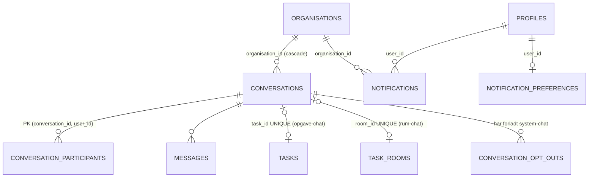
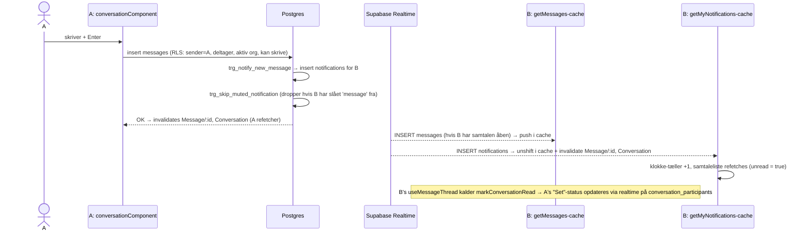

# 4.6 Kodegennemgang – Beskeder, notifikationer og realtime

Dækker: `src/store/apis/messageApi.ts`, `notificationApi.ts`, `notificationPreferenceApi.ts`, `src/store/hooks/{useMessageThread,useOpenNotification}.ts`, `src/utils/{notificationDisplay,systemMessageDisplay,conversationPath}.ts`, `src/components/messages/**`, `src/components/notification/**`, `src/components/profile/NotificationSettingsSection.tsx`, `src/components/dashboard/NotificationsWidget.tsx`, `src/pages/messages/messagePage.tsx` (`/beskeder`), `src/pages/notification/notificationPage.tsx` (`/notifikationer`).

> Domæneejer ifølge `docs/`: Studerende 3. **`docs/dbSchema.sql` dokumenterer ikke** tabellerne `conversations`, `conversation_participants`, `messages`, `notifications` (det står i filens header). Beskrivelsen af databasen herunder bygger derfor på **live-skemaeksporten** (CSV) og `dbSchema.sql` §15.24/§15.25, hvor ændringerne til dem er beskrevet.

---

## 1. Datamodel (live-skema)



| Tabel | Kolonner (udvalg) | Constraints |
|---|---|---|
| `conversations` | `is_group`, `name`, `created_by`, `archived_at/by`, `task_id`, `room_id`, `closed_at` | `name` kun for grupper; højst én af `task_id/room_id`; system-chats er altid grupper; `task_id` og `room_id` er hver UNIQUE |
| `conversation_participants` | `joined_at`, `last_read_at`, `completion_choice` (`keep`/`close`) | PK (conversation_id, user_id) |
| `messages` | `sender_id`, `content`, `message_type` (`user`/`system`), `edited_at`, `deleted_at` | `content` ikke tom medmindre slettet |
| `conversation_opt_outs` | (conversation_id, user_id) | Husker at man har forladt en opgave-/rum-chat |
| `notifications` | `type`, `title`, `body`, `link`, `reference_id`, `is_read`, `dismissed_at`, `organisation_id` | `type` ∈ {message, task_assigned, task_updated, task_completed, task_approved, task_rejected, news, task_favorite_room, membership_invitation} |
| `notification_preferences` | `enabled`, `muted_types text[]` | PK `user_id` |

**Samtaletyper:**
- **1:1 (DM)** – `is_group = false`, oprettes via `get_or_create_direct_conversation` (pr. organisation siden §15.25).
- **Gruppe** – `create_group_conversation(name, participant_ids)`.
- **Opgave-chat** – oprettes automatisk af triggere, når en opgave får 2+ tilmeldte; deltagerne følger de tilmeldte; lukkes/arkiveres når opgaven afsluttes og alle har valgt "Luk".
- **Rum-chat** – for rolle-låste rum; `get_or_join_room_conversation(room_id)` tjekker adgang og tilføjer kalderen.

---

## 2. Fil: `src/store/apis/messageApi.ts`

| Endpoint | Type | Kald | Bemærkning |
|---|---|---|---|
| `getMyConversations` | query | RPC `get_my_conversations()` | Én række pr. samtale med visningsnavn, seneste besked, `unread`, opgave/rum-info, `closed`, `completion_choice`. Tag `Conversation`. **Ingen realtime** – opdateres via invalidering. |
| `getOrCreateDirectConversation` | mutation | RPC | Returnerer samtale-id |
| `getMessages(conversationId)` | query + **realtime** | `messages.select(...).eq(conversation_id).order(created_at asc)` | Se nedenfor |
| `sendMessage` | mutation | `messages.insert({conversation_id, sender_id, content})` | Tom tekst → `errors:required.message` |
| `createGroupConversation` | mutation | RPC | Deltagere skal være i samme aktive org |
| `getConversationParticipants(id)` | query + **realtime** | participants + `fetchProfilesByIds` | Live "Set"-status via `last_read_at` |
| `markConversationRead` | mutation | RPC `mark_conversation_read` | **Optimistisk**: `unread = false` i `getMyConversations`-cachen, `patchResult.undo()` ved fejl |
| `addGroupParticipants`, `removeGroupParticipant`, `leaveGroupConversation` | mutation | RPC'er | Validering sker atomisk i DB |
| `editMessage` / `deleteMessage` | mutation | RPC `edit_message` / `delete_message` | Kun egen besked; redigering kun af seneste ikke-slettede besked; sletning = soft delete (`deleted_at`, `content = ''`) |
| `getOrJoinRoomConversation`, `joinTaskConversation`, `setTaskChatChoice` | mutation | RPC'er | System-chats |

### Realtime-mønstret (Observer via `onCacheEntryAdded`)

```ts
async onCacheEntryAdded(conversationId, { updateCachedData, cacheDataLoaded, cacheEntryRemoved, dispatch }) {
  await cacheDataLoaded
  const channel = supabase
    .channel(`messages:${conversationId}`)
    .on('postgres_changes', { event: 'INSERT', table: 'messages', filter: `conversation_id=eq.${conversationId}` },
        (payload) => updateCachedData((draft) => { if (!draft.some(m => m.id === payload.new.id)) draft.push(toMessage(payload.new)) }))
    .on('postgres_changes', { event: 'UPDATE', … }, /* redigering/sletning */)
    .subscribe()
  await cacheEntryRemoved
  supabase.removeChannel(channel)
}
```

**Hvordan det virker:** RTK Query opretter én cache-entry pr. `conversationId`. Så længe mindst én komponent bruger den, er kanalen åben; Supabase Realtime sender ændringer fra Postgres' WAL (Write-Ahead Log), filtreret på `conversation_id` og på modtagerens RLS. Nye rækker skrives direkte i cachen (ingen refetch). Dedup på `id` beskytter mod at ens egen besked tilføjes to gange (den kommer både via invalidering af `sendMessage` og via realtime).

> **Uklart:** Om tabellerne er tilføjet til publikationen `supabase_realtime`, kan ikke ses i eksporten. At realtime virker i praksis, antydes af kommentarerne (US-B8/B12/B13).

> **Observeret – potentiel fejl ved lange samtaler:** `getMessages` henter **hele** samtalen sorteret ældste først uden paginering. Ved PostgREST's `max_rows`-grænse (Supabase-default 1000; **uklart** hvad projektet bruger) afkortes resultatet til de **ældste** 1000 beskeder – de nyeste mangler så ved genåbning af samtalen.
>
> **Observeret – kodekvalitet:** Filen har inkonsistent indrykning (`getMessages`, `getConversationParticipants`, `editMessage`, `deleteMessage` står ude af niveau), kommentarer som `// NYT` og en efterladt instruks (`// getConversationParticipants: tilføj last_read_at til select + mapping`).

---

## 3. Fil: `src/store/apis/notificationApi.ts`

| Endpoint | Kald | Bemærkning |
|---|---|---|
| `getMyNotifications({limit=50, onlyVisible=true})` | `notifications.select(...).order(created_at desc).limit(limit)` (+ `is('dismissed_at', null)`) | Ingen `user_id`-filter i koden – RLS giver kun egne + aktiv org (invitationer undtaget) |
| `markNotificationRead`, `markAllNotificationsRead` | `update({is_read: true})` | |
| `dismissNotification` / `undismissNotification` | `update({dismissed_at})` | "Skjul fra klokken" uden at slette |
| `deleteNotification` | `delete()` | Permanent |

**Realtime i `getMyNotifications`:**
- Kanalnavn `notifications:${userId}:${crypto.randomUUID()}` – unikt pr. cache-entry, fordi klokken (`{limit: 8}`) og dashboard-widgetten (intet arg) er to forskellige entries på samme side, og `supabase.channel()` genbruger en kanal med samme navn (→ fejl ved dobbelt `.on()`).
- `INSERT` → `draft.unshift(...)` i cachen. Er typen `message`, invalideres `Message/<conversation_id>` + `Conversation` (det er sådan samtalelisten holdes opdateret uden et bredt abonnement på `messages`). Er typen `membership_invitation`, invalideres `MembershipInvitation`.
- `UPDATE` → opdaterer `body` (når en besked redigeres/slettes).

> **Observeret:** Notifikationer fungerer altså som *event-bus* for beskeder. Det er smart (én kanal i stedet for mange), men betyder at samtalelisten ikke opdateres for brugere, der har slået besked-notifikationer fra (`skip_muted_notification` forhindrer så, at rækken overhovedet oprettes). **Uklart** om det er tilsigtet.

### `notificationPreferenceApi.ts` (US-79)
`getNotificationPreferences` (ingen række = alt slået til) og `updateNotificationPreferences` (`upsert`, optimistisk). Selve filtreringen sker i databasen: BEFORE INSERT-triggeren `trg_skip_muted_notification` på `notifications` returnerer `NULL` (dropper rækken), hvis modtageren har slået typen fra.

---

## 4. Databasesiden

### Hvem opretter notifikationer?
Kun databasen (der findes **ingen** INSERT-policy på `notifications` for klienter):

| Kilde | Type |
|---|---|
| `trg_notify_new_message` (messages) | `message` til øvrige deltagere |
| `trg_notify_task_assigned`, `trg_notify_task_updated`, `trg_notify_task_completed`, `trg_notify_task_created_in_favorite_room` | opgave-typer |
| `approve_task_request`, `reject_task_request` | `task_approved`, `task_rejected` |
| `trg_notify_news_published` (news) | `news` |
| `trg_notify_membership_invitation` (membership_invitations) | `membership_invitation` |

> **Observeret – i18n-design:** Triggere skriver danske tekster i `title`/`body` (fx "Ny besked", "Gruppe", "Denne besked er slettet"). Klienten genkender disse **sentinel-strenge** og oversætter dem (`notificationTitle`, `notificationBody`, `systemMessageText`). Det virker, men ændres en dansk tekst i en trigger, holder oversættelsen stille op med at virke. Et `type`/kode-felt ville være mere robust.

### Hjælpefunktioner (live)

| Funktion | Bruges i | Logik |
|---|---|---|
| `is_conversation_participant(conv, user = auth.uid())` | policies | deltager-opslag |
| `conversation_in_active_org(conv)` | restriktive policies på messages | samtalens org = aktiv org |
| `conversation_room_access_ok(conv)` | restriktiv policy på messages | rum-chat kræver rum-adgang |
| `can_write_conversation(conv)` | restriktiv INSERT-policy + `edit_message` | deltager, ikke lukket, ikke selv valgt "luk", rum-adgang |
| `is_organisation_admin(org)` | 3 "Admins can view …"-policies | rollenavn = 'admin' |

### RLS (live)

Postgres kombinerer **permissive** policies med OR og **restrictive** med AND. Beskedtabellerne bruger begge:

| Tabel | Permissive (mindst én skal gælde) | Restrictive (alle skal gælde) |
|---|---|---|
| `conversations` SELECT | deltager **eller** `is_organisation_admin(org)` | aktiv org; rum-adgang hvis rum-chat |
| `conversation_participants` SELECT | deltager **eller** admin af samtalens org | – |
| `messages` SELECT | deltager **eller** admin af samtalens org | aktiv org; rum-adgang |
| `messages` INSERT | `sender_id = mig` ∧ deltager | aktiv org; `can_write_conversation` |
| `messages` UPDATE/DELETE | – (kun via RPC) | – |
| `notifications` SELECT/UPDATE/DELETE | `user_id = mig` | aktiv org **eller** `type = 'membership_invitation'` |

> **Observeret – privatliv (vigtigt, bør afklares):** Policyerne hedder "Admins can view **archived** conversations / … messages / … participants", men betingelsen er kun `is_organisation_admin(organisation_id)` – **der tjekkes ikke `archived_at`**. En organisations administrator kan derfor via direkte API-kald (`supabase.from('messages').select('*')`) læse **alle** beskeder i organisationen, også private 1:1-beskeder mellem andre medlemmer. Appens UI viser dem ikke (`get_my_conversations` returnerer kun egne samtaler), men RLS tillader det. Enten skal navnet rettes (hvis moderation er tilsigtet og brugerne informeres), eller betingelsen skal udvides med `archived_at is not null`.
>
> **Observeret – spoofing af systembeskeder:** INSERT-policyen på `messages` begrænser ikke `message_type` eller `created_at`. En deltager kan via direkte API-kald indsætte en besked med `message_type = 'system'` (vises som systembesked, fx "Opgaven er afsluttet") eller med en vilkårlig `created_at` (påvirker sortering og reglen "kun seneste besked kan redigeres").
>
> **Observeret:** `is_conversation_participant(conv, user)` har `EXECUTE` til `anon` og tager et vilkårligt `p_user_id` → enhver kan spørge "er bruger X med i samtale Y?" (kræver begge UUID'er).

---

## 5. Hooks, utils og UI

### `useMessageThread(conversationId)`
Fælles logik for åben 1:1- og gruppesamtale (tidligere to kopier):
- Henter beskeder og deltagere (begge med realtime).
- `lastEditableMessageId` – seneste ikke-slettede besked (spejler `edit_message`'s regel).
- Effect: `markConversationRead` ved åbning **og hver gang `messages.length` ændrer sig**.
- Effect: refetch deltagere ved `window` focus (læsestatus).
- Redigér/slet-state (`editingMessageId`, `editDraft`, `confirmingDeleteId`).

### `useOpenNotification()`
Markér læst (hvis ulæst) → `navigate(notification.link)`. `link` er en intern sti, skrevet af triggere.

### Komponenter

| Fil | Ansvar |
|---|---|
| `pages/messages/messagePage.tsx` (`/beskeder`) | To paneler (liste + samtale); under `md` ét ad gangen. Valgt samtale er lokal state; et deep link `?conversation=<id>` (fra notifikationer) åbnes én gang (`handledLink`). Arkiveret opgave-chat forsvinder også mens den er åben (afledt, ikke effect). |
| `conversationListComponent.tsx` | Samtaleliste med ulæst-prik og preview |
| `contactListComponent.tsx` | "Alle kontakter" = org-medlemmer (minus mig) |
| `conversationComponent.tsx` | 1:1; samtalen oprettes først ved første besked |
| `groupConversationComponent.tsx` | Gruppe/system-chat; forlad, administrér medlemmer (skjult for system-chats), "behold/luk"-valg efter afsluttet opgave |
| `MessageList.tsx` | Bobler, systembeskeder, "Set af", redigér/slet egne; scroller kun beskedområdet |
| `formMessageInputComponent.tsx` | Enter sender, Shift+Enter ny linje; tekst bevares ved fejl |
| `createGroupComponent.tsx`, `manageGroupMembersComponent.tsx`, `MemberPicker.tsx`, `ChatHeader.tsx` | Grupper og medlemsvalg |
| `notification/notificationBellComponent.tsx` | Klokke i headeren (`limit: 8`), ulæst-tæller, markér alle, skjul |
| `notification/NotificationSummary.tsx` | Titel/tekst/"for 5 min siden" (via `useTimeAgo`) |
| `pages/notification/notificationPage.tsx` (`/notifikationer`) | Alle notifikationer grupperet (`NOTIFICATION_TYPE_GROUPS`), filtre, fortryd skjul, slet permanent |
| `dashboard/NotificationsWidget.tsx` | Seneste notifikationer på dashboardet (Alle/Ulæst) |
| `profile/NotificationSettingsSection.tsx` | Hovedkontakt + pr. gruppe; gemmes straks (optimistisk) |

---

## 6. End-to-end: A sender en besked til B


