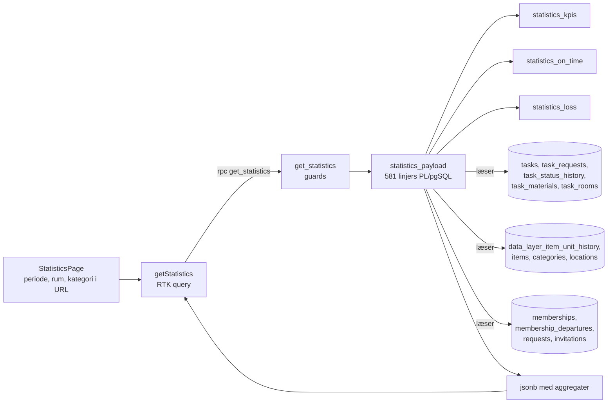

# 4.8 Kodegennemgang – Statistik ("Hvad fortæller data os?")

Dækker: `src/store/apis/statisticApi.ts`, `src/store/hooks/useStatisticsPeriod.ts`, `src/utils/{statisticsSnapshot,statisticsInsights,statisticsTrend,statisticsCsv,calendar}.ts`, `src/types/statistics/*`, `src/pages/statistik/StatisticsPage.tsx` (`/statistik`), `src/components/statistics/**` og DB-funktionerne `get_statistics`, `statistics_payload`, `statistics_kpis`, `statistics_on_time`, `statistics_loss`, `save_statistics_snapshot` samt tabellerne `statistics_snapshots`, `statistics_values`, `task_status_history`, `data_layer_item_unit_history`, `membership_departures`.

> Den detaljerede definition af hvert tal står i **`docs/statistik-plan.md`** (afsnit "Definitioner") og forventede værdier for seed-data i **`docs/seed/FACIT.md`**. Denne fil forklarer arkitekturen; læs planen for de præcise formler.

---

## 1. Arkitekturen: alt beregnes på serveren

Statistik er det eneste domæne, hvor tallene **ikke** samles i klienten:

**Hvorfor (fra `statisticApi.ts`-headeren og `docs/statistik-plan.md`):**
1. **Samme tal for alle** med `read_statistics` – uafhængigt af opgave-RLS (afsluttede opgaver, rolle-låste rum), som ellers ville give forskellige brugere forskellige tal.
2. **Uafhængigt af PostgREST's 1000-rækkers-loft** – kommentaren nævner det eksplicit. (Bemærk: samme loft er *ikke* adresseret i datalager- og beskeddomænet, se `04-kode/04-…` og `04-kode/06-…`.)
3. **Projektprincip:** statistik afledes automatisk af eksisterende data og indtastes aldrig manuelt.
4. **Privatliv:** resultatet indeholder kun aggregater – ingen rækker eller navne (fx "Opgaver pr. medlem" er en anonym fordeling 0 / 1–3 / 4–6 / 7+).

`statistics_payload`, `statistics_kpis`, `statistics_on_time` og `statistics_loss` har kun `EXECUTE` for `service_role` (live-grants) – klienten kan kun nå dem gennem `get_statistics`.

### Historik-tabeller (SCD type 2)
For at kunne svare på "hvordan så det ud ved periodens slutning?" logger triggere ændringer med gyldighedsintervaller:

| Tabel | Trigger | Bruges til |
|---|---|---|
| `data_layer_item_unit_history(unit, item, status, location, valid_from, valid_to)` | `trg_record_item_unit_history` | Enheder pr. status/lager ved periodens slut |
| `task_status_history(task, status, valid_from, valid_to)` | `trg_record_task_status_history` | "I gang", ventetid/tid i gang |
| `membership_departures(org, left_at, reason)` | `trg_record_membership_departure` | Udmeldinger (`left`/`removed`/`deleted`), anonymt |

Ligger et tidspunkt før historikkens start, vises "–" (ukendt) frem for et forkert tal.

---

## 2. Fil: `src/store/apis/statisticApi.ts`

| Endpoint | Kald | Tags |
|---|---|---|
| `getStatistics({start, end, granularity, tz, roomId, categoryId})` | RPC `get_statistics(p_start, p_end, p_granularity, p_tz, p_room_id, p_category_id)` → `jsonb` castet til `StatisticsResult` | `Statistics` |
| `getStatisticsSnapshots` | `statistics_snapshots.select(…, statistics_values(…))` (PostgREST-embed) | `StatisticsSnapshot` |
| `saveStatisticsSnapshot` | RPC `save_statistics_snapshot(p_start, p_end, p_label, p_tz, p_granularity)` | inv. `StatisticsSnapshot` |
| `deleteStatisticsSnapshot` | `delete().eq(id).select('id')` – 0 rækker = RLS afviste → fejl i stedet for falsk succes | inv. `StatisticsSnapshot` |

> **Observeret:** `data as StatisticsResult` er en ukontrolleret cast af en stor JSON-struktur (`src/types/statistics/statisticsTypes.ts`, 312 linjer). Ændres `statistics_payload`, fanges uoverensstemmelser ikke af TypeScript. **Anbefaling:** runtime-validering (fx zod) eller genererede typer.

### RPC `get_statistics` – guards (live)
Aktiv org (`NO_ACTIVE_ORG`) → `read_statistics` (42501) → `p_end > p_start` (`INVALID_PERIOD`) → rum i org (`ROOM_NOT_FOUND`) → kategori er en **hovedkategori** i org (`CATEGORY_NOT_FOUND`) → `statistics_payload(...)`.

### RPC `save_statistics_snapshot`
`create_statistics` → beregner samme payload uden filtre → gemmer **fladt** i `statistics_values(name, value, period_start, period_end)` med navne som `tasks_created`, `task_status:Completed`, `room:<navn>`, `development:created`. Navne "fryses" (omdøbes et rum senere, beholder snapshottet det gamle navn). Der findes **ingen UPDATE-policy** → snapshots er uforanderlige (bevidst, US-52).

RLS: SELECT kræver `read_statistics`, DELETE kræver `delete_statistics`; INSERT kun via RPC.

---

## 3. Fil: `src/store/hooks/useStatisticsPeriod.ts`

**Ansvar:** Periodevalget som *URL-state* (`?periode=dag|uge|maaned|aar|kvartal|alt|egen`, `&kvartal=3&aar=2025`, `&fra=…&til=…`) – danske parameterværdier, så delte links åbner samme visning; ukendte værdier → standard (måned).

- Perioder følger **kalenderen** i lokal tid (Uge = mandag–i dag, Måned = 1.–i dag osv.). `p_end` sendes **eksklusivt** (lokal midnat dagen efter) sammen med browserens tidszone (`Intl…timeZone`), som serveren bruger til bucket-grænser.
- `granularityFor(days)`: ≤ 1 dag → time, ≤ 31 → dag, ≤ 92 → uge, ellers måned.
- "I dag" er state, der opdateres ved `focus`/`visibilitychange`, så en side, der står åben over midnat, ikke viser gårsdagens periode.
- Kvartaler: 10 år tilbage (`STATISTICS_YEARS_BACK`), ikke-begyndte kvartaler kan ikke vælges.

`src/utils/calendar.ts` samler lokale datoberegninger (`toDateKey`, ugestart, kvartalsstart). Kommentaren advarer: `toISOString()` er UTC og giver "i går" mellem midnat og 01/02 i Danmark.

---

## 4. Fil: `src/pages/statistik/StatisticsPage.tsx` (585 linjer)

- Faner `?tab=overblik|snapshots`; filtre `?rum=` (US-55) og `?kategori=` i URL'en.
- `useGetStatisticsQuery(args, { skip: !hasOrganisation || !canRead || activeTab !== 'overblik', refetchOnFocus: true, refetchOnReconnect: true })` – den eneste query i appen, der bruger `refetchOnFocus` (aktiveret af `setupListeners` i `store.ts`).
- Bruger `currentData` (ikke `data`), så gamle tal aldrig vises under en ny periodes overskrift.
- Sektioner: `InsightSummary` (op til 3 sætninger fra `buildInsights`), KPI-kort med trend mod foregående periode af samme længde, `AttentionPanel` ("Lige nu" – følger ikke perioden), `RoomScorecard`, `TaskDevelopmentChart`, `TaskDistributionChart`, `ApprovalChart`, `LossCard`, `BarList`'er.

### Hjælpemoduler
| Fil | Ansvar |
|---|---|
| `utils/statisticsInsights.ts` | `buildInsights(...)` – vælger op til `MAX_INSIGHTS = 3` sætninger (forfaldne vs. forrige periode, til-tiden-andel, rum med flest forfaldne, gennemløbstid, kapacitet). Uafgjorte afgøres på rumnavn, så siden og `FACIT.md` er enige. |
| `utils/statisticsTrend.ts` | `kpiTrend(...)` + `TREND_TONE` – farve kun hvor retningen betyder noget, altid pil + tekst |
| `utils/statisticsSnapshot.ts` (440) | Parsing af snapshot-værdinavne (`parseValueName`), etiketter, sammenligning af op til 4 snapshots, kalenderjustering af tidsserier (`buildDevelopmentComparison`) |
| `utils/statisticsCsv.ts` | RFC 4180-CSV (citering af komma/citat/linjeskift), tal altid med punktum, `downloadCsv` via Blob |

### Komponenter (`src/components/statistics/`)
`KPICard`, `ChartCard`, `StatisticsSection`, `BarList`, `TaskDevelopmentChart`, `TaskDistributionChart`, `ApprovalChart` (recharts), `AttentionPanel`, `InsightSummary`, `LossCard`, `RoomScorecard`, `StatisticsPeriodPicker`, `StatisticsSelectFilter`, `CustomPeriodModal`, `SnapshotPanel` (gem/slet uafhængigt gatet), `SaveSnapshotModal` (egen periode, uafhængig af visningen), `SnapshotComparisonTable` (ændring mod ældste kolonne), `SnapshotDevelopmentChart`.

**Tilgængelighed (observeret som bevidst princip):** faste diagramfarver (`--chart-series-1..4` i `src/index.css`, ikke org-farven), status aldrig med farve alene (ikon + tekst), tabelvisning bag hver graf ("Vis som tabel") til skærmlæsere.

> **Observeret – konvention:** Statistikkodens kommentarer er på **engelsk**, resten af kodebasen overvejende på dansk (CLAUDE.md foreskriver engelsk).

---

## 5. Verifikation af tallene

`docs/seed/generate.mjs` genererer både seed-data (`04_datalayer.sql`, `06_tasks.sql`) **og** `FACIT.md` med forventede tal pr. periode. `docs/migrations/README.md` noterer gentagne gange "kørt og verificeret mod FACIT af bruger". Det er projektets eneste form for systematisk test – manuel, men datadrevet. Se `12-tests.md`.
