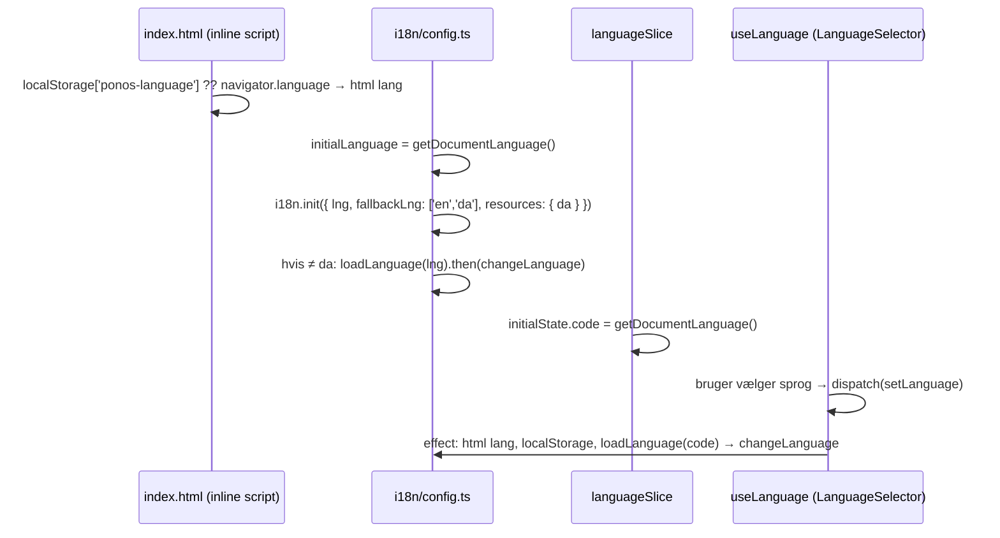

# 4.11 Kodegennemgang – Internationalisering (i18n), tema og organisationsfarver

Dækker: `src/i18n/{config.ts, languages.ts, i18next.d.ts, README.md}`, `src/i18n/locales/<sprog>/<namespace>.json`, `scripts/i18n-check.mjs`, `scripts/i18n-split.mjs`, `src/store/slices/{languageSlice,themeSlice}.ts`, `src/store/hooks/{useLanguage,useTheme,orgHook}.ts`, `src/utils/orgPalette.ts`, `src/index.css`, pre-hydration-scriptet i `index.html`.

> `src/i18n/README.md` er en god, præcis vejledning – læs den. Denne fil forklarer, hvordan delene hænger sammen.

---

## 1. i18n

### Struktur
- **14 sprog** (`LANGUAGES` i `languages.ts`): `cs da de en es fi fr hu it nl pl pt ro sv`. Dansk er master og sidste fallback; engelsk er første fallback (`fallbackLng: ['en', 'da']`).
- **15 namespaces** (`NAMESPACES` i `config.ts`): `common, nav, auth, public, dashboard, organisation, roles, profile, datalayer, tasks, news, messages, notifications, errors, statistics`. (README og `languages.ts` siger "14 namespace-filer" – `statistics` er kommet til siden.)
- Kun dansk bundles statisk; øvrige sprog hentes som separate chunks via `import.meta.glob(['./locales/*/*.json', '!./locales/da/*.json'])` (ses i build-output som mange små `nav-*.js`, `tasks-*.js` …).

### Opstartsflow


- `loadLanguage(code)` gemmer et *promise* pr. sprog i `languageLoads: Map` → samme sprog hentes aldrig to gange samtidig; fejl (offline) fjerner promiset, så det kan prøves igen.
- `useLanguage` henter ordbogen **før** `changeLanguage`, så UI'et ikke først renderer med fallback og derefter igen.

### Typesikre nøgler
`i18next.d.ts` binder `t()` til `typeof daResources`. En tastefejl i en *literal* nøgle bliver en **byggefejl** (`tsc -b`). For nøgler, der først kendes ved runtime (fx `roles:domain.${domain}` eller en fejlnøgle fra API'et), bruges `asDynamic(t)` – kun dér løsnes typningen.

### Fejltekster
Se `04-kode/01-infrastruktur.md` (`apiError.ts` → `ErrorMessage.ts`): endpoints returnerer `errors:<nøgle>`; DB-fejl med `hint` oversættes via `errors:db.<HINT>`; ukendte vises som databasens danske tekst.

### `npm run i18n:check` (`scripts/i18n-check.mjs`)
Sammenligner hvert sprog med dansk (manglende/overskydende nøgler) og kræver de flertalsformer, sproget faktisk har (`Intl.PluralRules`, fx polsk `_few`/`_many`).

> **Observeret – kørt 2026-10-01:** `i18n:check` **fejler**. `en` er komplet (1423/1423), men alle 12 øvrige sprog mangler 104 nøgler hver (fx `datalayer:addItems.helpDiscrete`). I praksis vises de manglende tekster på engelsk (fallback). Scriptet er ikke en del af `build`/`lint`, så fejlen opdages kun, hvis nogen kører det manuelt.
>
> **Observeret (README):** De 12 øvrige sprog er maskinoversat og ikke korrekturlæst.

### Hvor dansk stadig "lækker" igennem
- DB-fejl uden `hint` (fx `create_task_room`, `update_task_room`) → dansk tekst på alle sprog.
- Notifikations-/systembesked-tekster skrevet af triggere – oversættes kun via genkendte sentinel-strenge (`04-kode/06-…`).
- Standardrollernes navne "Admin"/"Medlem" er data, ikke oversatte etiketter.
- Forslagslister i `datalayerTypes.ts` (`'stk', 'dåse', …`).

---

## 2. Tema (lys/mørk)

| Del | Ansvar |
|---|---|
| `index.html` | Sætter `data-theme` før første paint (`localStorage['ponos-theme']` eller `prefers-color-scheme`) |
| `themeSlice.ts` | `mode: 'light' \| 'dark'`, initialiseret fra `data-theme`; `setTheme`, `toggleTheme` |
| `useTheme.ts` | Effect: skriver `data-theme` + `localStorage`; returnerer `toggleTheme` (header) og `setTheme` (profil) |
| `index.css` | `@custom-variant dark (&:where([data-theme="dark"], [data-theme="dark"] *))` – Tailwinds `dark:`-klasser styres af attributten, ikke af OS-indstillingen |

> **Observeret:** Tema og sprog gemmes kun i browseren (ikke i `profiles`) – bevidst, så de virker også udlogget. De følger derfor ikke brugeren til en anden enhed.

---

## 3. Organisationens farver (branding)

`useOrganisationTheme()` (`orgHook.ts`) kører i `App` og skriver CSS-variabler på `<html>` hver gang organisation eller tema ændres:

```ts
for (const [name, value] of Object.entries(paletteToCssVars(buildOrgPalette(organisation, mode))))
  root.style.setProperty(name, value)
```

`src/utils/orgPalette.ts`:
- Defaults spejler `@theme` i `index.css` (`DEFAULT_ACCENT = '#C7975D'`, `DEFAULT_BAR_COLOR = '#071B33'`).
- `relativeLuminance(hex)` og `contrastRatio(a, b)` efter WCAG-formlen.
- `buildOrgPalette(colors, mode)` justerer den valgte farve med en **binær søgning på HSL-lyshed** (`searchLightness`, 20 iterationer; nuance og mætning bevares, og luminans er monoton i lyshed), så farven flyttes mindst muligt, indtil kontrastkravene er opfyldt: accent ≥ 3:1 mod hvid (lys) / ≥ 6:1 mod `#1E293B` (mørk); tekst på header/footer ≥ 4,5:1; for lyse bjælker dæmpes i mørk tilstand (`DARK_BAR_MAX_LUMINANCE`).
- Resultatet: en organisation kan vælge en vilkårlig brandfarve, uden at UI'et bliver ulæseligt.

Tailwind-klasser som `bg-accent`, `text-accent`, `bg-header-bg` er defineret som `var(--color-…)` i `@theme`, så de følger organisationen automatisk.

> **Observeret – bevidst undtagelse:** Statistikdiagrammer bruger faste farver (`--chart-*`), ikke org-farven, så grafer ser ens ud i alle organisationer (beslutning dateret 2026-09-30 i `index.css`).
