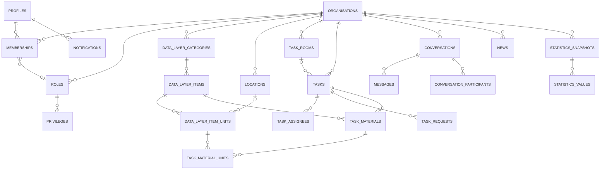
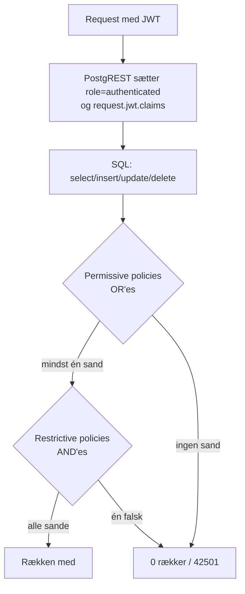

# 6. Database og data

> **Kilder:** (1) Live-skemaeksporten `docs/Supabase Snippet Fuld skemaeksport (ENUMs, constraints, RLS, triggers).csv` (kørt af projektejeren 2026-10-01 med `docs/exportSchema.sql`) – **autoritativ** for *hvad der findes*. (2) `docs/dbSchema.sql` (7.051 linjer) – forklarer *hvorfor*, med dato og user story pr. ændring. Hvor de to afviger, står det under "Drift".
>
> Domænespecifikke detaljer (policies, RPC-logik, triggere) står i `04-kode/02…08`. Denne fil giver helhedsbilledet.

---

## 6.1 Teknologi

| Emne | Valg (observeret) |
|---|---|
| Database | **PostgreSQL** hostet af **Supabase** |
| Adgang fra klienten | `@supabase/supabase-js` → **PostgREST** (auto-genereret REST over tabeller/views/funktioner) og **Realtime** (WAL-baseret change streaming) |
| ORM | **Intet ORM.** Forespørgsler bygges med supabase-js' query builder (`.from().select().eq()…`), som PostgREST oversætter til parameteriseret SQL. Komplekse operationer ligger i PL/pgSQL-funktioner kaldt med `.rpc()`. |
| Extension | `pgcrypto` (`gen_random_uuid()`, samt `crypt/gen_salt` i `reset_password_prototype`) |
| Autentificering | Supabase Auth (`auth.users`); `auth.uid()` i SQL giver den kaldende brugers id fra JWT'en |
| Migrations-værktøj | **Intet** (ingen Supabase CLI-migrations i repoet, ingen Docker/`pg_dump` på udviklermaskinen). Se 6.9. |

**Omfang (live):** 33 tabeller (alle med RLS slået til), 4 enums, 132 constraints, 87 indekser, 103 policies, 93 funktioner, 33 triggere. 1 view (`data_layer_item_status_counts`) ifølge `dbSchema.sql` – views er **ikke** med i eksporten.

---

## 6.2 Tabeller pr. domæne

Alle primærnøgler er `uuid default gen_random_uuid()`, undtagen historiktabellerne (`bigint`) og join-tabellerne (sammensatte nøgler).

| Domæne | Tabel | PK | Vigtigste FK'er (ON DELETE) |
|---|---|---|---|
| **Identitet** | `profiles` | `id` (= `auth.users.id`) | `auth.users` (cascade), `active_organisation_id → organisations` (set null) |
| **Tenant** | `organisations` | `id` | – |
| | `roles` | `id` | `organisation_id` (cascade); UNIQUE (org, name) |
| | `privileges` | `id` | `role_id` (cascade); UNIQUE (role_id, name) |
| | `memberships` | `id` | `user_id`, `organisation_id` (cascade), `role_id` (set null); UNIQUE (user, org) |
| | `membership_requests` | `id` | user/org (cascade), `reviewed_by` (set null); UNIQUE (user, org) WHERE Pending |
| | `membership_invitations` | `id` | UNIQUE (invited_user, org) WHERE Pending |
| | `membership_departures` | `bigint` | org (cascade) – anonym log |
| **Datalager** | `locations` | `id` | org; `parent_location_id` (cascade) |
| | `data_layer_categories` | `id` | org; `parent_category_id` (**set null**) |
| | `data_layer_items` | `id` | org, `category_id` (cascade), `location_id` (set null) |
| | `data_layer_item_units` | `id` | org, `item_id` (cascade), `location_id` (set null); UNIQUE (item, serial) WHERE serial not null |
| | `data_layer_item_unit_history` | `bigint` | org (cascade), `location_id` (set null) |
| | `data_layer_favorites` | `id` | user, org, category/location (cascade) |
| **Opgaver** | `task_rooms` | `id` | org |
| | `task_room_roles` | (room, role) | begge cascade |
| | `task_room_favorites` | `id` | user, org, room (cascade) |
| | `tasks` | `id` | org (cascade), `room_id` (set null) |
| | `task_assignees` | (task, user) | task/user (cascade), `assigned_by → profiles` (**no action**) |
| | `task_participants` | (task, user) | cascade – **ubrugt i `src/`** |
| | `task_requests` | `id` | task (cascade), `requested_by`/`handled_by → profiles` (**no action**) |
| | `task_materials` | `id` | task (cascade), `item_id` (**cascade**) |
| | `task_material_units` | (task_material, unit) | begge cascade |
| | `task_status_history` | `bigint` | org (cascade) |
| **Kommunikation** | `conversations` | `id` | org (cascade), `task_id`/`room_id` (cascade, UNIQUE), `created_by` (cascade), `archived_by` (**no action**) |
| | `conversation_participants` | (conversation, user) | cascade |
| | `conversation_opt_outs` | (conversation, user) | `user_id → auth.users` (cascade) |
| | `messages` | `id` | conversation, sender (cascade) |
| | `notifications` | `id` | user, org (cascade) |
| | `notification_preferences` | `user_id` | profiles (cascade) |
| | `news` | `id` | org (cascade) |
| **Statistik** | `statistics_snapshots` | `id` | org (cascade) |
| | `statistics_values` | `id` | snapshot (cascade) |

### Overordnet ER-diagram (forenklet)



> **Designvalg – denormaliseret `organisation_id`:** Næsten alle tabeller har deres egen `organisation_id`, også hvor den kunne udledes (items fra kategori, enheder fra item). Triggere (`sync_item_organisation`, `sync_item_unit_organisation`) holder den i sync. Fordelen er enkle og hurtige RLS-policies (`organisation_id = auth_profile_org()`) og at `ON DELETE CASCADE` fra `organisations` rydder alt op ved sletning af en organisation.

### Observerede konsekvenser af FK-valgene
- **`task_materials.item_id … ON DELETE CASCADE`**: Sletter man en vare i datalageret, forsvinder dens materiale-linjer fra *alle* opgaver – også afsluttede. Historiske opgaver mister oplysningen om, hvad der blev brugt, og statistik som "Brugte varer pr. kategori" kan ændre sig bagudrettet.
- **`ON DELETE NO ACTION` på `task_assignees.assigned_by`, `task_requests.requested_by/handled_by`, `conversations.archived_by`**: En bruger, der har tildelt nogen en opgave eller behandlet en anmodning, kan ikke slettes fra `auth.users` (kaskaden til `profiles` blokeres). Appen har ingen "slet konto"-funktion, men sletning fra Supabase-dashboardet vil fejle.
- **`data_layer_categories.parent_category_id … SET NULL`**: Slettes en overkategori, bliver dens underkategorier til rodkategorier (bevidst – se `deleteCategoryComponent`).

---

## 6.3 Enums

| Enum | Værdier |
|---|---|
| `e_task_status` | `Started`, `InProgress`, `Completed` |
| `e_task_priority` | `Low`, `Medium`, `High`, `Critical` |
| `e_item_status` | `Available`, `Reserved`, `OutOfStock`, `InUse`, `Missing`, `Damaged`, `Maintenance`, `Consumed`, `NeedsEmptying`, `NeedsRefilling` |
| `e_request_status` | `Pending`, `Accepted`, `Rejected` (deles af medlemsanmodninger, invitationer og opgaveanmodninger) |

TypeScript-spejlinger: `ETaskStatus`, `ETaskPriority` (`src/types/Task/Task.ts`), `ItemStatus` (`datalayerTypes.ts`). De vedligeholdes manuelt (ingen kodegenerering fra skemaet).

Andre "enums" er tekst + CHECK: `messages.message_type` (`user`/`system`), `conversation_participants.completion_choice` (`keep`/`close`), `notifications.type` (9 værdier). `privileges.name` er fri tekst uden CHECK.

---

## 6.4 Data-validering – fire lag

| Lag | Eksempler |
|---|---|
| 1. Klient (UX) | `passwordProblem`, email-regex i SignUp, `NumberInput`/`numberInputError`, tom titel |
| 2. Endpoint (`queryFn`) | `trim()` + `errorCode('required.…')` før kald |
| 3. Constraints | hex-farver (`organisations_*_hex_check`), `serial_requires_single_quantity`, `contents_range`, `quantity_positive_unless_capacity`, `package_size_positive`, `messages_content_check`, unikke indekser |
| 4. Triggere/RPC-guards | `validate_location_parent`, `prevent_*`-triggerne, `assert_task_materials_resolved`, `INVALID_QUANTITY`, `REJECTION_REASON_TOO_LONG` |

Kun lag 3 og 4 er reelle garantier; lag 1–2 kan omgås ved at kalde API'et direkte.

---

## 6.5 Funktioner (93) – kategoriseret

Alle er `SECURITY DEFINER` med `SET search_path` (undtagen `set_task_assignee_assigned_by`, som kører med kalderens rettigheder).

| Kategori | Funktioner | Bemærkning |
|---|---|---|
| **Adgangs-prædikater** (bruges i RLS) | `auth_profile_org`, `has_privilege`, `has_privilege_or_admin`, `role_has_privilege`, `is_organisation_admin`, `is_pending_requester_to_my_org`, `can_access_task_room`, `member_can_access_room`, `is_task_assignee`, `is_conversation_participant`, `conversation_in_active_org`, `conversation_room_access_ok`, `can_write_conversation` | `STABLE`. Security definer forhindrer RLS-rekursion |
| **Klient-RPC'er** | Organisation: `create_organisation`, `set_active_organisation`, `leave_organisation`, `delete_organisation`, `get_my_memberships`, `invite_member`, `remove_member`, `transfer_admin_role`, `create_role_with_privileges`. Datalager: `add_item_with_units`, `reserve_item_units`, `release_item_units`, `update_task_material_status`. Opgaver: `set_task_status`, `create_task_room`, `update_task_room`, `approve_task_request`, `reject_task_request`, `get_pending_task_requests`, `get_task_request_details`, `resolve_task_material_units`. Beskeder: `get_my_conversations`, `get_or_create_direct_conversation`, `create_group_conversation`, `add_group_participants`, `remove_group_participant`, `leave_group_conversation`, `rename_group_conversation`, `mark_conversation_read`, `edit_message`, `delete_message`, `get_or_join_room_conversation`, `join_task_conversation`, `set_task_chat_choice`. Statistik: `get_statistics`, `save_statistics_snapshot`. Auth: `reset_password_prototype` | Hver har egne guards (aktiv org, privilegie, ejerskab) og fejl med `hint` |
| **Interne hjælpere** | `split_unit_if_needed`, `apply_task_material_outcomes`, `assert_task_materials_resolved`, `sync_room_conversation`, `sync_task_conversation`, `sync_task_conversation_archive`, `statistics_payload`, `statistics_kpis`, `statistics_on_time`, `statistics_loss` | Statistik- og sync-hjælperne er låst til `service_role`; **`split_unit_if_needed`, `apply_task_material_outcomes`, `assert_task_materials_resolved` har `EXECUTE` til anon** (se `08-security.md`) |
| **Triggerfunktioner** | `handle_new_user`, `handle_membership_request_status_change`, `handle_membership_invitation_status_change`, `prevent_*` (8 stk.), `reassign_members_before_role_delete`, `record_*` (3 stk.), `sync_*` (5 stk.), `notify_*` (7 stk.), `skip_muted_notification`, `release_units_on_task_material_delete`, `set_task_assignee_assigned_by`, `validate_location_parent`, `archive_empty_group_conversation`, `handle_task_conversation_changes` | |

**Fejlkonvention:** `raise exception '<dansk tekst>' using hint = '<STABIL_KODE>'` (og `errcode = '42501'` for manglende privilegie). Klienten oversætter koden (se `09-error-handling.md`).

**Bypass-flag-mønstret** (transaktions-lokale indstillinger sat med `set_config(…, true)` inde i RPC'er og læst af triggere):

| Flag | Sat af | Slår fra |
|---|---|---|
| `ponos.bypass_self_role_org_change` | org-RPC'er | `prevent_self_role_org_change` |
| `ponos.bypass_admin_protection` | `create_organisation`, `delete_organisation`, `transfer_admin_role` | `prevent_admin_*`, `prevent_default_role_*`, `prevent_non_admin_role_change_on_admin_membership` |
| `ponos.bypass_self_membership_role_change` | `transfer_admin_role` | `prevent_self_membership_role_change` |
| `ponos.bypass_unit_status_guard` | `set_task_status`, `update_task_material_status` | `prevent_direct_status_change_on_reserved_unit` |
| `ponos.skip_task_completed_notify` | `approve_task_request` | `notify_task_completed` |

---

## 6.6 Triggere (33)

Grupperet efter formål – detaljer i domænefilerne:

| Formål | Triggere |
|---|---|
| Bootstrap | `on_auth_user_created` (auth.users → profiles) |
| Workflow | `trg_membership_request_status_change`, `trg_membership_invitation_status_change` (opretter medlemskab ved accept) |
| Integritet/beskyttelse | `trg_prevent_self_role_org_change`, `trg_prevent_admin_role_change`, `trg_prevent_default_role_change`, `trg_prevent_admin_privilege_change`, `trg_prevent_default_role_privilege_change`, `trg_prevent_self_membership_role_change`, `trg_prevent_non_admin_role_change_on_admin_membership`, `trg_prevent_direct_status_change_on_reserved_unit`, `trg_validate_location_parent`, `trg_set_task_assignee_assigned_by` |
| Denormalisering | `trg_sync_item_organisation`, `trg_sync_item_unit_organisation`, `trg_sync_status_from_contents` |
| Oprydning | `trg_reassign_members_before_role_delete`, `trg_release_units_on_task_material_delete`, `archive_empty_group_conversation` |
| Historik (statistik) | `trg_record_item_unit_history`, `trg_record_task_status_history`, `trg_record_membership_departure` |
| Notifikationer | `trg_notify_new_message`, `trg_notify_task_assigned`, `trg_notify_task_updated`, `trg_notify_task_completed`, `trg_notify_task_created_in_favorite_room`, `trg_notify_news_published`, `trg_notify_membership_invitation`, `trg_sync_membership_invitation_notification`, `trg_skip_muted_notification` |
| Chat-synkronisering | `trg_sync_task_conversation`, `trg_task_conversation_changes` |

> **Observeret – "skjult" forretningslogik:** En stor del af systemets adfærd sker som bivirkninger i triggere (notifikationer, chats, historik, statusser). Det giver atomisk konsistens, men gør adfærden svær at opdage for en udvikler, der kun læser frontend-koden. Ét `insert` i `task_assignees` kan fx udløse: `assigned_by` overskrives → notifikation oprettes → opgave-chat oprettes/udvides → system-besked skrives → besked-notifikationer oprettes (og evt. droppes af mute-triggeren).

---

## 6.7 Row Level Security – modellen



**Standardmønstret** for org-data (tabeller som `tasks`, `news`, `locations`, `data_layer_*`):
```sql
using ( organisation_id = auth_profile_org() and has_privilege_or_admin('<op>_<domæne>') )
```
- *Tenant-isolation* = `organisation_id = auth_profile_org()` (kun **aktiv** organisation).
- *Autorisation* = `has_privilege_or_admin(...)`.

**Variationer:** ejerskab (`user_id = auth.uid()` for favoritter, notifikationer, præferencer), rum-adgang (`can_access_task_room`), deltagelse (`is_conversation_participant`), restriktive policies på beskeder/notifikationer (aktiv org, rum-adgang, "kan skrive").

**Tabeller uden klient-skrivning** (ingen INSERT/UPDATE/DELETE-policy → kun via RPC/trigger): `memberships` (insert/delete), `task_requests` (update), `task_materials` (insert), `task_material_units`, `task_room_roles`, `notifications` (insert), `messages` (update/delete), `statistics_*` (insert), historiktabellerne.

> **Fordel:** isolationen håndhæves i databasen og kan ikke omgås fra browseren, uanset hvad klientkoden gør. **Ulempe:** semantikken "kun *aktiv* organisation" betyder, at en bruger aldrig kan se data fra to organisationer samtidig – bevidst (US-59).
>
> **Performance-note:** Policies kalder `auth_profile_org()`/`has_privilege_or_admin()` direkte. Supabase anbefaler at pakke dem i `(select …)`, så Postgres kun evaluerer dem én gang pr. forespørgsel (InitPlan) i stedet for potentielt pr. række. Kun `notifications`-policies bruger `(select auth.uid())`-formen. Se `10-performance.md`.

---

## 6.8 Indekser

87 indekser i alt. Gode eksempler: `idx_messages_conversation_created (conversation_id, created_at desc)`, `notifications_user_active_idx … WHERE dismissed_at IS NULL` (partielt), `idx_item_unit_history_open (unit_id) WHERE valid_to IS NULL`, unikke partielle indekser for "højst én ventende anmodning".

> **Observeret – manglende indekser for hyppige opslag:**
> - `task_requests(task_id)` – kun primærnøglen findes, men hvert opgavekort henter `task_requests` pr. `task_id`, og RLS/RPC'er filtrerer på `task_id` og `status`.
> - `task_assignees(user_id)` – PK er `(task_id, user_id)`, så opslag på `user_id` alene (`getMyTaskIds`, policyen "Se egne task_assignees-rækker") kan ikke bruge den.
> Ved seed-datamængder (70 opgaver) er det uden betydning; ved tusindvis af opgaver vil det kunne mærkes.

---

## 6.9 Migrationer og skema-dokumentation

Processen (fra `docs/migrations/README.md` og CLAUDE.md):
1. En ændring skrives som én SQL-fil i `docs/migrations/` (header + rollback som kommentar).
2. **Projektejeren kører den manuelt** i Supabase SQL Editor (Claude/udviklere kører aldrig SQL).
3. Efter verifikation opdateres `docs/dbSchema.sql`, og migrationsfilen **slettes** (git-historikken er arkivet).
4. `docs/exportSchema.sql` bruges til at tjekke drift mellem dokumentation og live-database.

> **Observeret:** Der er ingen automatisk sporing af, hvilke migrationer der er kørt. `docs/migrations/README.md` lister `2026-09-15-notifications.sql` som ventende med "status ikke verificeret", men filen findes ikke i mappen. Rækkefølge og idempotens hviler på disciplin.

### Drift: live-skema vs. `docs/dbSchema.sql` (målt 2026-10-01)

| | Live | `dbSchema.sql` |
|---|---|---|
| Tabeller | 33 | 29 (`conversations`, `conversation_participants`, `messages`, `notifications` mangler som `create table`; kun `alter table` i §15.24) |
| Policies | 103 | 91 |
| Funktioner kun i live | `archive_empty_group_conversation`, `create_group_conversation`, `delete_message`, `is_conversation_participant`, `is_organisation_admin`, `mark_conversation_read`, `notify_news_published`, `notify_task_assigned`, `notify_task_updated`, `validate_location_parent` | – |
| Triggere kun i live | `trg_notify_new_message`, `trg_notify_news_published`, `trg_notify_task_assigned`, `trg_notify_task_updated`, `trg_validate_location_parent`, `archive_empty_group_conversation` | – |

`dbSchema.sql` erkender selv driften i sin header ("Beskedsystemet og notifikationerne står IKKE i denne fil"). Konsekvens: en ny udvikler kan ikke genskabe databasen fra repoet alene.

---

## 6.10 Transaktioner

- **Hver PostgREST-request er én transaktion.** Et `insert` plus alle de triggere, det udløser, committes eller rulles tilbage samlet.
- **Hver RPC er én transaktion.** Derfor er multi-trin-operationer lagt i RPC'er (`create_organisation`, `reserve_item_units`, `approve_task_request`, `transfer_admin_role`, `create_role_with_privileges`).
- **Låsning:** `reserve_item_units` bruger `FOR UPDATE SKIP LOCKED`; `apply_task_material_outcomes` bruger `FOR UPDATE`.
- **Klient-orkestrerede multi-trin (ikke atomiske):** `deleteRoom` (3 trin), `addItems` (løkke), `useDeleteMany` (parallel), `handleMoveCategory` (parallel), `PrivilegeMatrix.handleCreateRole` (rolle + privilegier), `CreateTaskModal` (opgave + reservationer), `useApplyMaterialOutcomes` + `updateTaskStatus`, `updateSavedColors` (læs–ændr–skriv).

---

## 6.11 Dataflow mellem database og applikation

```mermaid
flowchart LR
  subgraph DB[Postgres]
    T[(tabeller)] --- V[(view)]
    F[[RPC-funktioner]]
    TR[[triggere]]
  end
  subgraph Klient
    E[RTK Query endpoint<br/>queryFn] --> M[mapper snake_case → camelCase<br/>fx toOrganisation, mapNewsRow, toMessage]
    M --> C[(RTK-cache)]
    C --> UI[React-komponent]
    RT[Realtime-kanal] -->|updateCachedData| C
  end
  E -->|from().select / rpc()| DB
  TR -->|WAL| RT
```

- **Mapping:** De fleste API-filer konverterer rækker til camelCase-typer (`toOrganisation`, `mapNewsRow`, `toMessage`, `mapNotificationRow`, `toItemLocation`). Undtagelse: opgaver (`Task` er snake_case, `select('*') as Task`).
- **Joins:** Bevidst sparsomt brug af PostgREST-embeds (`organisations(name)`, `task_room_roles(role_id)`, `statistics_values(...)`, `data_layer_item_units(...)`); profiler hentes separat med `fetchProfilesByIds` (begrundelse i `profileApi.ts`).
- **Typer:** Ingen genererede database-typer (`supabase gen types` bruges ikke). `createClient` er utypet, så kolonnenavne i `.select('…')` og `.eq('…')` kontrolleres ikke af TypeScript.

---

## 6.12 Seed-data

`docs/seed/` (se dens README): Roskilde Festival-mockdata – 27 brugere, 21 medlemskaber, 10 lagre/15 sektioner, 32 kategorier, 90 varer, 837 enheder, 20 nyheder, 8 rum, 70 opgaver. `04_datalayer.sql`, `06_tasks.sql` og `FACIT.md` genereres af `generate.mjs`, så forventede statistiktal altid passer til data. `99_cleanup.sql` nulstiller. Alle mock-brugere har password `Ponos1234!` (dokumenteret i README – kun testdata).
