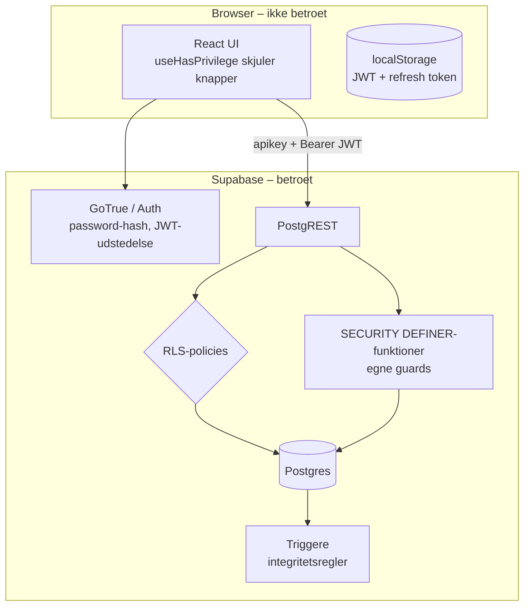

# 8. Authentication og security

> **Vigtig kontekst:** `docs/dbSchema.sql` og kommentarer i koden beskriver Ponos som en **prototype, der ikke deployes** ("PROTOTYPE-FORBEHOLD (bevidst beslutning, projektet deployes ikke)"). Flere fund herunder er derfor kendte og bevidste. De er alligevel medtaget, fordi de bliver kritiske, hvis systemet nogensinde sættes i drift. Fund markeret **(bør verificeres)** er udledt af funktionsdefinitioner og grants i live-eksporten, men ikke afprøvet mod en kørende database.

---

## 8.1 Sikkerhedsarkitektur – hvem beskytter hvad?

| Lag | Rolle | Betroet? |
|---|---|---|
| UI-tjek (`useHasPrivilege`, skjulte knapper) | UX – viser kun mulige handlinger | **Nej** – kan omgås via konsollen |
| RLS-policies | Tenant-isolation + CRUD-privilegier pr. tabel | Ja |
| RPC-guards | Multi-trin-operationer, eskaleringsregler | Ja – men kun hvis de selv tjekker alt (se 8.3) |
| Triggere | Invarianter (én admin, faste roller, låste enheder) | Ja |

Princippet er konsekvent dokumenteret i koden ("Kun til at vise/skjule UI; RLS håndhæver dem").

---

## 8.2 Gennemgang pr. emne

### Authentication
- **Mekanisme:** Supabase Auth med email + password (`signInWithPassword`, `signUp`). Ingen OAuth/SSO/MFA i koden.
- **Signup:** navne sendes som `user_metadata` → `handle_new_user` opretter profil. Om email-bekræftelse er slået til, er en dashboard-indstilling (**uklart**); koden håndterer begge dele.
- **Skift adgangskode (US-69):** kræver den nuværende kode (re-autentificering), fordi `updateUser` ellers ikke gør. God praksis.
- **Glemt adgangskode (US-68):** prototype uden email – se 8.3.1.

### Sessions, JWT og cookies
- `createClient` uden options → session (access token + refresh token) gemmes i **`localStorage`**, auto-refresh slået til. **Ingen cookies** bruges af appen.
- Konsekvens: Et vellykket XSS kan læse tokens og handle som brugeren – derfor er sanitering af rich text kritisk (kommentaren i `src/lib/richText.ts` siger præcis det).
- `session.ts` bruger `supabase.auth.getUser()` (validerer JWT'en hos Supabase) frem for blot at stole på den lokale session – sikkert, men dyrt (se `10-performance.md`).

### Authorization
- **Model:** RBAC – rolle pr. medlemskab, privilegier som tekststrenge på rollen, `admin` som supersæt. Tenant-isolation via `organisation_id = auth_profile_org()`.
- **Kun aktiv organisation:** al RLS bruger `profiles.active_organisation_id`, som kun kan ændres via RPC'er, der verificerer medlemskab.
- **Beskyttelse mod eskalering:** escalation-guard på `memberships` UPDATE (kan ikke tildele en admin-rolle uden selv at være admin), "kun Admin-rollen må have `admin`", højst én admin, kan ikke ændre egen rolle, `create_role_with_privileges` kun med egne privilegier. Se dog 8.3.4.

### Password handling
- Hashing og opbevaring håndteres af Supabase Auth (bcrypt). Undtagelse: `reset_password_prototype` skriver selv `crypt(p_new_password, gen_salt('bf', 10))` direkte i `auth.users.encrypted_password`.
- Minimumslængde: 6 tegn (klient: `MIN_PASSWORD_LENGTH`; DB: i reset-funktionen). Ingen kompleksitets- eller lækage-tjek i koden; Supabase-projektets egne regler er **uklare**.
- Seed-brugere har det fælles password `Ponos1234!` (dokumenteret i `docs/seed/README.md` – testdata).

### Secrets og environment variables
- Kun to variabler: `VITE_SUPABASE_URL`, `VITE_SUPABASE_ANON_KEY` i `.env.local` (gitignored). `VITE_`-præfikset betyder, at de **bygges ind i JavaScript-bundlen** – det er tilsigtet for anon-nøglen.
- Ingen `service_role`-nøgle, JWT'er eller andre hemmeligheder fundet i de trackede filer eller i git-historikken for `.env*`.
- **Observeret:** Live-skemaeksporten (CSV med alle funktionsdefinitioner og policies) blev committet i `fb74b0f` og fjernet igen i `9d2d39f` (begge 2026-09-29). Den ligger derfor stadig i git-historikken, som er pushet til `github.com/moar129/Ponos` (**uklart** om repoet er offentligt). `.gitignore`-mønsteret `.docs/*Supabase*` har et fejlagtigt punktum og matcher derfor ikke `docs/`, så det beskytter ikke mod gentagelse.

### Input validation
Fire lag (se `06-database.md` §6.4). Kun constraints, triggere og RPC-guards er reelle garantier.

### SQL injection
- Ingen rå SQL fra klienten. PostgREST parameteriserer alle filterværdier.
- Ingen dynamisk SQL (`EXECUTE format(...)`) i nogen af de 93 funktioner (søgt i eksporten). PL/pgSQL-parametre bruges som bind-variabler.
- ILIKE-wildcards escapes i `searchOrganisations` (korrekthed, ikke sikkerhed).
- **Konklusion:** ingen observeret SQL-injection-risiko.

### XSS
- React escaper al tekst. Eneste `dangerouslySetInnerHTML` (`NewsDetailPage`) går gennem whitelist-saniteringen `sanitizeRichText` – også ved visning.
- `href`/`src` fra brugerdata: `news.url` (uvalideret, se 8.3.7), `news.picture_url` og `profiles.url_picture` (`` – kan ikke køre script). React 19 blokerer `javascript:`-URL'er (verificeret i den installerede `react-dom`).
- Notifikationers `link` bruges med `navigate()` (intern routing), ikke som `href`.

### CSRF
Ikke relevant i den klassiske form: autentificering sker via `Authorization: Bearer`-header, som en fremmed side ikke kan få browseren til at sende automatisk (ingen cookies).

### CORS
Styres af Supabase (projektindstilling) – ikke synligt i repoet (**uklart**). Appen selv har ingen server.

### Rate limiting
Ingen i koden. Supabase Auth har indbyggede grænser for auth-endpoints; PostgREST/RPC har ingen som standard (**uklart** for dette projekt). Relevant for `reset_password_prototype` (brute force af navne) og `invite_member` (email-enumeration).

### Sensitive information
- Alle medlemmer kan læse **navn og email** på alle andre medlemmer (`profiles`-policy) – nødvendigt for kontaktlister, men kombineret med 8.3.1 farligt.
- DB-fejltekster kan lække interne værdier (fx reserveret mængde i `OUTCOME_QUANTITY_MISMATCH`).
- Statistik eksponerer kun aggregater (bevidst privatlivsdesign).

### Logging
- Klienten logger næsten intet (eneste `console.warn` i `supabase.ts`); ingen fejlrapportering (Sentry el.lign.).
- Audit trail findes kun indirekte: `reviewed_by`, `handled_by`, `assigned_by`, historiktabellerne. Ingen log af privilegieændringer, rolle-tildelinger eller sletninger.

---

## 8.3 Fundne sårbarheder og svagheder

Sorteret efter alvor. Format: **Hvor → Hvorfor → Udnyttelse → Løsning.**

### 8.3.1 KRITISK (ved deployment): Kontoovertagelse via `reset_password_prototype`
1. **Hvor:** RPC `reset_password_prototype` (`dbSchema.sql` §15.17), kaldt fra `authApi.resetPassword` / `ForgotPassword.tsx`; `grant execute … to anon`.
2. **Hvorfor:** Email + fornavn + efternavn er hele identitetsbeviset, og alle tre er synlige for alle medlemmer af samme organisation (`profiles`-SELECT-policy).
3. **Udnyttelse:** Et almindeligt medlem læser administratorens navn og email i medlemslisten → indsender `/glemt-adgangskode` med en ny kode → logger ind som administrator (fuld kontrol over organisationen, inkl. sletning). Kan også ske uden UI med anon-nøglen fra bundlen. Ingen notifikation til ejeren; eksisterende sessions bevares.
4. **Løsning:** Erstat med `supabase.auth.resetPasswordForEmail()` + `verifyOtp`/`updateUser`; fjern funktionen og grant'en. (Dokumenteret som kendt forbehold.)

### 8.3.2 HØJ (bør verificeres): Uautentificeret ændring af enhedsstatus via interne hjælpefunktioner
1. **Hvor:** `apply_task_material_outcomes(p_task_material_id, p_outcomes)` og `split_unit_if_needed(p_unit_id, p_needed)` – `SECURITY DEFINER`, `EXECUTE` til `anon` og `authenticated` (live-grants).
2. **Hvorfor:** `apply_task_material_outcomes` har ingen egen org- eller privilegie-kontrol. Den eneste kontrol er i `split_unit_if_needed`: `if v_unit.organisation_id <> public.auth_profile_org() then raise …`. For en udlogget kalder er `auth_profile_org()` `NULL`; `x <> NULL` giver `NULL`, og `IF NULL` er falsk → kontrollen springes over.
3. **Udnyttelse:** Med den offentlige anon-nøgle og et kendt `task_material_id` (UUID'er ses i API-svar, links, tidligere medlemskab): første kald med en forkert mængde afslører den korrekte i fejlteksten (`… matcher ikke den reserverede mængde (%)`); andet kald sætter fx alle reserverede enheder til `Missing`/`Consumed` og fjerner reservationerne. Et indlogget medlem af samme org kan gøre det samme uden `update_tasks`.
4. **Løsning:** `revoke execute on function public.apply_task_material_outcomes(uuid, jsonb), public.split_unit_if_needed(uuid, numeric), public.assert_task_materials_resolved(uuid) from anon, authenticated, public;` (de kaldes kun fra andre definer-funktioner). Brug generelt `is distinct from` i stedet for `<>` ved sammenligning med `auth_profile_org()`, og lad interne hjælpere tjekke `auth.uid() is not null`.

### 8.3.3 HØJ (privatliv, bør afklares): Administratorer kan læse alle private beskeder
1. **Hvor:** Policies "Admins can view archived conversations", "… archived conversation messages", "… conversation participants" på `conversations`, `messages`, `conversation_participants`.
2. **Hvorfor:** Navnet siger "archived", men betingelsen er kun `is_organisation_admin(organisation_id)` – `archived_at` tjekkes ikke.
3. **Udnyttelse:** En administrator kører `supabase.from('messages').select('*')` i browserkonsollen og får alle beskeder i organisationen, inkl. 1:1-samtaler mellem andre medlemmer.
4. **Løsning:** Tilføj `and c.archived_at is not null` (hvis moderation af arkiverede samtaler er hensigten) – eller fjern policyerne og dokumentér beslutningen over for brugerne.

### 8.3.4 MIDDEL: Privilegie-eskalering via `update_roles`
1. **Hvor:** INSERT/UPDATE-policies på `privileges` ("Opret/Rediger privilegier i egen organisation").
2. **Hvorfor:** De kræver kun `update_roles` og at navnet ikke er `admin`. Der er ingen regel om "kun privilegier, man selv har" (som `create_role_with_privileges` har), og intet forbud mod at ændre sin egen rolle.
3. **Udnyttelse:** En bruger med `update_roles` (fx en "HR"-rolle) indsætter `privileges(role_id = <egen rolle>, name = 'delete_members')`, `delete_datalayer`, `read_statistics` osv. og har dermed alle rettigheder undtagen `admin`.
4. **Løsning:** Udvid WITH CHECK med `has_privilege(name)` for ikke-admins, og/eller forbyd ændringer på den rolle, kalderen selv har.

### 8.3.5 MIDDEL: Forretningsregler håndhævet kun i klienten
| Regel | Hvor den mangler server-side | Udnyttelse | Løsning |
|---|---|---|---|
| Godkendelsespligt (`requires_approval`) | `set_task_status` | Tilmeldt kalder `rpc('set_task_status', {p_status:'Completed'})` og springer godkenderen over | Afvis `Completed` i RPC'en, når `requires_approval` og kalder ikke er godkender |
| Maks. tilmeldte (`max_assignees`) | policies på `task_assignees` | Direkte insert ud over loftet | BEFORE INSERT-trigger eller check i policy |
| Rum-begrænsning ved selvtilmelding | policy "Tilmeld sig selv …" | Kendt opgave-UUID i låst rum → tilmeld → opgaven bliver synlig (`is_task_assignee`) | Tilføj `can_access_task_room` i WITH CHECK |
| Systembeskeder | INSERT-policy på `messages` | Indsæt `message_type = 'system'` eller vilkårlig `created_at` | Policy: `message_type = 'user'`; ignorér klientens `created_at` (trigger) |

### 8.3.6 MIDDEL: `profiles` kan opdateres uden kolonnebegrænsning
1. **Hvor:** policy "Bruger kan opdatere egen profil" (`using (id = auth.uid())`); trigger beskytter kun `active_organisation_id`.
2. **Hvorfor:** Kolonne-grants er ikke med i eksporten (**uklart**); hvis der ikke findes nogen, kan brugeren ændre `email` og `note_admin`.
3. **Udnyttelse:** Sætte `profiles.email` til en endnu ikke registreret persons email → personens senere signup fejler (UNIQUE i `handle_new_user`); invitationer til den email (`invite_member` slår op på `profiles.email`) rammer angriberen. Skrive i "administratorens felt" `note_admin`.
4. **Løsning:** `revoke update on public.profiles from authenticated; grant update (first_name, last_name, description, url_picture) on public.profiles to authenticated;`

### 8.3.7 LAV
| Fund | Hvor | Løsning |
|---|---|---|
| `organisations` INSERT `with check (true)` – forældreløse orgs/navne-squatting | policy "Opret organisation (bootstrap)" | Fjern policyen (RPC'en er SECURITY DEFINER og behøver den ikke) |
| 60 funktioner har `EXECUTE` for `anon` (inkl. alle ældre RPC'er) | live-grants | `revoke … from anon, public` + `grant … to authenticated` (mønstret står i `dbSchema.sql` §15-headeren) |
| `is_conversation_participant(conv, user)` med vilkårligt user-id, kaldbar af anon | live-grants | revoke fra anon; fjern `p_user_id`-parameteren fra den offentlige signatur |
| User enumeration: `invite_member` (`NO_USER_WITH_EMAIL`), signup ("already registered") | RPC/Supabase | Bevidst UX; accepter eller generaliser fejlen |
| `news.url` valideres ikke (`data:`, phishing) | `NewsFormModal`, `NewsDetailPage` | `isSafeHref` i formular + DB-CHECK |
| Fri billed-URL (`url_picture`, `picture_url`) → tracking pixel | `Avatar`, `NewsImage` | Upload til Supabase Storage i stedet for fri URL |
| Skemadump i git-historik + forkert `.gitignore` | `fb74b0f`, `.gitignore` | Ret mønsteret til `docs/*Supabase*`; overvej at fjerne filen fra historikken, hvis repoet er offentligt |
| Svag minimumslængde (6) | `validatePassword.ts`, reset-RPC | ≥ 8 og tjek mod lækkede passwords (Supabase har indstilling) |
| Ingen audit-log af rettighedsændringer | DB | Trigger-baseret audit-tabel |

---

## 8.4 Hvad er godt (observeret)

- RLS på **alle** 33 tabeller; tenant-isolation i databasen, ikke i UI.
- Alle definer-funktioner har `SET search_path` (beskytter mod search_path-angreb).
- Konsekvent fejlkode-design (`hint`) uden at lække stack traces.
- Whitelist-sanitizer til rich text, anvendt både før gem og ved visning.
- Mange eskaleringsguards (én admin, faste roller, kan ikke ændre egen rolle), og de nyere RPC'er er låst til `authenticated`.
- Re-autentificering ved skift af adgangskode.
- Statistik eksponerer kun aggregater.
