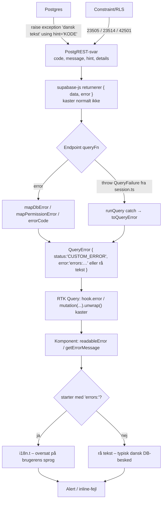

# 9. Error handling

## 9.1 Overblik: fejlens rejse fra database til skærm

## 9.2 Hvor opstår fejl?

| Kilde | Eksempel | Form |
|---|---|---|
| RPC-guard | `raise exception 'Du er ikke medlem…' using hint = 'NO_ACTIVE_ORG'` | `error.hint = 'NO_ACTIVE_ORG'` → `errors:db.NO_ACTIVE_ORG` |
| Unik constraint | dobbelt rollenavn | `code = '23505'` → endpointets `unique`-nøgle |
| CHECK constraint | ugyldig hex-farve | `code = '23514'` → `check`-nøgle |
| RLS afviser skrivning | mangler `create_news` | `code = '42501'` → `errors:permission.createNews` |
| RLS skjuler rækker | update på række man ikke må | **Ingen fejl** – 0 rækker påvirket |
| Session-hjælper | ingen login / ingen aktiv org | `QueryFailure(errorCode('loginRequired' \| 'noOrganisation'))` |
| Klientvalidering | tom titel | `errorCode('required.newsTitle')` eller lokal `setError(t(...))` |
| Netværk | offline | supabase-js `error.message` (fx "Failed to fetch") → vises råt |
| Auth | forkert password | Login viser altid `t('login.wrongCredentials')` |

> **"Stille" RLS-afvisninger:** RLS returnerer *ikke* en fejl, når en UPDATE/DELETE rammer 0 rækker. Koden håndterer det bevidst flere steder ved at tilføje `.select('id')` og tjekke længden: `reviewMembershipRequest` (`errors:requestAlreadyHandled`), `respondToInvitation` (`invitationAlreadyHandled`), `deleteStatisticsSnapshot`. Andre steder (fx `updateCategory`, `deleteItem`, `updateNews`, `cancelInvitation`) ville en RLS-afvisning se ud som succes.

## 9.3 Hvordan fejl propagerer

1. **I endpoints:** to stilarter findes side om side:
   - `queryFn: () => runQuery(async () => { … })` (52 steder) – alt, der kastes, bliver til en `QueryError`. Bruges, når `session.ts`-hjælperne kaldes.
   - `queryFn: async (…) => { … }` uden `runQuery` (resten) – returnerer `{ error }` eksplicit. Kaster supabase-js alligevel (sjældent), fanger RTK Query undtagelsen, men behandler den som uventet.
2. **I komponenter:**
   - **Queries:** `const { data, isLoading, error } = useXQuery()` → `{error && <Alert>{readableError(error)}</Alert>}`.
   - **Mutations:** typisk `try { await mutate(args).unwrap(); onClose() } catch { /* vises via mutationError */ }` (46 tomme `catch {}` med denne kommentar) – fejlen vises via hookens `error`-felt, og modalen forbliver åben, så brugerens input ikke tabes.
   - `getErrorMessage(err, fallback)` bruges, når fejlen fanges lokalt (28 steder); `readableError(err)` (61 steder) returnerer `null` ved ingen fejl.
3. **Oversættelse:** `ErrorMessage.ts` slår `errors:`-nøgler op via `i18n.t`. Fordi oversættelsen sker ved *visning*, skifter en synlig fejl sprog sammen med UI'et.

## 9.4 Hvad brugeren ser

- En `Alert` (rød boks, `role="alert"`) tæt ved den handling, der fejlede – fx i modalen, i en matrixcelle, i en listerække.
- Kendte DB-koder → præcis, oversat besked ("Du er den eneste administrator…").
- Ukendte DB-fejl → databasens danske tekst (bedre end "Noget gik galt"; kommentarerne i `apiError.ts` begrunder valget).
- Fuldstændig ukendte fejl → `errors:generic`.

## 9.5 Logging

- **Ingen** central fejllogning eller fejlrapportering (ingen Sentry/LogRocket o.l., ingen `console.error`). Den eneste `console.*` i `src/` er `console.warn` om manglende env-vars.
- Fejl, der kun vises for brugeren, efterlader altså intet spor for udviklerne.

## 9.6 Global error handling

| Mekanisme | Findes? |
|---|---|
| React Error Boundary | **Nej** (ingen `ErrorBoundary`/`componentDidCatch` i `src/`). En exception under render (fx `undefined.map` på uventet API-data) giver en **hvid side** for hele appen. |
| `window.onerror` / `unhandledrejection` | Nej |
| Fælles fejlformat for API-laget | **Ja** – `QueryError` + `errors:`-nøgler |
| Fælles visningskomponent | **Ja** – `Alert` |
| Route-fejl | `NotFoundPage` for ukendte URL'er; `ProtectedRoute` redirecter ved manglende login |

## 9.7 Steder hvor error handling mangler eller kan forbedres

| Sted | Problem | Forslag |
|---|---|---|
| `TaskCard.tsx` – `handleAssignment`, `handleStartTask`, `proceedToComplete` | Mutationer uden `.unwrap()` og uden at læse `error` → afvisninger (manglende privilegie, uafrapporterede materialer, fuld opgave) er **usynlige** | Vis mutationens `error` i kortet |
| `TaskCard.handleResolveConfirm` | `.unwrap()` uden try/catch i funktionen | Fang og vis i modalen |
| `useSignOutAndRedirect` | `signOut()` uden `.unwrap()` → navigerer til `/login`, selv hvis logout fejlede | `unwrap` + vis fejl |
| `useOpenNotification` | `markRead` uden fejlhåndtering | Acceptabelt (ikke kritisk), men bør logges |
| `useMessageThread` | `markConversationRead` fejl ignoreres | Acceptabelt – optimistisk opdatering rulles tilbage |
| `SignUp.tsx` | `alert()` til "tjek din email" | Brug `Alert`-komponenten / en side |
| `ProtectedRoute` | Viser kun `t('loading')`; en fejl i `getSession` behandles som "ikke logget ind" | Skeln mellem fejl og manglende session |
| `supabase.ts` | Manglende env-vars → kun `console.warn` | Kast en klar fejl i udvikling |
| RLS 0-rækker | Kun håndteret i 3 endpoints | Brug `.select('id')` + længdetjek konsekvent ved update/delete |
| DB-funktioner uden `hint` (`create_task_room`, `update_task_room`) | Dansk tekst på alle sprog | Tilføj `hint` + `errors:db.*`-nøgler |
| Global | Ingen Error Boundary | `ErrorBoundary` om `<Routes>` med "Noget gik galt – genindlæs" |
