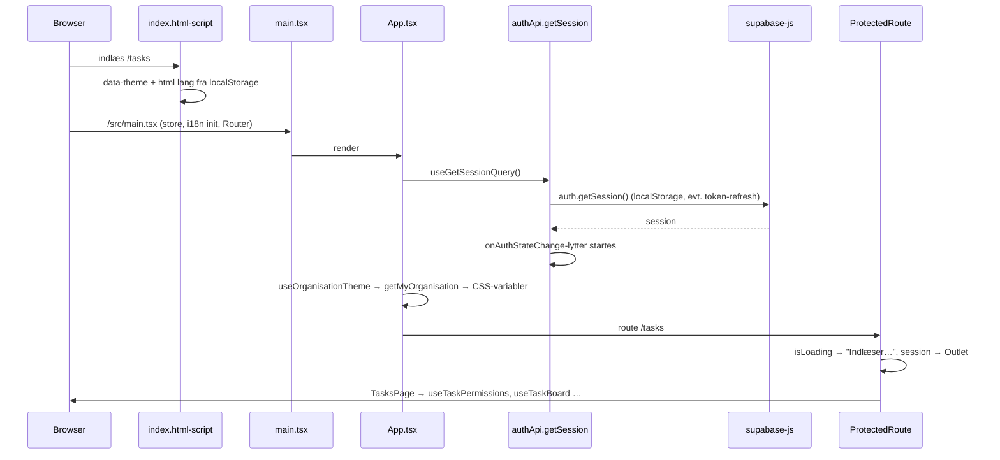
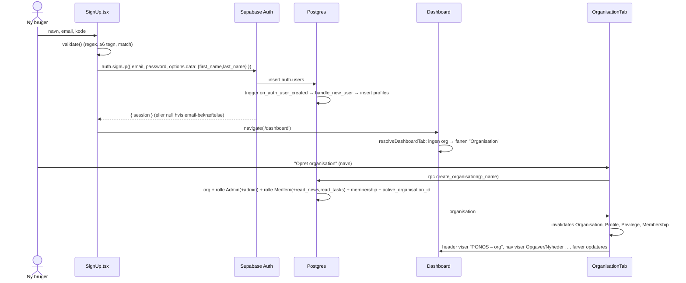
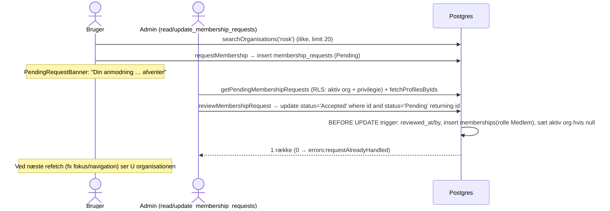
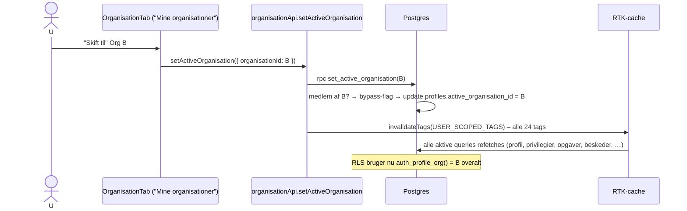
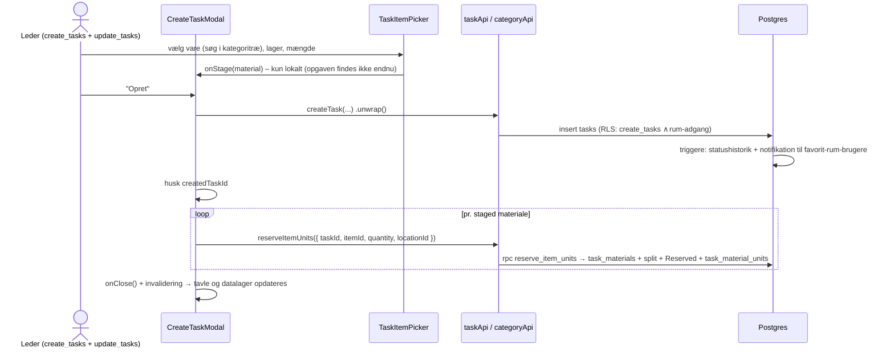
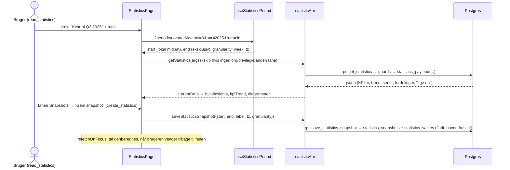

# 15. Kritiske flows (end-to-end)

Ti flows, der tilsammen dækker hele systemet. Hvert flow viser: **trigger → frontend → API-lag → database (RLS/RPC/triggere) → cache → UI**. Fejlstier og kendte svagheder er nævnt til sidst i hvert flow.

---

## Flow 1 – Appen starter, og en gemt session gendannes

**Bemærk:** `getMyOrganisation` (for farverne) og alle sidens queries kører `getUser()` + profilopslag hver for sig (se `10-performance.md`). Ugyldig/udløbet refresh token → `session = null` → redirect til `/login` (uden returnTo).

---

## Flow 2 – Ny bruger: signup → første organisation

**Fejlstier:** email findes → `signup.emailTaken`; navn findes → `errors:duplicateOrganisationName` (unik på `lower(trim(name))`).

---

## Flow 3 – Medlemskab: anmodning → godkendelse (og invitation)

**Invitation (US-67) er spejlvendt:** admin → `rpc invite_member(email)` → notifikation (`trg_notify_membership_invitation`) → bruger svarer med `respondToInvitation` → trigger opretter medlemskab og markerer notifikationen læst.

**Svagheder:** brugeren får ingen realtime-besked om accept (kun notifikation ved invitationer); `invite_member` afslører om en email har en konto.

---

## Flow 4 – Skift aktiv organisation

**Hvorfor dette er centralt:** al tenant-isolation hænger på `active_organisation_id`. Kommentaren i `supabaseApi.ts` beskriver en tidligere bug, hvor en tag manglede i listen og gav forkert rolle indtil F5.

---

## Flow 5 – Rettigheder: admin giver en rolle et privilegie, brugeren får adgang

1. Admin åbner Administration → "Roller & privilegier" (`PrivilegeMatrix`).
2. `cellLockState` afgør om cellen må ændres (spejler triggerne).
3. Klik → `createPrivilege({ roleId, name: 'read_statistics' })` → `POST privileges` → RLS: rolle i aktiv org ∧ `update_roles` ∧ ikke `admin` (medmindre Admin-rollen) → triggere (`prevent_default_role_privilege_change` blokerer Medlem).
4. Invaliderer `Privilege` **i admins klient**.
5. **Hos brugeren med rollen:** intet sker før deres `getMyPrivileges` refetches (ved næste login/org-skift/token-refresh, eller når en mutation invaliderer `Privilege`). Der er ingen realtime på privilegier.
6. Når den er hentet: `useNavItems` viser "Statistik", og `get_statistics` tillader adgangen (RLS/RPC tjekker hver gang, uanset klientens cache).

**Pointe for nye udviklere:** UI-adgang og reel adgang kan midlertidigt være ude af sync – databasen er altid den rigtige.

---

## Flow 6 – Datalager: opret vare med enheder
Se `04-kode/04-datalayer.md` §7 (sekvensdiagram). Kort: `AddItemsComponent` → `addItems` (løkke) → `rpc add_item_with_units` → item + N enheder i én transaktion → historik-trigger pr. enhed → invalidering af `Item/LIST` → `getCategoryTree` + `getUnitLocationCounts` refetches → `DataLayerPage` genberegner placeringer/chips.

---

## Flow 7 – Opret opgave med materialer (reservation)

**Fejlsti:** "ikke nok ledigt" på materiale 2 → opgaven og materiale 1 består; listen viser kun de resterende; nyt klik genbruger `createdTaskId`. Har brugeren `create_tasks` men ikke `update_tasks`, oprettes opgaven, men alle reservationer fejler.

---

## Flow 8 – Opgavens livscyklus: tilmeld → påbegynd → meld færdig → godkend

1. **Tilmeld:** `assignToTask` → `insert task_assignees` (RLS: selv eller `assign_tasks`) → `trg_set_task_assignee_assigned_by`, `trg_notify_task_assigned`, `trg_sync_task_conversation` (opgave-chat ved 2+ tilmeldte).
2. **Påbegynd:** `updateTaskStatus('InProgress')` → `set_task_status` → `Reserved → InUse`.
3. **Undervejs:** `changeTaskMaterialStatus` (fx 1 stk. `InUse → Damaged`).
4. **Meld færdig:** materialer uafrapporteret → `ResolveTaskMaterialsModal` → udfald → `requires_approval`?
   - **Ja:** `createTaskRequest({ materialOutcomes })` (gemmes som data).
   - **Nej:** `resolveTaskMaterialUnits` pr. linje → `updateTaskStatus('Completed')`.
5. **Godkend:** godkender (`TaskApprovalsPanel`) → `approve_task_request` → udfald anvendes → `Completed` → notifikation → chat lukkes/arkiveres efter brugernes valg.
6. **Afvis:** `reject_task_request(reason)` → notifikation med begrundelse → opgaven forbliver `InProgress`, materialer urørte.

Fuldt sekvensdiagram: `04-kode/05-opgaver.md` §7. **Kendte huller:** `set_task_status` tjekker ikke `requires_approval`; fejl i `TaskCard` vises ikke.

---

## Flow 9 – Realtime-besked og notifikation
Se `04-kode/06-beskeder-notifikationer.md` §6. Kort: `insert messages` → `trg_notify_new_message` → (evt. droppet af `trg_skip_muted_notification`) → Realtime sender `INSERT messages` til åbne samtaler og `INSERT notifications` til modtagerens klokke → klokken invaliderer `Message/<id>` og `Conversation` → `markConversationRead` → afsenderens "Set"-status opdateres via realtime på `conversation_participants`.

---

## Flow 10 – Statistik: vælg periode → beregn → gem snapshot

**Pointe:** Tallene er ens for alle med `read_statistics`, uafhængigt af opgave-RLS, og kan verificeres mod `docs/seed/FACIT.md`.
